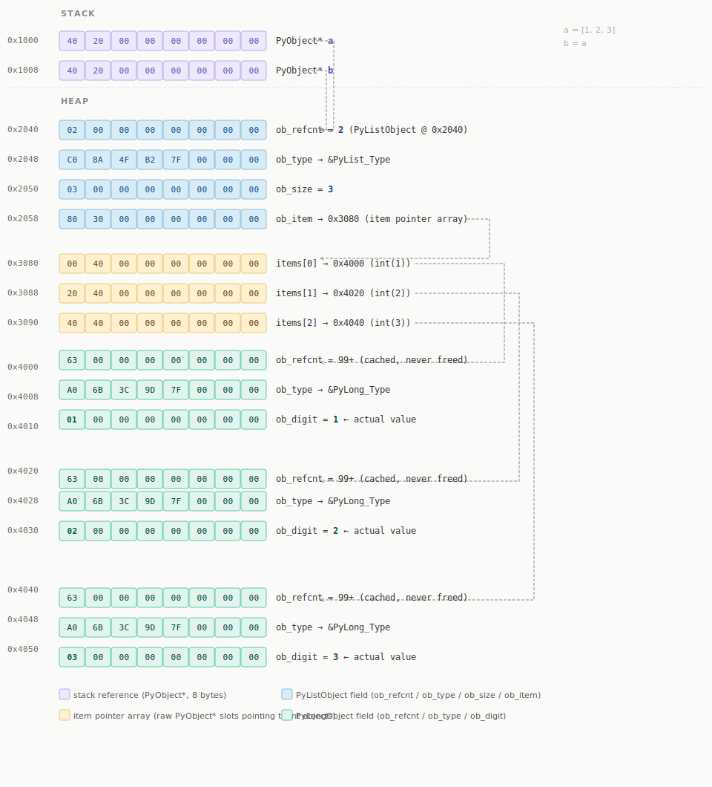

# Python Heap Memory Management

## Overview

In Python, **every object lives on the heap** — integers, strings, lists, functions, classes, everything. Unlike C++ where you explicitly choose stack vs heap allocation, Python handles this automatically. The variable names you write (`x`, `data`, `obj`) are just references stored on the stack; the actual objects they point to always live on the heap.

```python
x = 42           # int object on the heap, 'x' is a stack reference
name = "Alice"   # str object on the heap
data = [1, 2, 3] # list object on the heap, holds refs to int objects
```

---

## Core Mechanism: Reference Counting

Python's primary memory management tool is **reference counting**. Every heap object carries a hidden integer field tracking how many references point to it. When that count reaches zero, the memory is freed immediately — no GC cycle needed.

```python
import sys

a = [1, 2, 3]
print(sys.getrefcount(a))  # 2 — one for 'a', one for getrefcount's own arg

b = a                      # same object, second reference
print(sys.getrefcount(a))  # 3

del b
print(sys.getrefcount(a))  # 2 again

del a                      # refcount → 0, list freed immediately
```

> `sys.getrefcount()` always shows +1 because passing the object to the function creates a temporary reference.

### What happens step by step

```
a = [1, 2, 3]   →  list created at 0x2040, refcount = 1
b = a           →  refcount = 2  (no new object, just a second name)
del a           →  refcount = 1  (b still holds it)
del b           →  refcount = 0  →  freed immediately
```

The key point: `del` doesn't delete the object — it removes the name binding and decrements the refcount. The object itself is only freed when refcount hits zero.

---

## Memory Diagram



### Pointers Inside Python Heap Memory Management

There are actually **3 levels of pointers** in that one line `a = [1, 2, 3]`:

```
Stack          Heap: PyListObject     Heap: item array      Heap: PyLongObjects
──────         ──────────────────     ────────────────      ───────────────────

a ──────────►  ob_refcnt = 2
(0x1000)       ob_type                                      int(1) @ 0x4000
               ob_size = 3                                  ob_refcnt = 99+
(0x1008)       ob_item ────────────►  items[0] ──────────►  ob_type
b ──────────►  (0x2058→0x3080)       (0x3080→0x4000)       ob_digit = 1

                                      items[1] ──────────►  int(2) @ 0x4020
                                      (0x3088→0x4020)       ob_digit = 2

                                      items[2] ──────────►  int(3) @ 0x4040
                                      (0x3090→0x4040)       ob_digit = 3
```

So there are **two heap pointers** specifically:

**Pointer 1 — `a` (stack → heap)**
`a` at `0x1000` on the stack holds the address `0x2040` — the address of the `PyListObject`. This is the reference Python calls a "name binding."

**Pointer 2 — `ob_item` (heap → heap)**
`ob_item` at `0x2058` inside the `PyListObject` holds `0x3080` — pointing to a separate buffer also on the heap, the item array holding the three `PyObject*` slots. This is an internal C-level pointer inside CPython's list implementation.

**Pointer 3 — `items[0/1/2]` (heap → heap)**
Each slot in that item array is itself a pointer to another heap object — the actual `PyLongObject` for `1`, `2`, `3`:
- `0x3080` → `0x4000` (int(1))
- `0x3088` → `0x4020` (int(2))
- `0x3090` → `0x4040` (int(3))

So the full chain is:

```
a (0x1000)  →  PyListObject (0x2040)  →  item array (0x3080)  →  PyLongObject int(1) (0x4000)
                                                                →  PyLongObject int(2) (0x4020)
                                                                →  PyLongObject int(3) (0x4040)
```

This is why Python lists are so flexible — the list never stores the values directly. It stores pointers to objects, which means a single list can hold any mix of types, and two lists can point to the same object without copying it:

```python
a = [1, 2, 3]
b = [a[0], a[1]]  # b's item array points to the same int objects at 0x4000 and 0x4020
                  # no copying of 1 or 2 — just new pointers
```

---

## What Actually Gets Freed

When refcount hits zero on a list, Python frees:

- The list object itself at `0x2040`
- The internal item pointer buffer at `0x3080`
- Each referenced item's refcount is decremented too (which may cascade)

```python
a = [1, 2, 3]
b = a

print(id(a) == id(b))  # True — one heap object at 0x2040, two stack references

del a  # refcount: 2 → 1, object at 0x2040 survives
del b  # refcount: 1 → 0, object at 0x2040 freed
```

---

## The Problem: Circular References

Reference counting alone cannot free objects that reference each other:

```python
a = {}
b = {}
a["other"] = b   # b's refcount = 2
b["other"] = a   # a's refcount = 2

del a            # a's refcount → 1 (b still holds it)
del b            # b's refcount → 1 (a still holds it)
# Neither reaches 0 — they keep each other alive indefinitely
```

Both objects are now unreachable from your code but will never be freed by reference counting alone. This is where the cyclic garbage collector comes in.

---

## Cyclic Garbage Collector

Python's `gc` module runs a **generational garbage collector** alongside reference counting. It periodically scans for isolated reference cycles — groups of objects that only reference each other and nothing reachable from the program.

```python
import gc

gc.collect()           # force a full GC run, returns number of objects freed
gc.disable()           # turn off cyclic GC (reference counting still works)
gc.enable()            # turn it back on
print(gc.get_count())  # (young, middle, old) generation object counts
```

### Generational collection

Objects are divided into three generations based on how long they've survived:

| Generation | Contains | Collected |
|---|---|---|
| 0 (young) | Newly created objects | Most frequently |
| 1 (middle) | Survived one GC pass | Occasionally |
| 2 (old) | Long-lived objects | Rarely |

Most objects die young (temporaries, loop variables, intermediate results), so scanning the young generation frequently and the old generation rarely is highly efficient.

### When cycles occur in practice

```python
class Node:
    def __init__(self, val):
        self.val = val
        self.next = None

# Linked list with a cycle — reference counting can't free this
a = Node(1)
b = Node(2)
a.next = b
b.next = a  # cycle

del a
del b
# Still in memory until gc.collect() runs
```

You can verify this with `gc.get_referrers()` or the `objgraph` library.

---

## Weak References

Sometimes you want to reference an object without keeping it alive — for caches, observers, or parent-child relationships where the child shouldn't prevent the parent from being freed. Python provides `weakref` for this:

```python
import weakref

class Node:
    pass

obj = Node()
weak = weakref.ref(obj)   # doesn't increment refcount

print(weak())   # <__main__.Node object> — object still alive
del obj         # refcount → 0, object freed (weak ref doesn't prevent it)
print(weak())   # None — object is gone, weak ref is "dead"
```

This is the Python equivalent of C++'s `std::weak_ptr`. Common use cases:

```python
import weakref

# Cache that doesn't prevent GC of unused entries
cache = weakref.WeakValueDictionary()
cache["key"] = some_large_object
# Entry disappears automatically when some_large_object has no other refs

# Observer pattern — observer doesn't keep the subject alive
class EventEmitter:
    def __init__(self):
        self._listeners = weakref.WeakSet()

    def add_listener(self, fn):
        self._listeners.add(fn)
```

---

## The GIL and Thread Safety

Python's **Global Interpreter Lock (GIL)** ensures that refcount increments and decrements are atomic. Without it, two threads decrementing the same refcount simultaneously could corrupt memory. This is why Python's memory model is safe in multithreaded code without explicit locking around object lifetime — but it also means threads cannot execute Python bytecode truly in parallel for CPU-bound work.

---

## Small Integer Caching

CPython pre-allocates integers in the range **-5 to 256** permanently. These objects are never freed — their refcount never hits zero in practice because CPython holds its own reference to them. This is why the int objects in the diagram (`0x4000`, `0x4020`, `0x4040`) show `ob_refcnt = 99+` — they are shared across the entire interpreter.

```python
a = 42
b = 42
print(a is b)   # True — same cached object

x = 1000
y = 1000
print(x is y)   # False — large ints are freshly allocated each time
```

Similar caching applies to short strings (interning) and `None`, `True`, `False`.

---

## Comparison with C++

| Concept | C++ | Python |
|---|---|---|
| Heap allocation | `new T` / `make_shared<T>` | Automatic for all objects |
| Deallocation | `delete` / RAII destructor | Automatic via refcount |
| Shared ownership | `std::shared_ptr` | Every reference (implicit) |
| Non-owning reference | `std::weak_ptr` | `weakref.ref()` |
| Cycle collection | Manual (`weak_ptr`) | `gc` module |
| Memory control | Full | None (by design) |
| Deterministic free | Yes (RAII) | Yes for non-cycles (refcount = 0) |
| GC pauses | No | Yes for cyclic GC |

---

## Debugging Memory Issues

```python
import gc
import tracemalloc
import sys

# Find objects keeping something alive
print(gc.get_referrers(my_object))

# Track memory allocations by source line
tracemalloc.start()
# ... run your code ...
snapshot = tracemalloc.take_snapshot()
for stat in snapshot.statistics("lineno")[:10]:
    print(stat)

# Check refcount of any object
print(sys.getrefcount(my_object))  # subtract 1 for the getrefcount arg

# Force-collect cycles
collected = gc.collect()
print(f"Collected {collected} unreachable objects")
```

For deeper inspection, the `objgraph` third-party library can render reference graphs and find what's keeping objects alive.

---

## Summary

Python's heap memory management is a layered system:

1. **Reference counting** — the primary mechanism; frees objects immediately when no longer referenced
2. **Cyclic GC** — handles the edge case of circular references that refcounting can't resolve
3. **Weak references** — opt-in tool for non-owning references, similar to `std::weak_ptr`
4. **GIL** — makes refcount operations thread-safe without explicit locking

The design philosophy is safety over control: you trade manual memory management and predictable performance for a model where memory errors are essentially impossible at the Python level.


