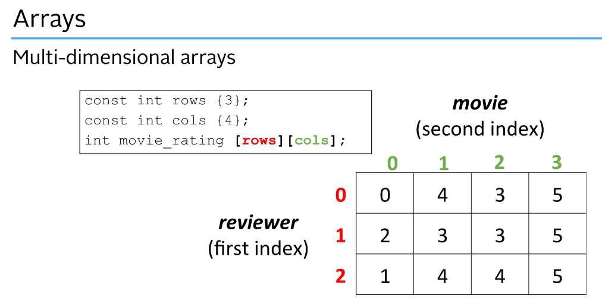
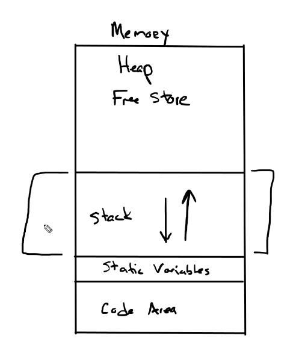
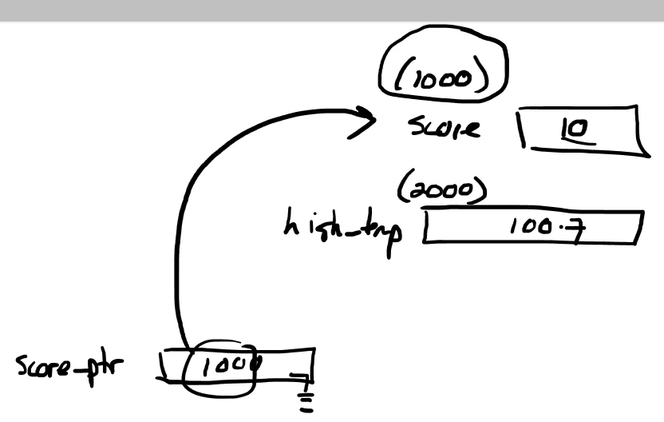
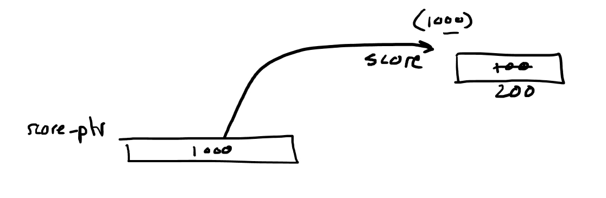

# C++ Learning Handbook

# RAII
Resource Acquisition Is Initialization or RAII, is a C++ programming technique[1][2] which binds the life cycle of a resource that must be acquired before use (allocated heap memory, thread of execution, open socket, open file, locked mutex, disk space, database connection—anything that exists in limited supply) to the lifetime of an object.

RAII guarantees that the resource is available to any function that may access the object (resource availability is a class invariant, eliminating redundant runtime tests). It also guarantees that all resources are released when the lifetime of their controlling object ends, in reverse order of acquisition. Likewise, if resource acquisition fails (the constructor exits with an exception), all resources acquired by every fully-constructed member and base subobject are released in reverse order of initialization. This leverages the core language features (object lifetime, scope exit, order of initialization and stack unwinding) to eliminate resource leaks and guarantee exception safety. Another name for this technique is Scope-Bound Resource Management (SBRM), after the basic use case where the lifetime of an RAII object ends due to scope exit.

RAII can be summarized as follows:

encapsulate each resource into a class, where
the constructor acquires the resource and establishes all class invariants or throws an exception if that cannot be done,
the destructor releases the resource and never throws exceptions;
always use the resource via an instance of a RAII-class that either
has automatic storage duration or temporary lifetime itself, or
has lifetime that is bounded by the lifetime of an automatic or temporary object.
Move semantics enable the transfer of resources and ownership between objects, inside and outside containers, and across threads, while ensuring resource safety.

(since C++11)
Classes with open()/close(), lock()/unlock(), or init()/copyFrom()/destroy() member functions are typical examples of non-RAII classes:

# Build
```
touch CMakeLists.txt
mkdir build
cd build
cmake .. 
make 
./my_program
```

# Compilation vs Linking
| Step            | Input                  | What happens                                                                                                                                                       | Output              | Happens where                 |
| --------------- | ---------------------- | ------------------------------------------------------------------------------------------------------------------------------------------------------------------ | ------------------- | ----------------------------- |
| **Compilation** | `.cpp` files           | Each `.cpp` file is compiled separately into **machine code**, but not yet complete (no connections between files).                                                | `.o` (object) files | Inside `build/CMakeFiles/...` |
| **Linking**     | `.o` files + libraries | All object files (and libraries) are **combined** into one final program. The linker **resolves all symbol references** (functions, variables, etc.) across files. | final executable    | `build/`                      |
## Linking 
Every function or global variable name (like `foo`, `bar`, `std::cout`) becomes a **symbol** inside object files.

There are two types:

- **Defined symbols**: functions/variables you define yourself  
  → e.g., `void greet() {}`

- **Undefined symbols**: references to something defined elsewhere  
  → e.g., `greet();` in another file

The linker’s job is to:

> Match every **undefined symbol** with its corresponding **defined symbol** across all object files and libraries.


# Getting Started
## Preprocessor
The preprocessor runs before actual compilation. It handles all lines starting with #, like:
```
#include <iostream>  // includes the standard I/O library
#define PI 3.14159   // defines a constant
#ifdef DEBUG         // conditional compilation
```

## Header Files Preprocessor
| Method                       | Standard?                   | Works everywhere? | Simplicity       | Typical use           |
| ---------------------------- | --------------------------- | ----------------- | ---------------- | --------------------- |
| `#ifndef / #define / #endif` | ✅ Yes                       | ✅ 100%            | Slightly verbose | Old & modern projects |
| `#pragma once`               | ❌ No (but widely supported) | ✅ 99%             | Very simple      | Modern C++ projects   |


## Standard Template Library vs Standard Library 
| Term                     | Contains                      | Examples                                          |
| ------------------------ | ----------------------------- | ------------------------------------------------- |
| **STL**                  | Templates for data structures | `vector`, `map`, `sort`, `iterator`               |
| **C++ Standard Library** | STL + many other libraries    | `string`, `iostream`, `thread`, `regex`, `memory` |

## Standard Library Headers
```
#include <iostream>
#include <vector>
#include <string>
#include <iomanip>
#include <cmath>
#include <ctime>
#include <cstdlib>
```

## Variable
A variable is just a name (or label) for a location in your computer's memory where a value is stored.
```
int age = 25;
size_t position; // unsigned int or unsigned long 
```
The computer reserves a spot in memory big enough to store an int (usually 4 bytes).
- It puts the value 25 into that memory.
- It gives that memory location a name — in this case, age.
- So when you use age, you're referring to that memory location.

## Namespace
All ROS 2 C++ functionality is grouped under the **rclcpp** namespace. This keeps the API structured and makes it clear where functions and classes come from.
```
rclcpp::shutdown();
```
rclcpp::shutdown() clearly tells the compiler "use ROS 2’s shutdown"

## Arguments
```cpp
int main(int num_args, char *args[]){
    std::cout << "Number of arguments: " << num_args << "\n";
    std::cout << "5th argument is: " << args[4] << "\n";
    return 1;
}
```

## User Input
```cpp
int num_rooms = 0;
std::cout << "How many rooms do you want to be cleaned? ";
std::cin >> num_rooms;
```

## Constant Variable
```cpp
const double tax_rate = 0.06;
```

## Byte Size
```cpp
sizeof(char)
```

## Long Variable
```cpp
long double large_amount = 2.7e120;
```

## Signed vs Unsigned
| Type                    | Bit width | Range                           |
| ----------------------- | --------- | ------------------------------- |
| `int` (signed 32-bit)   | 32        | −2,147,483,648 → +2,147,483,647 |
| `unsigned int` (32-bit) | 32        | 0 → 4,294,967,295               |


# Arrays and Vectors
## Arrays
1-D Array
```cpp
int my_array [5] = {1,2,3,4,5};
std::cout << my_array[0] << std::endl;
```

Multi-D Array



## Vectors
std::vector<T> stores its elements in a contiguous dynamic array on the heap.

Internally, it uses raw pointers to manage this array.

```cpp
template<typename T>
class Vector {
    T* data_;      // raw pointer to heap memory
    size_t size_;
    size_t capacity_;
};
```
When you push_back(), it may allocate a new array, copy/move the elements, and delete the old array.

```cpp
#include <iostream>
#include <vector>

int main()
{
    std::vector <double> number_vector = {0.5, 0.6, 0.7, 0.8, 0.9};
    std::cout << number_vector.at(0) << std::endl; 

    number_vector.at(0) = 1000;

    number_vector.push_back(1.0);

    number_vector.insert(number_vector.begin(), -0.6);

    std::cout << "Length of the vector is: " << number_vector.size() << std::endl;

    number_vector.pop_back();

    std::vector <std::vector<int>> my_2d_vector = {
        {1, 2, 3},
        {4, 5, 6}
    };

    std::cout << my_2d_vector.at(1).at(2) << std::endl; 
    
    return 0;
}  
```

# Statements and Operators
## Operator
- Operator = The symbol that performs an action
- Operand = The value or variable the operator acts on
```cpp
int a = 10;
int b = 5;
int c = a + b;
```
- "+" is the operator
- a and b are the operands
- The operator + adds the two operands

## static_cast
```cpp
std::cout << "Precise average is: " << static_cast<double>(total) / count << std::endl;
```

## Comparision
11.99999999999999999999999 and 12.0 could be equal for C++ code so be careful with the library usage

## Compound Assignment
| Operator | Meaning                | Equivalent To         |         |     |
| -------- | ---------------------- | --------------------- | ------- | --- |
| `+=`     | Add and assign         | `x = x + y`           |         |     |
| `-=`     | Subtract and assign    | `x = x - y`           |         |     |
| `*=`     | Multiply and assign    | `x = x * y`           |         |     |
| `/=`     | Divide and assign      | `x = x / y`           |         |     |
| `%=`     | Modulo and assign      | `x = x % y`           |         |     |
| `&=`     | Bitwise AND and assign | `x = x & y`           |         |     |
| \`       | =\`                    | Bitwise OR and assign | \`x = x | y\` |
| `^=`     | Bitwise XOR and assign | `x = x ^ y`           |         |     |
| `<<=`    | Left shift and assign  | `x = x << y`          |         |     |
| `>>=`    | Right shift and assign | `x = x >> y`          |         |     |


```cpp
int x = 10;
x += 5;   // x = 15
x *= 2;   // x = 30
x -= 3;   // x = 27
```

## Operator Precedence
| Precedence  | Operator(s)             | Type                  | Associativity |            |               |
| ----------- | ----------------------- | --------------------- | ------------- | ---------- | ------------- |
| 1 (Highest) | `()` `[]` `->` `.`      | Function call, member | Left to right |            |               |
| 2           | `++` `--` `+` `-` `!`   | Unary operators       | Right to left |            |               |
| 3           | `*` `/` `%`             | Multiplicative        | Left to right |            |               |
| 4           | `+` `-`                 | Additive              | Left to right |            |               |
| 5           | `<` `<=` `>` `>=`       | Relational            | Left to right |            |               |
| 6           | `==` `!=`               | Equality              | Left to right |            |               |
| 7           | `&&`                    | Logical AND           | Left to right |            |               |
| 8           |                         | Logical OR            | Left to right |            |               |
| 9           | `=` `+=` `-=` `*=` `/=` | Assignment            | Right to left |            |               |
| 10 (Low)    | `,`                     | Comma                 | Left to right |            |               |


## Enumerator
```cpp
enum Color {
    red, green, blue
};

Color screen_color = green;
```

## Precision Set
```cpp
#include <iomanip>

if (temperatures.size() != 0){
    std::cout << std::fixed << std::setprecision(2) ;
    std::cout << "Average: " << sum/temperatures.size() << std::endl;
}
```

# Controlling Program Flow
## If-Else
```cpp
if (score >= 90)
{
    letter_grade = 'A';
}
else if (score >= 80)
{
    letter_grade = 'B';
}
else if (score >= 70){
    letter_grade = 'C';
}
else if (score >= 60){
    letter_grade = 'D';
}
else{
    letter_grade = 'F';
}
```

## Switch-Case
In C++, you cannot use switch with double or std::string directly. The switch statement only works with integral or enumeration types, such as:
- int
- char
- enum
```cpp
int day;

std::cout << "Enter a number (1-7): ";
std::cin >> day;

switch (day) {
    case 1:
        std::cout << "Monday\n";
        break;
    case 2:
        std::cout << "Tuesday\n";
        break;
    case 3:
        std::cout << "Wednesday\n";
        break;
    case 4:
        std::cout << "Thursday\n";
        break;
    case 5:
        std::cout << "Friday\n";
        break;
    case 6:
        std::cout << "Saturday\n";
        break;
    case 7:
        std::cout << "Sunday\n";
        break;
    default:
        std::cout << "Invalid number! Please enter a number between 1 and 7.\n";
}
```

## Ternary Operator (Conditional Operator)
```cpp
int num1, num2, bigger, smaller;
std::cout << "Enter two integers seperated by space: ";
std::cin >> num1 >> num2;

if (num1 != num2) {
    bigger = (num1 > num2) ? num1 : num2;
    smaller = (num1 < num2) ? num1 : num2;
    std::cout << "Bigger is " << bigger << std::endl;
    std::cout << "Smaller is " << smaller << std::endl;
}
```

```cpp
    for (int i = 1; i <=100; i++)
    {
        std::cout << i;
        std::cout << ((i%10 == 0) ? "\n" : " ");
    }
```

## For Loop
```cpp
#include <iostream>
#include <vector>

int main() {

    for (int i = 0; i < 5; i++){
        std::cout << i << std::endl;
    }

    for (int i = 10; i > 0; i--){
        std::cout << i << std::endl;
    }

    for (int i=0; i<=100; i+=10){
        if (i%15 == 0){
        std::cout << i << std::endl;
        } 
    }

    for (int i=1, j=5; i<=5; i++, j++){
        std::cout << i << " + " << j << " = " << i+j << std::endl;
    }

    std::vector<int> my_vector = {10,20,30,40};
    for (int i = 0; i<my_vector.size() ; i++){
        std::cout << my_vector.at(i) << std::endl;
    }

    return 0;
}
```

## Range Based For Loop
The term range refers to a collection of elements you can iterate over — like arrays, vectors, lists, maps, and any container that provides begin() and end() functions (which define a range of iterators).

```cpp
#include <iostream>
#include <vector>

int main() {

    double sum = 0.0;
    std::vector <double> temperatures = {22.3, 15.6, 40.4} ;
    for (auto temperature : temperatures){
        sum += temperature;
    }
    std::cout << "Average: " << sum/temperatures.size() << std::endl;

    return 0;
}
```

## While Loop
```cpp
#include <iostream>

int main() {

    bool done = false;
    int number = 0;
    while (!done)
    {
        std::cout << "Enter an integer between 1 and 5: ";
        std::cin >> number;
        if (number<1 || number>5){
            std::cout << "Out of range try again." << std::endl;
        }
        else{
            std::cout << "Thanks!" << std::endl;
            done = true;
        }
    }

    return 0;
}
```

## Do While Loop
If you know that you must perform at least one iteration of the loop, then you should consider the do while loop over while loop.
```cpp
#include <iostream>

int main() {

    char selection;

    do {
        std::cout << "\n------------" << std::endl;
        std::cout << "1: Do this" << std::endl;
        std::cout << "2: Do that" << std::endl;
        std::cout << "3: Do something else" << std::endl;
        std::cout << "Q: Quit" << std::endl;
        std::cout << "Enter your selection: ";
        std::cin >> selection;

        switch (selection){
            case '1':
                std::cout << "I am doing this." << std::endl;
                break ;
            case '2':
                std::cout << "I am doing that." << std::endl;
                break ;
            case '3':
                std::cout << "I am doing something else." << std::endl;
                break ;
            case 'Q':
            case 'q':
                std::cout << "I am exitting from loop." << std::endl;
                break ;
            default:
                std::cout << "Wrong option" << std::endl;
        }

    } while(selection != 'q' && selection != 'Q') ;
    

    return 0;
}
```

## Continue and Break
### Continue
When a continue statement is executed in the loop, no further statements in the body of the loop or executed and control immediately goes directly to the beginning of the loop for the next iteration. So you can think of this as skip processing in the rest of this iteration and go to the beginning of the loop.

### Break
When the brake statement is executed in the loop, no further statements in the body are executed and the loop is terminated. So controllers transfer to the statement immediately following the loop.

```cpp
#include <iostream>
#include <vector>

int main() {

    std::vector <int> my_vector = {1,2,-1,3,-1,-99,7,8,10};

    for (int element : my_vector){
        if (element == -99){
            break;
        }
        else if (element == -1){
            continue;
        }
        else{
            std::cout << element << std::endl;
        }
    }

    return 0;
}
```
```sh
1
2
3
```

## Infinite Loops
For Loop
```cpp
    for(;;){
        std::cout << "This will print forver" << std::endl;
    }
```

While Loop
```cpp
    while(true){
        std::cout << "This will print forver" << std::endl;
    }
```

Do-While Loop
```cpp
    do{
        std::cout << "This will print forver" << std::endl;
    } while(true);
```

## Nested Loops
```cpp
#include <iostream>
#include <vector>

int main (){

    int num_items;
    std::cout << "How many items you have?: ";
    std::cin >> num_items;

    std::vector <int> my_vector;

    for(int i=1;i<=num_items;i++){
        int vector_item;
        std::cout << "Enter vector item " << i << ": ";
        std::cin >> vector_item;
        my_vector.push_back(vector_item);
    }

    std::cout << "\nDisplaying Histogram" << std::endl;
    for (auto val : my_vector){
        for(int i=1; i<=val; i++){
            if(i%5 == 0){
                std::cout << " ";
            }
            else{
                std::cout << "+";
            }
        }
        std::cout << std::endl;
    }

    std::cout << std::endl;
    return 0;
}
```

# Characters and Strings
## C++ Strings
```cpp
#include <iostream>
#include <string>

int main(){

    std::string s1 = "Apple";
    std::string s2 = "Kanana";

    s2.at(0) = 'B';
    std::cout << s2; // "Banana"

    std::cout << std::boolalpha;
    std::cout << (s1 < s2); // true ('A' comes before 'B' in the ASCII table)

    std::string s3 =  s1 + " and " + s2 + " juice"; // "Apple and Banana juice"
    
    std::string my_text = "My name is Oben";
    std::cout << my_text.size() << std::endl;   // 15
    std::cout << my_text.length() << std::endl; // 15

    for (int i = 0; i < s1.length(); ++i) 
        std::cout << s1.at(i);     
    std::cout << std::endl; // "Apple"
  
    s1 = "This is a test";
    std::cout << s1.substr(0,4) << std::endl;  // "This"
    std::cout << s1.substr(5,2) << std::endl;  // "is"
    std::cout << s1.substr(10,4) << std::endl; // "test"

    s1.erase(0,5);    
    std::cout << s1 << std::endl; // "is a test"   

    std::string full_name;
    std::cout << "Enter your full name: ";
    std::getline(std::cin, full_name);
    std::cout << full_name << std::endl ; // "Oben Sustam"
    std::cin >> full_name;
    std::cout << full_name << std::endl; // "Oben"

    s1 = "The secret word is Boo";
    std::string word;
    std::cout << "Enter the word to find: ";
    std::cin >> word;
    int position = s1.find(word);
    if (position < s1.length()) 
        std::cout << "Found " << word << " at position: " << position << std::endl;
    else
        std::cout << "Sorry, " << word <<  " not found" << std::endl;
        
    return 0;
}
```

# Functions
## Random number generation
```cpp
#include <iostream>
#include <ctime> // time
#include <cstdlib> // random

int main() {

    // Random number generation
    int random_number;
    int count = 10;
    int min = 1;
    int max = 6;

    // seed the random generator, if not you will get the same sequence random numbers
    std::cout << "RAND_MAX on my system is: " << RAND_MAX << std::endl;
    srand(time(nullptr));
    
    for (int i=0; i<count; i++){
        random_number = rand() % (max - min + 1) + min;
        std::cout << random_number << std::endl;
    }

    return 0;
}
```

## Nearest integer floating-point operations
```cpp
#include <iostream>
#inclue <cmath>

int main(){
    double num = 31.7;
    std::cout << "The ceil of " << num << " is " << ceil(num) << std::endl;   // 32
    std::cout << "The floor of " << num << " is " << floor(num) << std::endl; // 31
    std::cout << "The round of " << num << " is " << round(num) << std::endl; // 32
    return 0;
}
```

## Power functions
```cpp
#include <iostream>
#inclue <cmath>

int main(){

    std::cout << "Enter a double number: ";
    std::cin >> num;

    std::cout << "The square root of " << num << " is " << sqrt(num) << std::endl;
    std::cout << "The cubed root of " << num << " is " << cbrt(num) << std::endl;

    double power;
    std::cout << "Enter a power: ";
    std::cin >> power;
    std::cout << num << " power " << power << " is " << pow(num, power) << std::endl;
    return 0;
}
```

## Trigonometric functions
```cpp
#include <iostream>
#inclue <cmath>

int main(){
    double num = 30;
    std::cout << "The sine of " << num << " is " << sin(num*(M_PI/180)) << std::endl;
    std::cout << "The cosine of " << num << " is " << cos(num*(M_PI/180)) << std::endl;

    return 0;
}
```

## Function Prototypes
```cpp
#include <iostream>
#include <cmath>

double area_circle(double);
double volume_cylinder(double, double);

int main() {
    double radius, height;
    std::cin >> radius >> height;
    double my_volume = volume_cylinder(radius, height);
    std::cout << my_volume << std::endl;
    return 0;
}

double area_circle(double r){
    double area = M_PI * pow(r,2);
    return area;
}

double volume_cylinder(double radius, double height){
    double volume = area_circle(radius) * height;
    return volume;
}
```

## Default arguments
Put the default arguments in prototypes
```cpp
#include <iostream>
#include <iomanip>

double calc_cost(double base_cost, double tax_rate = 0.4, double shipping = 0.0);

int main(){
    double cost = 0.0;
    cost = calc_cost(100.0, 0.08, 4.25);
    std::cout << std::fixed << std::setprecision(3);
    std::cout << "Cost is: " << cost << std::endl; // 112.250
    cost = calc_cost(100.0);
    std::cout << "Cost is: " << cost << std::endl; // 140.000
    return 0;
}

double calc_cost(double base_cost, double tax_rate, double shipping){
    return base_cost += (base_cost*tax_rate) + shipping;
}
```


## Pass by Reference
```cpp
void double_data2(int &val){
    val *= 2;
}

void trial2(){
    int value2 = 10;
    std::cout << "Value: " << value2 << std::endl; 
    double_data2(value2);
    std::cout << "Value: " << value2 << std::endl; 
    double_data2(value2);
    std::cout << "Value: " << value2 << std::endl; 
}

int main(){
    trial2();
    return 0;
}
```
```sh
Value: 10
Value: 20
Value: 40
```

## Pass by Value vs Pass by Reference
| Feature                         | **Pass by Value**                                                         | **Pass by Reference**                                                                |
| ------------------------------- | ------------------------------------------------------------------------- | ------------------------------------------------------------------------------------ |
| **Definition**                  | A copy of the argument is passed to the function.                         | A reference (alias) to the original argument is passed.                              |
| **Modification of Argument**    | Changes made inside the function **do not** affect the original variable. | Changes made inside the function **affect** the original variable.                   |
| **Memory Usage**                | More memory (copy is made).                                               | Less memory (no copy, uses the original variable).                                   |
| **Performance**                 | Slower for large objects (due to copying).                                | Faster for large objects (no copying).                                               |
| **Syntax Example**              | `void foo(int x);`                                                        | `void foo(int& x);`                                                                  |
| **Safe from Side Effects?**     | ✅ Yes (original data is safe)                                             | ❌ No (can accidentally modify original data)                                         |
| **Typical Use Cases**           | Use when you **don't want** the function to modify the original data.     | Use when you **want** the function to modify the original data, or to avoid copying. |
| **Can be used with Constants?** | Yes                                                                       | Yes (use `const` reference to prevent modification)                                  |
| **Example Call**                | `foo(num);` (copies `num`)                                                | `foo(num);` (references `num`)                                                       |


## Const usage for printing with reference inputs
```cpp
#include <iostream>
#include <string>
#include <typeinfo>
using namespace std;

void print_guest_list(const std::string &g1, const std::string &g2, const std::string &g3);
void clear_guest_list(std::string &g1, std::string &g2, std::string &g3);

int main() {

    string guest_1 {"Larry"};
    string guest_2 {"Moe"};
    string guest_3 {"Curly"};
    
    print_guest_list(guest_1, guest_2, guest_3);
    clear_guest_list(guest_1, guest_2, guest_3);
    print_guest_list(guest_1, guest_2, guest_3);
    
    return 0;
}


void print_guest_list(const std::string &g1, const std::string &g2, const std::string &g3) {
    
    cout << g1 << endl;
    cout << g2 << endl;
    cout << g3 << endl;
}


void clear_guest_list(std::string &g1, std::string &g2, std::string &g3) {
    g1 = " ";    
    g2 = " "; 
    g3 = " "; 
}
```

## Local Global - Scope Rules
| Concept          | Explanation                                                                                                     |
| ---------------- | --------------------------------------------------------------------------------------------------------------- |
| **Scope**        | A variable is only accessible within the block it is declared in and its inner blocks.                          |
| **Shadowing**    | A variable in an inner scope can have the same name as one in an outer scope, temporarily hiding the outer one. |
| **Lifetime**     | Inner `num` (value 200) only exists within its block. Once the block ends, it's destroyed.                      |
| **Outer Access** | Inner blocks can access variables from outer blocks unless they’re shadowed.                                    |

```cpp
#include <iostream>

int num = 300;

int main() {
    
    int num = 100;  
    int num1 = 500; 
    
    std::cout << "Local num is : " << num << " in main" << std::endl; // 100
    
    {   
        int num = 200;  
        std::cout << "Local num is: " << num << " in inner block in main" << std::endl; // 200
        std::cout << "Inner block in main can see out - num1 is: " << num1 << std::endl; // 500
    }
    
    std::cout << "Local num is : " << num << " in main" << std::endl; // 100

    return 0;
}
```

## Function Calls - Memory Stack - Recursive Function


```cpp
#include <iostream>

unsigned long long factorial(unsigned long long val);

int main (){
    unsigned long long input;
    std::cout << "Enter factorial input: ";
    std::cin >> input;
    int result = factorial(input);
    std::cout << input << "! = " << result << std::endl;
    return 0;
}

unsigned long long factorial(unsigned long long val){
    if(val == 1){
        return 1;
    }
    return val * factorial(val-1);
}
```

# Pointers and References

## Stack vs Heap Memory

| Feature              | **Stack**                                                                 | **Heap**                                                                 |
|-----------------------|---------------------------------------------------------------------------|--------------------------------------------------------------------------|
| **Size limit**        | Small & fixed (e.g., ~8 MB per thread on Linux)                          | Large & flexible (limited by system RAM, often GBs)                      |
| **Lifetime**          | Automatic: variables destroyed when scope ends                           | Manual: memory stays until `delete` or smart pointer frees it             |
| **Speed**             | Very fast (simple push/pop operations)                                   | Slower (requires OS bookkeeping and possible fragmentation)               |
| **Allocation**        | Done automatically by compiler                                           | Done manually with `new`, `malloc`, or containers like `std::vector`      |
| **Deallocation**      | Automatic when scope ends                                                | Manual (`delete` / `delete[]`), or automatic with smart pointers/RAII     |
| **Typical usage**     | Local variables, function parameters, small temporary objects            | Large data, dynamic arrays, objects needing custom lifetime               |
| **Errors**            | Stack overflow (too much usage)                                          | Memory leak (forgetting to free), dangling pointers, fragmentation        |
| **Example**           | `int x = 10;`                                                           | `int* p = new int(10); delete p;`                                        |
| **Analogy**           | Lunch tray (items stacked & removed in order)                           | Warehouse (flexible storage, but must clean up yourself)                  |


**Properties**
- Pointer size is independent from which variable address it points.

## Simple Pointers



```cpp
#include <iostream>

int main() {
    int score = 10;
    int *score_ptr = nullptr;
    score_ptr = &score;

    std::cout << "\nValue of score is " << score << std::endl;
    std::cout << "Address of score  is " << &score << std::endl;
    std::cout << "Value of the score_ptr is " << score_ptr << std::endl;
    std::cout << "Value pointed to score_ptr is " << *score_ptr << std::endl;
}

```

```sh
Value of score is 10
Address of score  is 0x7ffcb29541cc
Value of the score_ptr is 0x7ffcb29541cc
Value pointed to score_ptr is 10
```

## Dereference Pointers
Accessing the actual value stored at the memory address the pointer holds



```cpp
#include <iostream>

int main() {
    int score = 100;
    int *score_ptr = &score;
    std::cout << "Dereferencing the pointer: " << *score_ptr << std::endl;
    std::cout << "Score value: " << score << std::endl;

    *score_ptr = 200; // updating the original score variable through the pointer
    std::cout << "\nDereferencing the pointer: " << *score_ptr << std::endl;
    std::cout << "Score value: " << score << std::endl;
    
    score = 500;  // change directly
    std::cout << "\nDereferencing the pointer: " << *score_ptr << std::endl;
    std::cout << "Score value: " << score << std::endl;

    return 0;
}
```
```sh
Dereferencing the pointer: 100
Score value: 100

Dereferencing the pointer: 200
Score value: 200

Dereferencing the pointer: 500
Score value: 500
```

## Dynamic Memory
```cpp
#include <iostream>

int main(){
    int *int_ptr = nullptr;
    int_ptr = new int;
    std::cout << int_ptr << std::endl; // Heap address
    delete int_ptr;

    return 0;
}
```

## Pointer Arithmetic 
```cpp
int main(){
    std::string s1 = "Frank";
    std::string s2 = "Frank";
    std::string s3 = "James";
    std::string *p1 = &s1;
    std::string *p2 = &s2;
    std::string *p3 = &s3;
    std::cout << std::boolalpha;
    std::cout << "\n" << p1 << " == " << p2 << ": " << (p1==p2) << std::endl;
    std::cout << p1 << " == " << p3 << ": " << (p1==p3) << std::endl;
    std::cout << *p1 << " == " << *p2 << ": " << (*p1==*p2) << std::endl;
    std::cout << *p1 << " == " << *p3 << ": " << (*p1==*p3) << std::endl;
    p3 = &s3 ;
    std::cout << *p1 << " == " << *p3 << ": " << (*p1==*p3) << std::endl;

    return 0;
}
```

```sh
0x7fff44d228c0 == 0x7fff44d228e0: false
0x7fff44d228c0 == 0x7fff44d22900: false
Frank == Frank: true
Frank == James: false
Frank == James: false
```

## Pass by Pointer
```cpp
#include <iostream>

void increase_by_ten(int *num_ptr){
    *num_ptr +=10;
    std::cout << "Inside function: *num_ptr = " << *num_ptr << std::endl;
}

int main(){
    int number = 42;
    std::cout << "Before: number = " << number << std::endl;

    increase_by_ten(&number);

    std::cout << "After: number = " << number << std::endl;
    
    return 0;
}
```
```sh
Before: number = 42
Inside function: *num_ptr = 52
After: number = 52
```


## Some Pointer Problems

### Stack Overflow (Stack Memory)
**int** stores 4 bytes. BigStackArray has 4m elements -> 4.000.000 x 4 = 16.000.000 Byte = 16 MB. Which is higher than stack memory size (8 MB). Code will give error.
```cpp
#include <iostream>

int main(){

    // stack memory
    int bigStackArray[4000000]; 
    bigStackArray[0] = 0;
    std::cout << "First Element: " << bigStackArray[0] << std::endl; 
}
```

### Memory Leak (Heap Memory)
Creating 16MB array in each loop will exceed the 9GB available system RAM and system will crash
```cpp
#include <iostream>

int main(){

    while(true){
        new int[4000000];
    }

    return 0;
}
```


## Reference
```cpp
int main(){
    int num = 100;
    int &ref = num;
    std::cout << num << std::endl;
    std::cout << ref << std::endl;
    std::cout << &ref << std::endl;
    num = 500;
    std::cout << num << std::endl;
    std::cout << ref << std::endl;
    std::cout << &ref << std::endl;
    ref = -300;
    std::cout << num << std::endl;
    std::cout << ref << std::endl;
    std::cout << &ref << std::endl;    
    return 0;
}
```

```sh
100
100
0x7ffe0551263c
500
500
0x7ffe0551263c
-300
-300
0x7ffe0551263c
```

## lvalue and rvalue
## lvalue and rvalue

| Term       | Meaning                                                                                                    | Examples                               |
| ---------- | ---------------------------------------------------------------------------------------------------------- | -------------------------------------- |
| **lvalue** | An object that has an identifiable location in memory (can appear on the left-hand side of assignment).    | variables (`x`), dereferenced pointers (`*p`) |
| **rvalue** | A temporary value or literal without a persistent memory address (usually on the right-hand side of `=`).  | `5`, `x+1`, return value of a function |


# Classes and Objects
## Accessing class members
```cpp
#include <iostream>
#include <string>
#include <vector>


class Player{
public:
    // attributes
    std::string name;
    int health;
    int experience;

    // methods
    void talk(std::string text_to_say){ std::cout << name << " says " << text_to_say << std::endl;}
    bool is_dead();
};


class Account{
public:
    // attributes
    std::string name;
    double balance;

    // methods
    bool deposit(double bal){ balance += bal;  std::cout << "In deposit" << std::endl; return true;}
    bool withdraw(double bal){ balance -= bal; std::cout << "In withdraw" << std::endl; return true;}
};


int main (){
    Player frank;
    frank.name = "Frank";
    frank.health = 100;
    frank.experience = 12;
    frank.talk("Hi");

    Player *enemy = new Player;
    enemy->name = "Enemy";
    enemy->health = 100;
    enemy->talk("I will destroy you");

    Account n26;
    n26.balance = 1000;
    n26.deposit(500);
    std::cout << n26.balance << std::endl;


    return 0;
}
```

## Implementing Member Methods 
```cpp
#include <iostream>
#include <string>
#include <vector>


class Account{
private:
    // attributes
    std::string name;
    double balance;

public:
    // methods declared inline
    void set_balance(double bal){
        balance = bal;
    }

    double get_balance(){
        return balance;
    }

    // methods will be declared outside the class declaration
    void set_name(std::string name);
    std::string get_name();
    bool deposit(double amount);
    bool withdraw(double amount);
};


void Account::set_name(std::string n){
    name = n;
}

std::string Account::get_name(){
    return name;
}

bool Account::deposit(double amount){
    balance += amount;
    return true;
}

bool Account::withdraw(double amount){
    if (balance-amount >= 0){
        balance -= amount;
        return true;
    }
    else {
        return false;
    }

}


int main (){

    Account n26;
    n26.set_name("Oben Main Account");
    n26.set_balance(1000.0);

    if (n26.deposit(200.0)){
        std::cout << "Deposit OK" << std::endl;
    }
    else{
        std::cout << "Deposit not allowed" << std::endl;
    }

    if (n26.withdraw(500.0)){
        std::cout << "Withdraw OK" << std::endl;
    }
    else{
        std::cout << "Not sufficient funds" << std::endl;
    }

    if (n26.withdraw(1500.0)){
        std::cout << "Withdraw OK" << std::endl;
    }
    else{
        std::cout << "Not sufficient funds" << std::endl;
    }


    return 0;
}
```

```sh
Deposit OK
Withdraw OK
Not sufficient funds
```

## Implementing Methods with Header File (.h)
**account.h**
```cpp
#ifndef _ACCOUNT_H_
#define _ACCOUNT_H_

#include <iostream>
#include <string>

class Account{
private:
    std::string name;
    double balance;

public:
    std::string get_name();
    double get_balance();
    void set_name(std::string);
    void set_balance(double);
    bool deposit(double);
    bool withdraw(double);
    
    
};


#endif // _ACCOUNT_H_
```

**04_account.cpp**
```cpp
#include "account.h"

void Account::set_name(std::string n){
    name = n;
}

std::string Account::get_name(){
    return name;
}

bool Account::deposit(double dep){
    balance += dep;
    return true;
}

bool Account::withdraw(double with){
    if(balance-with >= 0){
        balance -= with;
        return 1;
    }
    else{
        return 0;
    }
}

void Account::set_balance(double bal){
    balance = bal;
}

double Account::get_balance(){
    return balance;
}
```

**04_main.cpp**
```cpp
#include "account.h"

int main(){
    Account n26;
    n26.set_name("Oben Sustam");
    n26.set_balance(1000);
    std::cout << "Username: " << n26.get_name() << std::endl;
    std::cout << "Balance: " << n26.get_balance() << std::endl;
    n26.deposit(500);
    std::cout << "Balance after deposit: " << n26.get_balance() << std::endl;

    if(n26.withdraw(200)){
        std::cout << "Balance after withdraw: " << n26.get_balance() << std::endl;
    }
    else{
        std::cout << "Not enough money" << std::endl;
    }

    if(n26.withdraw(2200)){
        std::cout << "Balance after withdraw: " << n26.get_balance() << std::endl;
    }
    else{
        std::cout << "Not enough money" << std::endl;
    }

    return 0;
}
```

## Constructors and Deconstructors
```cpp
#include <iostream>
#include <string>

class Player{
private:
    std::string name;
    int health;
    int xp;

public:
    void set_name(std::string new_name){
        name = new_name;
    }

    std::string get_name(){
        return name;
    }

    Player(){
        std::cout << "No args constructor is called" << name << std::endl;
    }

    Player(std::string init_name){
        name = init_name;
        std::cout << "String arg constructor is called for " << name << std::endl;
    }

    Player(std::string init_name, int init_health, int init_xp){
        name = init_name;
        health = init_health;
        xp = init_xp;
        std::cout << "Three args constructor is called for " << name << std::endl;
    }

    ~Player(){
        std::cout << "Deconstructor called for " << name << std::endl;
    }
};


int main(){
    Player oben("Oben");
    Player orbay("Orbay", 100, 10);
    Player orcun;
    orcun.set_name("Orcun");

    Player *tenzile = new Player("Tenzile");
    Player *orhan = new Player;
    orhan->set_name("Orhan");
    
    delete tenzile;
    delete orhan;


    return 0;
}
```
```sh
String arg constructor is called for Oben
Three args constructor is called for Orbay
No args constructor is called
String arg constructor is called for Tenzile
No args constructor is called
Deconstructor called for Tenzile
Deconstructor called for Orhan
Deconstructor called for Orcun
Deconstructor called for Orbay
Deconstructor called for Oben
```

| Feature             | `Player oben("Oben")` | `Player *tenzile = new Player("Tenzile")` |
| ------------------- | --------------------- | ----------------------------------------- |
| Memory location     | Stack                 | Heap                                      |
| Lifetime            | Automatic             | Manual (until `delete`)                   |
| Destructor call     | Automatic             | Manual (`delete tenzile;`)                |
| Access method       | `.`                   | `->`                                      |
| Risk of memory leak | No                    | Yes, if `delete` is not called            |

```cpp
void example() {
    int a = 5;              // Stack (static) allocation
    int* b = new int(10);   // Heap (dynamic) allocation

    // Use a and b...
    
    delete b; // must manually free heap memory
}
```

## Constructor Initialization
```cpp
#include <iostream>
#include <string>

class Player{
private:
    std::string name;
    int health;
    int xp;

public:
    std::string get_name(){
        return name;
    }

    int get_health(){
        return health;
    }

    // Overloaded Constructors (with different parameters (type, number, or order).)
    Player();
    Player(std::string name_val);
    Player(std::string name_val, int health_val, int xp_val);
};

Player::Player() : 
    name("Oben"), health(99), xp(29) {
}

Player::Player(std::string name_val) : 
    name(name_val), health(80), xp(22){
}

Player::Player(std::string name_val, int health_val, int xp_val) : 
    name(name_val), health(health_val), xp(xp_val) {
}

int main(){

    Player first_player;
    std::cout << first_player.get_name() << std::endl;
    std::cout << first_player.get_health() << std::endl;

    Player second_player("Orbay");
    std::cout << "\n" << second_player.get_name() << std::endl;
    std::cout << second_player.get_health() << std::endl;

    Player third_player("Orcun", 100, 20);
    std::cout << "\n" << third_player.get_name() << std::endl;
    std::cout << third_player.get_health() << std::endl;

    return 0;
}
```


## Delegating Constructor 
```cpp
Player() : Player("None", 13, 56) {}                          // 👈 Delegator
Player(std::string name_val) : Player(name_val, 13, 56) {}   // 👈 Delegator
Player(std::string name_val, int health_val) : Player(name_val, health_val, 56) {} // 👈 Delegator

Player(std::string name_val, int health_val, int xp_val) 
    : name(name_val), health(health_val), xp(xp_val) {}      // 👈 Delegatee
```


## Default Constructor Parameters 
No need to define multiple constructor
```cpp
#include <iostream>
#include <string>

class Player{
private:
    std::string name;
    int health;
    int xp;

public:
    std::string get_name(){
        return name;
    }

    int get_health(){
        return health;
    }

    int get_xp(){
        return xp;
    }

    Player(std::string name_val = "None", int health_val = 13, int xp_val = 56) : 
        name(name_val), health(health_val), xp(xp_val){
    }
};


int main(){

    Player first_player;
    std::cout << first_player.get_name() << std::endl;
    std::cout << first_player.get_health() << std::endl;
    std::cout << first_player.get_xp() << std::endl;

    Player second_player("Orbay");
    std::cout << "\n" << second_player.get_name() << std::endl;
    std::cout << second_player.get_health() << std::endl;
    std::cout << second_player.get_xp() << std::endl;

    Player extra_player("Orhan", 20);
    std::cout << "\n" << extra_player.get_name() << std::endl;
    std::cout << extra_player.get_health() << std::endl;
    std::cout << extra_player.get_xp() << std::endl;

    Player third_player("Orcun", 100, 20);
    std::cout << "\n" << third_player.get_name() << std::endl;
    std::cout << third_player.get_health() << std::endl;
    std::cout << third_player.get_xp() << std::endl;


    return 0;
}
```

## Copy Constructor
| **Aspect**                            | **Shallow Copy**                                       | **Deep Copy**                                  |
| ------------------------------------- | ------------------------------------------------------ | ---------------------------------------------- |
| **Definition**                        | Copies outer structure, not internal dynamic memory    | Copies both structure and internal data        |
| **Pointer member handling**           | Copies pointer address (both point to same memory)     | Allocates new memory and copies the data       |
| **Shared memory?**                    | ✅ Yes – shared underlying data                         | ❌ No – separate copies of everything           |
| **Data update in one affects other?** | ✅ Yes – changes in one reflect in the other            | ❌ No – changes in one do not affect the other  |
| **Memory efficiency**                 | ✅ More memory-efficient (no duplication)               | ❌ Uses more memory                             |
| **Risk of bugs**                      | ❌ High – aliasing, double deletion, accidental changes | ✅ Safe and isolated                            |
| **Destructor behavior**               | ❌ Dangerous – may delete same memory twice             | ✅ Each object cleans up its own memory safely  |
| **Typical usage**                     | Default behavior if no custom copy constructor         | Classes that manage their own dynamic memory   |
| **Performance**                       | ✅ Faster (no duplication)                              | ❌ Slower (due to deep copying)                 |
| **Compiler generated?**               | ✅ Yes – default behavior                               | ❌ No – must write copy constructor manually    |
| **Ideal when**                        | You want to share resources carefully                  | You want complete independence between objects |


## Deep Copy
```cpp
#include <iostream>
#include <cstring>

class Car{
private:
    char *model_;
    int year_;

public:
    Car(const char *model, int year) : year_(year){
        model_ = new char[strlen(model) + 1];
        strcpy(model_, model);
        std::cout << "Car created: " << model_ << std::endl;
    }

    // Deep Copy
    Car(const Car &other) : year_(other.year_){
        model_ = new char[strlen(other.model_) + 1];
        strcpy(model_, other.model_);  
        std::cout << "Deep copy car created: " << model_ << std::endl;
    }

    ~Car(){
        std::cout << "Deleting car: " << model_ << std::endl;
        delete[] model_;
    }

    void set_year(int new_year){
        year_ = new_year;
    }

    void print() { 
        std::cout << "Model: " << model_ << ", Year: " << year_ << std::endl; 
    } 
};


int main(){
    Car c1("Audi", 1996);

    Car c2 = c1;
    c2.set_year(2000);

    c1.print();
    c2.print();

    return 0;
}
```

## Shallow Copy
```cpp
#include <iostream>
#include <cstring>

class Car{
private:
    char *model_;
    int year_;

public:
    Car(const char *model, int year) : year_(year){
        model_ = new char[strlen(model) + 1];
        strcpy(model_, model);
        std::cout << "Car created: " << model_ << std::endl;
    }

    // Shallow Copy
    Car(const Car &other) : model_(other.model_), year_(other.year_){
        std::cout << "Shallow copy car created: " << model_ << std::endl;
    }

    ~Car(){
        std::cout << "Deleting car: " << model_ << std::endl;
        delete[] model_;
    }

    void set_year(int new_year){
        year_ = new_year;
    }

    void print() { 
        std::cout << "Model: " << model_ << ", Year: " << year_ << std::endl; 
    } 
};


int main(){
    Car c1("Audi", 1996);

    Car c2 = c1;
    c2.set_year(2000);

    c1.print();
    c2.print();

    return 0;
}
```

When c1 is destroyed → delete[] model; frees the heap memory.

But c2.model still contains the same address (dangling pointer now).

Then when c2 is destroyed → delete[] model; tries to free the same memory again → ❌ double delete → undefined behavior (often a crash).
```
Stack:                        Heap:
+------+                      +-----------+
| c1   | --model------------->| "BMW\0"   |
+------+                      +-----------+
| c2   | --model--------------^  (same block)
+------+


Stack:                        Heap:
+------+                      +-----------+
| c1   | X (being destroyed)  |  FREED    |
+------+                      +-----------+
| c2   | --model------------->|  (dangling pointer!)
+------+


Stack:                        Heap:
+------+                      +-----------+
| c2   | X (being destroyed)  |  FREED    |
+------+                      +-----------+
```


## Move Constructor
To efficiently transfer ownership of resources (like heap memory) from one object to another, without copying.

| Benefit                   | Explanation                                                |
| ------------------------- | ---------------------------------------------------------- |
| 🚀 **Performance**        | No deep copy — just pointer swap and nulling               |
| 🔐 **No duplication**     | Ensures one owner of a resource (avoids double delete)     |
| ♻️ **Temporary handling** | Efficiently handles return values and other temporaries    |
| 📦 **Resource transfer**  | Transfers file handles, memory buffers, network sockets... |

```cpp
#include <iostream>

class Number {
private:
    int* data;

public:
    // Constructor
    Number(int value) {
        data = new int(value);
        std::cout << "Constructor: allocated " << *data << ", at address: " << data << std::endl;
    }

    // Copy Constructor
    Number(const Number& source) {
        data = new int(*source.data);  // deep copy
        std::cout << "Copy Constructor: copied " << *data << ", at address: " << data << std::endl;
    }

    // ✅ Move Constructor
    Number(Number &&source) : data(source.data) {
        source.data = nullptr;  // steal ownership
        std::cout << "Move Constructor: ownership moved" << std::endl;
    }

    // Destructor
    ~Number() {
        if (data)
            std::cout << "Destructor: deleting " << *data << std::endl;
        else
            std::cout << "Destructor: nullptr — nothing to delete" << std::endl;

        delete data;
    }

    void print() const {
        if (data)
            std::cout << "Value: " << *data << std::endl;
        else
            std::cout << "No value (nullptr)" << std::endl;
    }
};

Number create_number() {
    Number temp(99);
    return std::move(temp);  // Forces move constructor
}


int main() {
    Number n1(10);          // Constructor
    Number n2 = n1;         // Copy constructor
    Number n3 = create_number();  // Move constructor

    std::cout << "n1: ";
    n1.print();

    std::cout << "n2: ";
    n2.print();

    std::cout << "n3: ";
    n3.print();

    return 0;
}
```
```sh
Constructor: allocated 10, at address: 0x654b3e9e6eb0
Copy Constructor: copied 10, at address: 0x654b3e9e72e0
Constructor: allocated 99, at address: 0x654b3e9e7300
Move Constructor: ownership moved
Destructor: nullptr — nothing to delete
n1: Value: 10
n2: Value: 10
n3: Value: 99
Destructor: deleting 99
Destructor: deleting 10
Destructor: deleting 10
```

## Const with Classes
- Object properties won't be changed

```cpp
#include <iostream>

class Account{ 
private:
    double balance;

public:
    Account(int balance_val) : 
        balance(balance_val){
    }

    void set_balance(double bal){
        balance = bal;
    }

    // const method
    double get_balance() const {
        return balance;
    }
};


int main (){

    Account n26(100);
    n26.set_balance(200);
    std::cout << n26.get_balance() << std::endl;

    const Account revolut(300);
    std::cout << revolut.get_balance() << std::endl;
    // revolut.set_balance(600); // COMPILER ERROR BECAUSE set_balance IS NOT CONST METHOD

    return 0;
}
```
```sh
200
300
```

## Static Class Members
The purpose of declaring:

```cpp
static int num_players;
```
is to make num_players a class-level variable that is shared by all objects of the class, rather than being specific to each object.


```cpp
static int get_num_players();
```
Because it accesses the static variable num_players, which belongs to the class, not any specific object.

| **Reason**                                           | **Explanation**                                                                                                                                                     |
| ---------------------------------------------------- | ------------------------------------------------------------------------------------------------------------------------------------------------------------------- |
| 🔄 **No need for an object**                         | Since `num_players` is static (shared across all objects), we don’t need an object to access it. `get_num_players()` should also be callable **without an object**. |
| 📦 **Class-level utility**                           | `get_num_players()` describes something about the **class as a whole**, not an individual `Player`.                                                                 |
| 🔐 **Static methods can only access static members** | If `get_num_players()` were **not** static, you’d need to create an object just to access a shared class variable, which makes no sense.                            |


**player.h**
```cpp
#ifndef _PLAYER_H_
#define _PLAYER_H_

#include <iostream>
#include <string>

class Player{
private:
    std::string name;
    int health;
    int xp;
    static int num_players; // shared by all objects of the class

public:
    std::string get_name();
    int get_health();
    int get_xp();

    Player(std::string name_val = "None", int health_val = 13, int xp_val = 56);
    Player(const Player &source);
    ~Player();

    static int get_num_players(); // I don't need an object to call this method
};


#endif // _PLAYER_H_
```

**15_static_class_members.cpp**
```cpp
#include "player.h"


int Player::num_players = 0;

std::string Player::get_name(){
    return name;
}

int Player::get_health(){
    return health;
}

int Player::get_xp(){
    return xp;
}

Player::Player(std::string name_val, int health_val, int xp_val) :
    name(name_val), health(health_val), xp(xp_val){
    num_players += 1;
    std::cout << "Constructor" << std::endl;
}

Player::Player(const Player &source) : 
    Player(source.name, source.health, source.xp){ // delegating to constructor
    std::cout << "Deep Copy Constructor" << std::endl;
}

Player::~Player(){
    num_players -= 1;
    std::cout << "Destructor for: " << name << std::endl;
}

int Player::get_num_players(){
    return num_players;
}
```

**15_main.cpp**
```cpp
#include "player.h"


void display_active_players(){
   std::cout << "Active players: " << Player::get_num_players() << std::endl;
}

int main(){

    display_active_players(); // 0

    {
        Player hero("Hero");
        Player hero2("Hero2");
        display_active_players(); // 2
    } // hero and hero2 go out of scope *here*

    display_active_players(); // now it will print 0 again

    Player *enemy = new Player("Enemy", 100, 100);
    display_active_players();
    delete enemy;
    display_active_players();
    
    Player my_hero("Oben");
    Player copy_hero(my_hero);
    display_active_players();

    return 0;
}
```

```sh
Active players: 0
Constructor
Constructor
Active players: 2
Destructor for: Hero2
Destructor for: Hero
Active players: 0
Constructor
Active players: 1
Destructor for: Enemy
Active players: 0
Constructor
Constructor
Deep Copy Constructor
Active players: 2
Destructor for: Oben
Destructor for: Oben
```

## Struct
| Feature                 | `class`   | `struct` |
| ----------------------- | --------- | -------- |
| **Default access**      | `private` | `public` |
| **Default inheritance** | `private` | `public` |

```cpp
#include <iostream>
#include <string>

struct Log {
    int severity;
    std::string text;

    void print() {
        std::cout << "Logging Severity: " << severity << ", Text: " << text << "\n";
    }
};


int main(){
    Log my_log;
    my_log.severity = 2;
    my_log.text = "Hello World";
    my_log.print();

    return 0;
}
```

```sh
Logging Severity: 2, Text: Hello World
```


## Movie Section Challenge
**movie.h**
```cpp
#ifndef _MOVIE_
#define _MOVIE_

#include <iostream>
#include <string>

class Movie{
private: 
    std::string name;
    std::string rating;
    int watched;

public: 
    std::string get_name();
    std::string get_rating();
    int get_watched();
    void increase_watch();
    
    Movie(std::string default_name = "book", std::string default_rating = "PG", int default_watched = 1);
};

#endif // _MOVIE_
```

**movie.cpp**
```cpp
#include "17_movie.h"

std::string Movie::get_name(){
    return name;
}

std::string Movie::get_rating(){
    return rating;
}

int Movie::get_watched(){
    return watched;
}

void Movie::increase_watch(){
    watched +=1;
    std::cout << "Watched increased to " << watched << std::endl;
}

Movie::Movie(std::string default_name, std::string default_rating, int default_watched) : 
    name(default_name), rating(default_rating), watched(default_watched){
}
```

**movies.h**
```cpp
#ifndef _MOVIES_
#define _MOVIES_

#include "17_movie.h"
#include <vector>

class Movies{
private:
    std::vector<Movie> movies;
    
public:
    void display();
    void add_new_movie(Movie);
    bool contains(std::string);
    void increase_watched(std::string);
};

#endif // _MOVIES_
```

**movies.cpp**
```cpp
#include "17_movies.h"


void Movies::display(){
    if(movies.size() == 0){
        std::cout << "Sorry, no movies to display" << std::endl;
        return;
    }

    std::cout << "\n================================" << std::endl;
    for(Movie movie_ : movies){
        std::cout << movie_.get_name() << ", " << movie_.get_rating() << ", " << movie_.get_watched() << std::endl;
    }
    std::cout << "================================\n" << std::endl;
}


void Movies::add_new_movie(Movie new_movie){
    movies.emplace_back(new_movie);
    std::cout << new_movie.get_name() << " is added." << std::endl;
}


bool Movies::contains(std::string movie_name){
    for(Movie movie_ : movies){
        if (movie_.get_name() == movie_name){
            return true;
        }
    }
    return false;
}


void Movies::increase_watched(std::string movie_name){
    for(Movie &movie_ : movies){
        if(movie_.get_name() == movie_name){
            movie_.increase_watch();
        }
    }
}
```

**main.cpp**
```cpp

#include "17_movies.h"


void add_movie(Movies &movies_, std::string movie_name, std::string movie_rating, int watched_counter){
    if(movies_.contains(movie_name)){
        std::cout << movie_name << " already exists" << std::endl;
        return;
    }

    Movie new_movie(movie_name, movie_rating, watched_counter);
    movies_.add_new_movie(new_movie);
}

void increment_watched(Movies &movies_, std::string movie_name){
    if(movies_.contains(movie_name) == false){
        std::cout << movie_name << " movie doesn't exist\n" << std::endl;
        return;
    }

    movies_.increase_watched(movie_name);
}


int main(){

    Movies my_movies;
    
    my_movies.display();
    
    add_movie(my_movies, "Big", "PG-13", 2);
    add_movie(my_movies, "Star Wars", "PG", 5);
    add_movie(my_movies, "Cinderella", "PG", 7);
    
    my_movies.display();
    
    add_movie(my_movies, "Cinderella", "PG", 7);
    add_movie(my_movies, "Ice Age", "PG", 12);

    my_movies.display();

    increment_watched(my_movies, "Big");
    increment_watched(my_movies, "Ice Age");

    my_movies.display();

    increment_watched(my_movies, "XXX");

    return 0;
}
```

**Output**
```
 
Sorry, no movies to display
Big is added.
Star Wars is added.
Cinderella is added.

================================
Big, PG-13, 2
Star Wars, PG, 5
Cinderella, PG, 7
================================

Cinderella already exists
Ice Age is added.

================================
Big, PG-13, 2
Star Wars, PG, 5
Cinderella, PG, 7
Ice Age, PG, 12
================================

Watched increased to 3
Watched increased to 13

================================
Big, PG-13, 3
Star Wars, PG, 5
Cinderella, PG, 7
Ice Age, PG, 13
================================

XXX movie doesn't exist

```

# Enums
An **enum** (short for *enumeration*) is a user-defined type that assigns names to a set of integer constants.  
It makes code more readable and easier to maintain.

```cpp
#include <iostream>
using namespace std;

enum Direction {
    North,   // 0
    East,    // 1
    South,   // 2
    West     // 3
};

int main() {
    Direction dir = South;

    if (dir == South)
        cout << "Going South!" << endl;

    cout << "Direction value: " << dir << endl; 
}
```

```sh
Going South
Direction Value: 2
```

# Smart Pointers 
Some important terms are **std::move(unique_ptr)** **shared_ptr.use_count()** 

## `std::unique_ptr`
- Exclusive ownership (only one pointer can own the resource).
- Lightweight and fast (no reference counting).
- Best default choice for heap allocation.

## `std::shared_ptr`
- Shared ownership (multiple pointers can manage the same resource).
- Uses reference counting → automatic cleanup when last owner dies.
- Slightly slower due to atomic reference count operations.
- Useful when ownership is genuinely shared (e.g., graph structures).

## `std::weak_ptr`
- Non-owning reference to a `shared_ptr` resource.
- Prevents circular references (e.g., parent ↔ child).
- Can check validity before access (`lock()`).

---

## Rule of Thumb
- Start with stack allocation whenever possible.
- Use `unique_ptr` for heap allocation when ownership is clear.
- Use `shared_ptr` only if ownership must be shared.
- Use `weak_ptr` to break cycles with `shared_ptr`.

```cpp
#include <iostream>
#include <memory>
#include <string>

class Car{
private:
    std::string name_;

public:
    Car(std::string name) : name_(name){
        std::cout << "Car object created: " << name_ << std::endl;
    } 

    Car(Car &copy_car) : name_(copy_car.name_){
        std::cout << "Copy car object created: " << name_ << std::endl;
    } 

    ~Car(){
        std::cout << "Car object deleted: " << name_ << std::endl;
    }

    void set_name(std::string new_name){
       name_ = new_name; 
    }

    std::string get_name(){
        return name_;
    }
};


int main(){
    // Unique Pointer
    std::unique_ptr<Car> my_car_ptr = std::make_unique<Car>("Audi");
    my_car_ptr->set_name("Audi RS");
    std::cout << "My car is called: " << my_car_ptr->get_name() << std::endl;

    std::unique_ptr<Car> copy_c1_ptr = std::move(my_car_ptr);
    copy_c1_ptr->set_name("Audi R3");
    std::cout << "Copy car is called: " << copy_c1_ptr->get_name() << std::endl;
    
    // Shared Pointer
    std::shared_ptr<Car> shared_car_ptr1 = std::make_shared<Car>("Volkswagen");
    shared_car_ptr1->set_name("Golf 5");
    std::cout << "My car is called: " << shared_car_ptr1->get_name() << std::endl;

    std::shared_ptr<Car> shared_car_ptr2 = shared_car_ptr1;
    std::cout << "My car is called: " << shared_car_ptr2->get_name() << std::endl;

    std::shared_ptr<Car> shared_car_ptr3 = std::make_shared<Car>("Porsche");

    std::shared_ptr<Car> shared_car_ptr4 = shared_car_ptr1;

    std::cout << "Shared pointer counter: " << shared_car_ptr2.use_count() << std::endl; // 3

    
    return 0;
}
```

```
Car object created: Audi
My car is called: Audi RS
Copy car is called: Audi R3
Car object created: Volkswagen
My car is called: Golf 5
My car is called: Golf 5
Car object created: Porsche
Shared pointer counter: 3
Car object deleted: Porsche
Car object deleted: Golf 5
Car object deleted: Audi R3
```


# Threads
## join vs detach

| Feature                     | `join()`                          | `detach()`                      |
|-----------------------------|----------------------------------|--------------------------------|
| Wait for thread             | ✅ Yes (blocks until thread ends) | ❌ No (runs independently)     |
| Safe to access results      | ✅ Yes                            | ❌ No                          |
| Thread cleanup              | Automatic after thread finishes   | Automatic after thread finishes|
| Use case                    | Coordinated work / dependencies   | Background / fire-and-forget  |
| Thread ownership            | Thread remains joinable           | Thread is detached (no ownership) |
| Consequence if thread object is destroyed without join/detach | ❌ `std::terminate()` | ❌ Undefined behavior if accessing out-of-scope data |

## atomic vs mutex
| Feature             | `std::atomic`                                                                                | `std::mutex`                                                                        |
| ------------------- | -------------------------------------------------------------------------------------------- | ----------------------------------------------------------------------------------- |
| **Purpose**         | Provides lock-free atomic operations on a single variable                                    | Provides mutual exclusion for critical sections (any block of code)                 |
| **Scope**           | Works only for the variable it wraps                                                         | Can protect **multiple variables** or a whole code section                          |
| **Locking**         | No explicit locking; atomic operations happen in hardware                                    | Explicit locking (`lock()`) and unlocking (`unlock()`), or `std::lock_guard`        |
| **Performance**     | Usually faster because lock-free (depends on hardware)                                       | Can be slower due to OS-level locking and context switching                         |
| **Use cases**       | Counters, flags, shared state of a single variable                                           | Complex operations, multiple variables, critical sections, or non-atomic operations |
| **Complexity**      | Simple API (`load`, `store`, `fetch_add`, etc.)                                              | More general, requires careful lock management to avoid deadlocks                   |
| **Deadlocks**       | Impossible                                                                                   | Possible if multiple mutexes are locked in the wrong order                          |
| **Memory ordering** | Supports fine-grained memory ordering (`memory_order_relaxed`, `memory_order_seq_cst`, etc.) | Mutex automatically provides sequential consistency                                 |


## Join
Do I need the thread’s work to finish before continuing?
- If yes → join soon after creation.
- If no, it’s background work → join when shutting down.

```cpp
#include <iostream>
#include <thread>
#include <chrono>
#include <mutex>


std::mutex mtx1, mtx2;
int counter = 0;


void increment1(int id){
    for(int i=0; i<5; i++){
        std::lock_guard<std::mutex> lock(mtx1); // locks the mutex
        counter++; // safe access
        std::cout << "Thread " << id << " incremented counter to " << counter << "\n";
    }
} // lock goes out of scope here → mutex is automatically unlocked

void increment2(int id){
    for(int i=0; i<5; i++){
        std::lock_guard<std::mutex> lock(mtx2);
        counter += 5;
        std::cout << "Thread " << id << " incremented counter to " << counter << "\n";
    }
}


int main(){
    std::cout << "Main ID: " << std::this_thread::get_id() << std::endl;
    
    std::thread t1(increment1, 1);
    std::thread t2(increment2, 2);

    t1.join();
    t2.join();

    std::cout << "Final counter: " << counter << "\n";

    return 0;
}
```

```sh
oben@oben-ABRA-A5-V13-2:~/cpp_exercises/xx_interview_preparation/build$ ./13_thread_mutex 
Main ID: 129642844219200
Thread Thread 2 incremented counter to 6
Thread 2 incremented counter to 11
Thread 2 incremented counter to 16
Thread 2 incremented counter to 21
Thread 2 incremented counter to 26
1 incremented counter to 26
Thread 1 incremented counter to 27
Thread 1 incremented counter to 28
Thread 1 incremented counter to 29
Thread 1 incremented counter to 30
Final counter: 30
oben@oben-ABRA-A5-V13-2:~/cpp_exercises/xx_interview_preparation/build$ ./13_thread_mutex 
Main ID: 136471178823488
Thread 1 incremented counter to 1
Thread 1 incremented counter to 2
Thread 1 incremented counter to 3
Thread 1 incremented counter to 4
Thread 1 incremented counter to 5
Thread 2 incremented counter to 10
Thread 2 incremented counter to 15
Thread 2 incremented counter to 20
Thread 2 incremented counter to 25
Thread 2 incremented counter to 30
Final counter: 30
```

Unlock Version
```cpp
std::mutex mtx;
int counter = 0;

void increment_manual(int id) {
    for(int i = 0; i < 5; i++) {
        mtx.lock();  // manually lock the mutex
        counter++;   // critical section
        std::cout << "Thread " << id << " incremented counter to " << counter << "\n";
        mtx.unlock(); // manually unlock the mutex
    }
}
```

Atomic Version
```cpp
std::atomic<int> counter(0); // atomic counter

void increment1(int id){
    for(int i=0; i<5; i++){
        counter++; // atomic increment
        std::cout << "Thread " << id << " incremented counter to " << counter.load() << "\n";
    }
}
```

## Detach
```cpp
#include <iostream>
#include <thread>
#include <chrono>


void backgroundTask(){
    std::cout << "backgroundTask ID: " << std::this_thread::get_id() << std::endl;
    std::this_thread::sleep_for(std::chrono::milliseconds(2000));
    std::cout << "backgroundTask finished" << std::endl;
}

int main(){
    std::cout << "Main ID: " << std::this_thread::get_id() << std::endl;
    
    std::thread baby_thread(backgroundTask);
    baby_thread.detach();

    for(int i=0;i<5;i++){
        std::cout << "I don't wait the backgroundTask completion to run" << std::endl;
        std::this_thread::sleep_for(std::chrono::milliseconds(1000));
    }

    std::cout << "Exiting the program." << std::endl;

    return 0;
}
```

# this Pointer
**this** is always a pointer to the object itself, but it does not know whether the object is on the stack or heap.

Its type is always ClassName* (a raw pointer).

| Expression | Type                           | Holds                        | How to Access Members              | Typical Use Case                                                           |
| ---------- | ------------------------------ | ---------------------------- | ---------------------------------- | -------------------------------------------------------------------------- |
| `this`     | `Robot*` (pointer to object)   | Memory address of the object | `this->member`                     | Passing pointer to functions, accessing members via pointer                |
| `*this`    | `Robot&` (reference to object) | The object itself (alias)    | `(*this).member` or `this->member` | Returning the object for method chaining, working directly with the object |


```cpp
#include <iostream>
#include <string>

class Robot{
private:
    std::string name;
    int id;
    
public:
    // Constructor with name conflict
    Robot(const std::string &name, int id){
        this->name = name; // resolves conflict with parameter
        this->id = id;
    }

    // Method that returns the current object for chaining
    Robot& setName(const std::string &newName){
        this->name = newName;
        return *this; // returning current object
    }

     // Pass current object to another function
    void sendToFunction(){
        displayRobot(this); // passing this pointer
    }

    // Static function to display robot info from pointer
    static void displayRobot(Robot *r_ptr){
        std::cout << "Display: Robot " << r_ptr->name << " with ID " << r_ptr->id << std::endl;
    }
};


int main(){
    Robot r("Alpha", 1);

    r.setName("Beta").setName("Gamma");

    r.sendToFunction();

    return 0;
}
```

Sketch
```sh
+--------------------------+
| Robot object 'r'         |  <-- created on stack in main()
+--------------------------+
| name : "Gamma"           |
| id   : 1                 |
+--------------------------+
          ^
          |
        this pointer inside member functions
        (type: Robot*)

---------------------------------------------------
Inside setName("Beta"):
this -> points to 'r'
*this -> reference to 'r' (Robot&)
return *this -> allows chaining
---------------------------------------------------

Inside setName("Gamma"):
this -> points to 'r'
*this -> reference to 'r'
return *this -> continues chaining
---------------------------------------------------

Inside sendToFunction():
this -> points to 'r'
displayRobot(this) -> passes pointer

Inside displayRobot(Robot* r_ptr):
r_ptr -> points to 'r'
r_ptr->name accesses "Gamma"
r_ptr->id accesses 1
```

Output
```sh
Display: Robot Gamma with ID 1
```

# Lambda Expressions
a lambda expression is essentially an anonymous function you can define inline without giving it a name. It's often used for short, local operations, such as sorting, filtering, or passing functions to algorithms.

```sh
auto FUNCTION_NAME = [capture](parameters){
    // function body
};
```

- auto tells the compiler: “Deduce the type of this lambda for me.”. Its type is unique and known only to the compiler (you cannot write it explicitly).

- [capture]: captures variables from the surrounding scope.

- (parameters): the function arguments, like in a normal function.

- function body: what the lambda does.

```cpp
#include <iostream>
#include <string>


int main(){

    // Simple Lambda
    auto greet = [](){
        std::cout << "Hello Lambda!" << std::endl;
    };
    greet();
    greet();


    // Lambda with parameters
    auto add = [](int a, int b){
        return a+b;
    };
    std::cout << "Add: " << add(3,4) << std::endl; 


    // Lambda with capturing variables
    int x = 10;
    int y = 5;
    auto sum = [x,y](){
        return x+y;
    };
    std::cout << "Sum: " << sum() << std::endl; 


    // Lambda with auto parameter
    auto print = [](auto val){
        std::cout << val << std::endl;
    };
    print("Oben");
    print(29);


    return 0;
}
```

# Inheritance

**Inheritance** means that one class (called the *child* or *derived* class) can **reuse and extend** the properties and behaviors of another class (called the *parent* or *base* class).

> A derived class inherits everything from its base class — and can add or change features.

---

```cpp
#include <iostream>

class Entity{
public:
    float X, Y;

    void move(float xa, float ya){
        X += xa;
        Y += ya;  
    }
};

class Player : public Entity{
public: 
    const char *name;

    void printName(){
        std::cout << name << std::endl;
    }

};

int main(){

    std::cout << sizeof(Entity) << std::endl;
    std::cout << sizeof(Player) << std::endl;

    Player p1;
    p1.name = "Oben";
    p1.move(5,5);
    std::cout << p1.X << std::endl;
    p1.printName();
    return 0;
}
```

```sh
8
16
5
Oben
```

# Polymorphism
Polymorphism literally means “many forms.”
In programming, it means the same function, operator, or method name can behave differently depending on the type of object or data it’s working with.

**Why It Exists?**

It allows you to write flexible and reusable code — you don’t have to know the exact type of object in advance, yet the correct behavior will still happen automatically.

**Two Main Types**
| Type                          | Also called            | Achieved by                                           | When it happens        |
| ----------------------------- | ---------------------- | ----------------------------------------------------- | ---------------------- |
| **Compile-time polymorphism** | *Static polymorphism*  | Function overloading, operator overloading, templates | During compilation     |
| **Runtime polymorphism**      | *Dynamic polymorphism* | Virtual functions and inheritance                     | While the program runs |

## 1. Compile-time Polymorphism
The function that will be called is known at compile time.
```cpp
#include <iostream>
void print(int x) { std::cout << "Integer: " << x << "\n"; }
void print(double x) { std::cout << "Double: " << x << "\n"; }

int main() {
    print(5);     // Calls print(int)
    print(5.5);   // Calls print(double)
}
```
Same function name (print), different behavior depending on parameter type.


## 2. Runtime/Dynamic Polymorphism ( Virtual Functions)
The function that will be called is determined at runtime — usually using virtual functions in a base class and overriding them in derived classes.

```cpp
#include <iostream>

class Animal {
public:
    virtual void speak() { std::cout << "Some sound\n"; }
};

class Dog : public Animal {
public:
    void speak() override { std::cout << "Woof!\n"; }
};

class Cat : public Animal {
public:
    void speak() override { std::cout << "Meow!\n"; }
};

int main() {
    Animal* a1 = new Dog();
    Animal* a2 = new Cat();

    a1->speak();  // Outputs "Woof!"
    a2->speak();  // Outputs "Meow!"
}
```

Even though both a1 and a2 are pointers to Animal, the correct function (Dog::speak or Cat::speak) is chosen at runtime.


# Inheritance + Dynamic Polymorphism (Virtual Functions) + Pointer Example
```cpp
#include <iostream>
#include <string>
#include <memory>

class Animal{
protected:
    std::string name_;

public:
    Animal(std::string name) : name_(name){
    }

    void eat(){
        std::cout << name_ << " is eating." << std::endl;
    }

    // virtual enables polymorphism
    virtual void sleep(){
        std::cout << name_ << " is sleeping." << std::endl;
    }
};

class Dog : public Animal{
public:
    Dog(std::string dog_name) : Animal(dog_name){
    }

    void bark(){
        std::cout << name_ << " is barking." << std::endl;
    }

    // override the base version
    void sleep() override{
        std::cout << name_ << " is snoring while sleeping." << std::endl;
    }
};


int main(){

    // stack object
    Dog d1("Boncuk");
    d1.eat();
    d1.bark();
    d1.sleep();

    // stack object
    Animal a1("Kertenkele");
    a1.sleep(); 

    // stack pointer
    Dog d2("Cesur");
    Dog *d2_ptr = &d2;
    d2_ptr->sleep();

    // raw heap pointer
    Animal *a2 = new Animal("Sincap");
    a2->sleep();
    delete a2;

    // smart pointer (heap)
    std::unique_ptr<Animal> a3 = std::make_unique<Animal>("Fare");
    a3->sleep();

    return 0;
}
```

Memory Layout
```sh
STACK (automatic variables)
+-------------------------------+
| d1 : Dog("Boncuk")            | <-- Dog object (includes Animal::name_="Boncuk")
+-------------------------------+
| a1 : Animal("Kertenkele")     | <-- Animal object
+-------------------------------+
| d2 : Dog("Cesur")             | <-- Dog object (Animal::name_="Cesur")
+-------------------------------+
| d2_ptr : pointer -> &d2       | <-- stack pointer pointing to d2
+-------------------------------+
| a2 : pointer -> Heap("Sincap")| <-- raw pointer on stack
+-------------------------------+
| a3 : unique_ptr -> Heap("Fare")| <-- smart pointer on stack
+-------------------------------+
```

```sh
HEAP (dynamic memory)
+-------------------------------+
| Animal("Sincap")              | <-- pointed by a2 (raw heap pointer)
+-------------------------------+
| Animal("Fare")                | <-- pointed by a3 (smart pointer)
+-------------------------------+
```


# Interfaces
What is an Interface in C++?

- C++ does not have a dedicated interface keyword like Java or C#. Instead, interfaces are implemented using abstract classes, specifically classes that contain only pure virtual functions.

- Definition of an Interface (Abstract Class)
    - A class is considered an interface when:
    - All its methods are pure virtual (declared with = 0).
    - It contains no data members (ideally).
    - It defines a contract that derived classes must implement.

```cpp
// Interface for any robot gripper
class IGripper {
public:
    virtual void open() = 0;          // pure virtual
    virtual void close() = 0;         // pure virtual
    virtual bool isHolding() const = 0;

    virtual ~IGripper() {}            // always add virtual destructor
};
```

```cpp
class FanucGripper : public IGripper {
public:
    void open() override {
        std::cout << "Fanuc gripper opening...\n";
    }

    void close() override {
        std::cout << "Fanuc gripper closing...\n";
    }

    bool isHolding() const override {
        return true; // example
    }
};
```

```cpp
IGripper* gripper = new FanucGripper();
gripper->open();
gripper->close();
delete gripper;
```

# C++ Visibility / Access Specifiers

| Specifier   | Accessible From Class Itself | Accessible from Derived Classes | Accessible from Outside | Typical Use |
|-------------|------------------------------|----------------------------------|--------------------------|-------------|
| `public`    | Yes                          | Yes                              | Yes                      | Public API, interface to the class |
| `protected` | Yes                          | Yes                              | No                       | Allow derived classes to reuse/extend functionality |
| `private`   | Yes                          | No                               | No                       | Strict encapsulation; internal details |

## Notes
- **Default access**:  
  - `class` → `private`  
  - `struct` → `public`
- Inheritance can also change visibility (public / protected / private inheritance).


# Templates
Templates avoid code duplication.

They are resolved at compile time, which means the compiler generates a specific function/class for each type used.

```cpp
#include <iostream>
#include <string>

template<typename T>
void print(T value){
    std::cout << value << std::endl;
}

template<typename T1, typename T2>
void sum(T1 num1, T2 num2){
    std::cout << "Sum: " << num1 + num2 << std::endl;
}


template<typename type, int size>
class Array{
private:
    type arr[size];
public:
    int getSize(){
        return size;
    }
};


int main(){

    // Testing of template function      
    print("Hello");
    print(23);
    print(55.57);

    sum(10,3);
    sum(10.4, 5.44);


    // Testing of template class
    Array<float, 7> array;
    std::cout << array.getSize() << std::endl;

    return 0;
}
```

Output
```sh
Hello
23
55.57
Sum: 13
Sum: 15.84
7
```