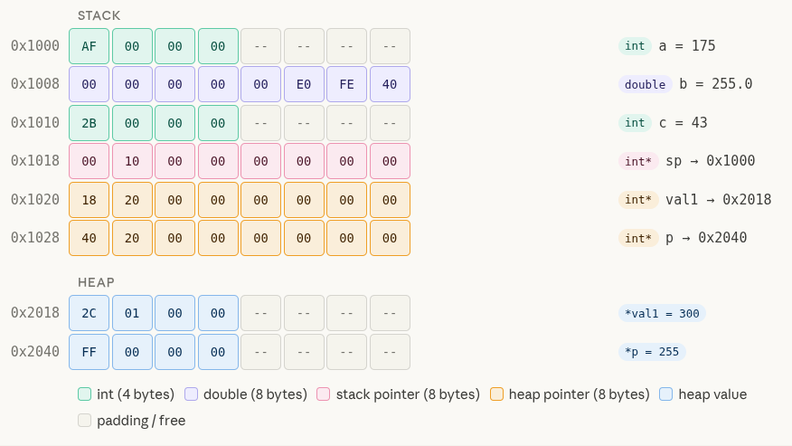

# C++ Learning Handbook

# Table of Content
   - [RAII in C++](#raii-in-c)
   - [Literal Types in C++](#literal-types-in-c)
   - [`const` and `constexpr` in C++](#const-and-constexpr-in-c)
   - [Enums in C++](#enums-in-c)
   - [C++ Visibility / Access Specifiers](#c-visibility--access-specifiers)

   - [Getting Started](#getting-started)
        - [Preprocessor in C++](#preprocessor-in-c)
        - [Variable](#variable)
        - [Namespaces in C++](#namespaces-in-c)
        - [Arguments](#arguments)
        - [User Input](#user-input)
        - [Constant Variable and Methods](#constant-variable--methods)
        - [Mutable Keyword](#mutable-keyword)
        - [Byte Size](#byte-size)
        - [Long Variable](#long-variable)
        - [Signed vs Unsigned](#signed-vs-unsigned)

   - [Templates in C++](#templates-in-c)
   - [Compiler Concepts in C++](#compiler-concepts-in-c)
        - [Compile Time vs Runtime](#compile-time-vs-runtime)
        - [Compilation Pipeline](#compilation-pipeline)
        - [Compilation vs Linking](#compilation-vs-linking)
        - [Precompiled Headers (PCH)](#precompiled-headers-pch)
   - [Arrays and Vectors](#arrays-and-vectors)
        - [C-Style Array](#c-style-array)
        - [std::array (C++11)](#stdarray-c11)
        - [std::vector](#stdvector)
   - [Statements and Operators](#statements-and-operators)
        - [Operator](#operator)
        - [Comparision](#comparision)
        - [Compound Assignment](#compound-assignment)
        - [Operator Precedence](#operator-precedence)
        - [Precision Set](#precision-set)
   - [Controlling Program Flow](#controlling-program-flow)
        - [If-Else](#if-else)
        - [Switch-Case](#switch-case)
        - [Ternary Operator (Conditional Operator)](#ternary-operator-conditional-operator)
        - [For Loop](#for-loop)
        - [Range Based For Loop](#range-based-for-loop)
        - [While Loop](#while-loop)
        - [Do While Loop](#do-while-loop)
        - [Continue and Break](#continue-and-break)
        - [Infinite Loops](#infinite-loops)
        - [Nested Loops](#nested-loops)
   - [Characters and Strings](#characters-and-strings)
        - [C-Style Strings](#c-style-strings)
        - [`std::string` — C++ Strings](#stdstring--c-strings)
        - [`std::string` vs `std::string_view`](#stdstring-vs-stdstring_view)
   - [Functions](#functions)
        - [Random number generation](#random-number-generation)
        - [Nearest integer floating-point operations](#nearest-integer-floating-point-operations)
        - [Power Functions](#power-functions)
        - [Trigonometric Functions](#trigonometric-functions)
        - [Function Prototypes](#function-prototypes)
        - [Default Arguments](#default-arguments)
        - [Pass by Reference, Value, Pointer](#pass-by-reference-value-pointer)
        - [Const usage for printing with reference inputs](#const-usage-for-printing-with-reference-inputs)
        - [Local Global - Scope Rules](#local-global---scope-rules)
        - [Function Calls - Memory Stack - Recursive Function](#function-calls---memory-stack---recursive-function)
   - [Memory](#memory)
        - [Sample Memory Diagram](#sample-memory-diagram)
        - [Stack vs Heap Memory](#stack-vs-heap-memory)
        - [Heap Memory Tracker Software](#heap-memory-tracker-software)
   - [Pointers](#pointers)
        - [Why Pointers Exist in C++](#why-pointers-exist-in-c)
        - [Why Do We Need Pointers If We Have References](#why-do-we-need-pointers-if-we-have-references)
        - [Stack and Raw Heap Pointers](#stack-and-raw-heap-pointers)
        - [Heap Pointer Memory Addresses](#heap-pointer-memory-addresses)
        - [Some Raw Pointer Problems](#some-raw-pointer-problems)
        - [Smart Pointers in C++](#smart-pointers-in-c)
            - [`unique_ptr` — Single Owner](#1-unique_ptr--single-owner)
            - [`shared_ptr` — Shared Ownership](#2-shared_ptr--shared-ownership)
            - [`weak_ptr` — Non-Owning Observer](#3-weak_ptr--non-owning-observer)
        - [this Pointer](#this-pointer)
   - [Classes and Objects](#classes-and-objects)
        - [Accessing class members](#accessing-class-members)
        - [Implementing Member Methods](#implementing-member-methods)
        - [Implementing Methods with Header File (.h)](#implementing-methods-with-header-file-h)
        - [Constructor & Destructor](#constructor--destructor)
        - [Copy Constructor](#copy-constructor)
            - [Shallow Copy](#shallow-copy)
            - [Deep Copy](#deep-copy)
        - [Struct](#struct)
        - [Inheritance](#inheritance)
   - [Polymorphism](#polymorphism)
        - [Compile-time Polymorphism](#compile-time-polymorphism)
            - [Function Overloading](#function-overloading)
            - [Templates](#templates)
            - [Operator Overloading (from different chapter)](#operator-overloading)
        - [Runtime Polymorphism - Virtual Functions](#runtime-polymorphism---virtual-functions)
   - [Function Pointers & Lambdas](#function-pointers--lambdas)
        - [Raw Function Pointers](#raw-function-pointers)
        - [Lambdas](#lambdas)
   - [`static` in C++](#static-in-c)
   - [`<fstream>` in C++](#fstream-in-c)
   - [Threads](#threads)
   - [`<iostream>` — C++ Standard I/O](#iostream--c-standard-io)

   - [Operator Overloading](#operator-overloading)
   - [explicit Keyword](#explicit-keyword-in-c)
   - [Structured Bindings](#structured-bindings)
   - [`std::sort` — C++ Sorting](#stdsort--c-sorting)
   - [Casting in C++](#casting-in-c)
   - [`std::optional` — Optional Data in C++](#stdoptional--optional-data-in-c)
   - [`std::variant` — Type-Safe Union](#stdvariant--type-safe-union)
   - [`std::any` — Type-Erased Single Value](#stdany--type-erased-single-value)
   - [`std::async` and `std::future` — Asynchronous Functions](#stdasync-and-stdfuture--asynchronous-functions)
   - [Timing in C++](#timing-in-c)
        - [steady_clock — elapsed time](#steady_clock--elapsed-time)
        - [system_clock — wall time and timestamps](#system_clock--wall-time-and-timestamps)
   - [C++ Exception Handling (try-catch)](#c-exception-handling-try-catch)
   - [Singleton in C++ (Design Pattern)](#singleton-in-c-design-pattern)
   - [lvalues, rvalues & Move Semantics](#lvalues-rvalues--move-semantics)


# RAII in C++

**Resource Acquisition Is Initialization** — a C++ idiom where a resource is tied to an object's lifetime:
- **Acquired** in the constructor
- **Released** in the destructor — guaranteed, even if an exception is thrown

## 1. The Problem Without RAII

```cpp
void foo() {
    int* p = new int(42);

    doSomething();  // if this throws → delete never runs → memory leak ❌

    delete p;       // only reached if no exception
}
```

Manual cleanup is fragile — exceptions, early returns, and forgotten `delete` all cause leaks.

## 2. With RAII

```cpp
void foo() {
    auto p = std::make_unique<int>(42);

    doSomething();  // throws? no problem — destructor runs automatically ✅

}                   // p destroyed here → memory freed
```

Cleanup is **automatic and guaranteed** — the destructor always runs when the object goes out of scope.

## 3. How It Works — The Destructor Guarantee

C++ guarantees destructors run when objects go out of scope. RAII exploits this:

```cpp
struct ScopedLock {
    std::mutex& mtx;
    ScopedLock(std::mutex& m) : mtx(m) { mtx.lock();   }  // acquire
    ~ScopedLock() { mtx.unlock(); }  // release — always runs
};

void foo() {
    ScopedLock lock(mtx);  // acquired here
    doSomething();         // exception? early return? no problem
}                          // lock destroyed → mutex released ✅
```

## 4. What Counts as a Resource

Anything with a matching **acquire / release** pair:

| Resource | Acquire | Release |
|---|---|---|
| Heap memory | `new` | `delete` |
| File | `open` | `close` |
| Mutex | `lock` | `unlock` |
| Network socket | `socket()` | `close()` |
| Database connection | `connect()` | `disconnect()` |
| Thread | `create` | `join` |
| GPU texture (OpenGL) | `glGenTextures` | `glDeleteTextures` |
| OS handle (Windows) | `CreateHandle` | `CloseHandle` |

## 5. RAII in the Standard Library

Everything in the stdlib follows RAII:

```cpp
// memory — freed automatically
{
    auto p = std::make_unique<int>(42);
}  // deleted here ✅

// mutex — unlocked automatically
{
    std::lock_guard<std::mutex> lock(mtx);
    counter++;
}  // unlocked here ✅

// file — closed automatically
{
    std::fstream file("data.txt");
    file << "hello";
}  // closed here ✅
```

## 7. RAII and Smart Pointers

Smart pointers are RAII applied to heap memory:

```cpp
// unique_ptr constructor → acquires (new)
// unique_ptr destructor  → releases (delete)

// shared_ptr constructor → acquires (new + control block)
// shared_ptr destructor  → decrements count, releases if count == 0

// lock_guard constructor → lock()
// lock_guard destructor  → unlock()
```

They all follow the same pattern — different resources, same idiom.

## Summary

| Without RAII | With RAII |
|---|---|
| Manual `acquire` + `release` | Automatic via constructor/destructor |
| Leaks on exception | Exception safe — destructor always runs |
| Easy to forget cleanup | Impossible to forget — tied to object lifetime |
| Fragile with multiple return paths | Safe regardless of how scope exits |

**Rule:** Any time you write a matching acquire/release pair manually, ask if it should be wrapped in a RAII class instead. If the answer is yes — wrap it.

---

# Literal Types in C++

A **literal type** is a type that can be fully constructed and known at **compile time**. It is the requirement for anything used in a `constexpr` context.

## 1. Rules — What Makes a Type Literal

A type is literal if:
- All constructors are `constexpr` (or it is trivially constructible)
- All data members are also literal types
- Trivial destructor (or `constexpr` destructor in C++20)

## 2. Built-in Literal Types

All fundamental types are literal:

```cpp
int, float, double, bool, char   // ✅ all fundamental types
int*, float*                     // ✅ pointers to literal types
int&                             // ✅ references to literal types
void                             // ✅
```

## 3. Structs and Classes — Literal if All Members Are

```cpp
struct Point {
    int x, y;
    constexpr Point(int x, int y) : x(x), y(y) {}
};

constexpr Point p(3, 4);              // ✅ Point is a literal type
constexpr int dist = p.x + p.y;      // ✅ usable at compile time
```

All members (`x`, `y`) are `int` — a literal type. Constructor is `constexpr`. So `Point` is literal.

```cpp
struct Bad {
    std::string name;   // ❌ std::string is not a literal type
};

constexpr Bad b;        // ❌ compile error
```

One non-literal member makes the whole struct non-literal.

## 4. Non-Literal Types

These all involve runtime resources — heap, OS handles, dynamic allocation:

```cpp
std::string     // ❌ manages heap memory, non-trivial destructor
std::vector     // ❌ dynamic allocation
std::map        // ❌ dynamic allocation
std::thread     // ❌ OS resource
std::mutex      // ❌ OS resource
std::fstream    // ❌ file handle
```

Cannot be used in `constexpr` context pre-C++20.

## 5. Literal Types and `constexpr`

`constexpr` variables and functions can only work with literal types:

```cpp
constexpr int x = 42;              // ✅ int is literal
constexpr Point p(1, 2);           // ✅ Point is literal

constexpr std::string s = "hello"; // ❌ std::string not literal (pre-C++20)
constexpr std::vector<int> v;      // ❌ std::vector not literal (pre-C++20)

// alternatives:
constexpr const char* s = "hello"; // ✅ raw pointer is literal
constexpr std::array<int, 3> v = {1, 2, 3}; // ✅ std::array is literal
```

## 6. `std::array` vs `std::vector`

A common point of confusion:

```cpp
constexpr std::array<int, 3> a = {1, 2, 3};  // ✅ literal — fixed size, no heap
constexpr std::vector<int>   v = {1, 2, 3};  // ❌ not literal — heap allocation
```

`std::array` is just a fixed-size wrapper around a raw array — no dynamic allocation, no destructor work. Fully literal.

## 7. How to Check

```cpp
#include <type_traits>

static_assert(std::is_trivially_destructible_v<int>);    // ✅
static_assert(std::is_trivially_destructible_v<Point>);  // ✅
static_assert(std::is_trivially_destructible_v<std::string>); // ❌ fails
```

Note: `std::is_literal_type` was deprecated in C++17 and removed in C++20.

## Summary

| Type | Literal? | Reason |
|---|---|---|
| `int`, `float`, `bool`, `char` | Yes | Fundamental types |
| Raw pointers (`int*`) | Yes | Just an address |
| References | Yes | Just an alias |
| `std::array` | Yes | Fixed size, no heap |
| Custom struct (all `constexpr`) | Yes | If all members are literal |
| `std::string` | No | Heap memory, non-trivial destructor |
| `std::vector` | No | Dynamic allocation |
| `std::map` | No | Dynamic allocation |
| `std::thread` / `std::mutex` | No | OS resources |

## Mental Model

> A literal type is one the compiler can **fully understand and construct without running any code**.
> No heap, no OS calls, no side effects — just pure compile-time data.

If a type needs runtime resources to be constructed, it cannot be literal.

---

# `const` and `constexpr` in C++

## 1. `const` — Immutable at Runtime

> "This value won't change after initialization."

Evaluated at **compile time or runtime** — the compiler just promises it won't be modified.

```cpp
// runtime const — value not known until program runs
int n = getUserInput();
const int x = n;        // ✅ immutable, but only known at runtime

// compile-time const — value known at compile time, but not guaranteed
const int y = 42;       // ✅ could be optimized by compiler, but no guarantee
```

### `const` on pointers

```cpp
const int* p  = &x;   // pointer to const — can't modify value, can move pointer
int* const p  = &x;   // const pointer    — can modify value, can't move pointer
const int* const p = &x; // both immutable
```

### `const` on member functions

Promises the function won't modify the object:
```cpp
struct Sensor {
    int value;
    int read() const { return value; }  // ✅ won't modify *this
    void set(int v)  { value = v; }     // non-const — modifies *this
};
```

---

## 2. `constexpr` — Guaranteed Compile Time

> "This value must be computable at compile time."

Stronger than `const` — forces evaluation at compile time when used in a constant expression context.

```cpp
constexpr int x = 42;             // ✅ must be known at compile time
constexpr int y = getUserInput();  // ❌ compile error — not a constant expression
```

### `constexpr` variables

```cpp
constexpr int MAX = 100;
constexpr double PI = 3.14159;

std::array<int, MAX> arr;   // ✅ template argument — requires compile-time constant
int buffer[MAX];            // ✅ array size    — requires compile-time constant
```

`const` alone is not always sufficient for template arguments and array sizes.

### `constexpr` functions — dual mode

Can run at **compile time or runtime** depending on how they are called:

```cpp
constexpr int square(int x) { return x * x; }

constexpr int a = square(5);   // compile time — result baked into binary
int n = getUserInput();
int b = square(n);             // runtime — n not known at compile time, falls back
```

The context decides which mode runs — not the function itself.

### `constexpr` on member functions

```cpp
struct Point {
    int x, y;
    constexpr Point(int x, int y) : x(x), y(y) {}
    constexpr int distSquared() const { return x*x + y*y; }
};

constexpr Point p(3, 4);
constexpr int d = p.distSquared();  // ✅ evaluated at compile time — result is 25
```

---

## 3. What `constexpr` Cannot Do

```cpp
// runtime input
int n = getUserInput();
constexpr int x = n;               // ❌ not a constant expression

// dynamic memory (pre-C++20)
constexpr int* p = new int(5);     // ❌ C++17 and earlier

// throwing exceptions
constexpr int divide(int a, int b) {
    if (b == 0) throw std::runtime_error("div by 0"); // ❌ can't throw
    return a / b;
}

// I/O
constexpr void print() {
    std::cout << "hello";          // ❌ I/O is runtime
}

// static local variables
constexpr int foo() {
    static int x = 0;             // ❌ not allowed in constexpr
    return x;
}

// reinterpret_cast
constexpr int* p = reinterpret_cast<int*>(42); // ❌ not allowed

// non-literal types (pre-C++20)
constexpr std::string s = "hello";  // ❌ std::string not a literal type
constexpr std::vector<int> v = {1}; // ❌ same reason

// use instead:
constexpr const char* s = "hello";
constexpr std::array<int, 3> v = {1, 2, 3};
```

---

## 4. `consteval` — Compile Time Only (C++20)

Stricter than `constexpr` — function **must** be called at compile time, never runtime:

```cpp
consteval int square(int x) { return x * x; }

constexpr int a = square(5);   // ✅ compile time
int n = getUserInput();
int b = square(n);             // ❌ compile error — n not a constant
```

Use when a runtime fallback is never acceptable.

---

## 5. `constinit` — Safe Static Initialization (C++20)

Guarantees a variable is **initialized at compile time** but still allows runtime mutation:

```cpp
constinit int counter = 0;  // ✅ initialized at compile time
counter++;                   // ✅ can still be modified at runtime
```

Prevents the **static initialization order fiasco** — globals initialized in undefined order across translation units.

```cpp
// without constinit — order not guaranteed across .cpp files
int a = computeA();
int b = a + 1;       // b might initialize before a ❌

// with constinit — guaranteed safe
constinit int a = 42;
```

---

## Comparison

| | `const` | `constexpr` | `consteval` | `constinit` |
|---|---|---|---|---|
| Immutable | Yes | Yes | Yes | No |
| Compile-time guaranteed | No | Yes (in CE context) | Always | Init only |
| Runtime fallback | Yes | Yes | No | — |
| Usable in templates / array sizes | Sometimes | Yes | Yes | No |
| Functions | Yes (member only) | Yes | Yes | No |
| C++ version | C++98 | C++11 | C++20 | C++20 |

---

## Benefits of Compile-Time Evaluation

| Benefit | Why |
|---|---|
| **Performance** | Result baked into binary — zero cost at runtime |
| **Earlier errors** | Divide by zero, out of range caught at compile time |
| **Enables templates** | Array sizes and template args must be compile-time constants |
| **Dead code elimination** | Compiler removes branches it knows are never taken |
| **Smaller binary** | Less instructions, less stack usage |

---

## When to Use What

```cpp
// const — value may only be known at runtime, or just needs to be immutable
const int userLimit = getUserInput();
const int MAX = 100;              // works, but constexpr is better here

// constexpr — value can be computed at compile time
constexpr int MAX = 100;          // preferred over const for true constants
constexpr int square(int x) { return x * x; }

// consteval — must only ever run at compile time, no exceptions
consteval int makeFlag(int bit) { return 1 << bit; }

// constinit — global/static that must be safely initialized
constinit int globalCounter = 0;
```

**Rule:** Prefer `constexpr` over `const` for all true constants — same or better, never worse.

---

# Getting Started

## Preprocessor in C++

The preprocessor runs **before** compilation. It handles all lines starting with `#` — no C++ syntax, no types, just text manipulation.

### `#include` — File Inclusion

Copies and pastes the contents of another file into your current file.

```cpp
#include <iostream>   // pastes the iostream header — gives you std::cout etc.
#include "my_file.h"  // pastes a local file
```

This is why `using namespace std` works after `#include <iostream>` — the `std` namespace is already defined by the time the compiler sees your code.

### `#define` — Macros

Defines a find-and-replace rule. Wherever the macro name appears, the preprocessor substitutes the value before compilation.

```cpp
#define PI 3.14159
#define SQUARE(x) ((x) * (x))

int main() {
    double area = PI * SQUARE(5);
    // preprocessor turns this into:
    // double area = 3.14159 * ((5) * (5));
}
```

> **No type checking.** The preprocessor doesn't know C++ types or scopes — it's pure text substitution. Errors from macros often point to the expanded code, not the macro definition, making them hard to debug. Prefer `const` or `constexpr` for constants, and inline functions or lambdas over function macros.

```cpp
// prefer this over #define for constants
constexpr double PI = 3.14159;
```

### `#ifdef` / `#ifndef` / `#if` — Conditional Compilation

Shows or hides parts of your code based on conditions — evaluated at compile time.

```cpp
#define DEBUG

int main() {
#ifdef DEBUG
    std::cout << "Debug mode on" << std::endl;  // included
#else
    std::cout << "Release mode" << std::endl;   // excluded
#endif
}
```

Common use — platform-specific code:

```cpp
#ifdef _WIN32
    // Windows-only code
#else
    // Linux / macOS code
#endif
```

### `#pragma` — Compiler Instructions

Special directives for the compiler. The most common is `#pragma once` — prevents a header file from being included more than once.

```cpp
// my_sensor.h
#pragma once  // if this file is included multiple times, ignore duplicates

class Sensor {
    // ...
};
```

The alternative is the classic include guard using `#ifndef`:

```cpp
#ifndef MY_SENSOR_H
#define MY_SENSOR_H

class Sensor {
    // ...
};

#endif
```

Both do the same thing. `#pragma once` is shorter and used in most modern codebases.

### Summary

| Directive | What it does |
|---|---|
| `#include` | Paste another file's contents here |
| `#define` | Find-and-replace before compilation |
| `#ifdef / #ifndef` | Include code only if a macro is / isn't defined |
| `#if / #else / #endif` | Conditional code blocks |
| `#pragma once` | Include this file only once |

--- 

## Variable
A variable is just a name (or label) for a location in your computer's memory where a value is stored.
```
int age = 25;
size_t position; // unsigned int or unsigned long 
```
The computer reserves a spot in memory big enough to store an int (usually 4 bytes).
- It puts the value 25 into that memory.
- It gives that memory location a name — in this case, age.
- So when you use age, you're referring to that memory location.

---

## Namespaces in C++

A namespace is a named scope that groups related code and prevents name collisions.

```cpp
#include <iostream>

namespace MySensors {
    int id = 1;
    void read() {
        std::cout << "id: " << id << std::endl;
    }
}

namespace MyActuator {
    int id = 2;      // no collision with MySensors::id
    void read() {
        std::cout << "id: " << id << std::endl;
    }
}

int main() {
    MySensors::read();   // :: is the scope resolution operator
    MyActuator::read();
}
```

Both namespaces define `id` and `read()` — no collision because they live in separate scopes.

### `using namespace`

Tells the compiler to look inside a namespace automatically — so you don't need to type the prefix every time.

> **Important:** `using namespace` must come **after** the namespace definition. The compiler reads top to bottom — using a namespace before defining it causes a compile error.

```cpp
#include <iostream>

namespace MySensors {
    int id = 1;
    void read() {
        std::cout << "id: " << id << std::endl;
    }
}

namespace MyActuator {
    int id = 2;
    void read() {
        std::cout << "id: " << id << std::endl;
    }
}

using namespace MySensors;  // defined above, safe to use here

int main() {
    read();              // compiler knows you mean MySensors::read()
    MyActuator::read();  // still need prefix for everything else
}
```

You can also bring in a single name instead of the whole namespace:

```cpp
using MySensors::read;  // only import read(), nothing else

int main() {
    read();              // works
    MyActuator::read();  // still needs prefix
}
```

> Avoid `using namespace` in larger projects — if two namespaces have a function with the same name, the compiler won't know which one you mean.

### `std` Namespace

The entire C++ Standard Library lives inside the `std` namespace.

```cpp
std::vector<int> data;
std::string name;
std::cout << name << std::endl;
```

With `using namespace std` you can drop the prefix — fine for small scripts, risky in large codebases:

```cpp
using namespace std;

vector<int> data;   // same as std::vector
string name;        // same as std::string
```

### In Practice — Large Projects

Namespaces are used to wrap classes so they don't collide with other libraries:

```cpp
namespace fanuc_gripper_controller {

    using CallbackReturn = rclcpp_lifecycle::node_interfaces::LifecycleNodeInterface::CallbackReturn;

    class FanucGripperInterface : public hardware_interface::SystemInterface {
        // ...
    };

} // namespace fanuc_gripper_controller
```

```cpp
fanuc_gripper_controller::FanucGripperInterface obj;  // unambiguous
```

The `using` alias inside the namespace is also scoped — it won't leak out and pollute the global scope.

### Summary

| | Meaning |
|---|---|
| `namespace Foo { }` | Create a named scope called Foo |
| `Foo::bar` | Access `bar` from namespace Foo |
| `using namespace Foo` | Skip the `Foo::` prefix for everything in Foo (define Foo first!) |
| `using Foo::bar` | Skip the prefix for `bar` only |

---

## Arguments
```cpp
int main(int num_args, char *args[]){
    std::cout << "Number of arguments: " << num_args << "\n";
    std::cout << "5th argument is: " << args[4] << "\n";
    return 1;
}
```

## User Input
```cpp
int num_rooms = 0;
std::cout << "How many rooms do you want to be cleaned? ";
std::cin >> num_rooms;
```

---

## Byte Size
```cpp
#include <iostream>
#include <string>

int main() {
    std::cout << sizeof(char) << "\n";
    std::cout << sizeof(int) << "\n";
    std::cout << sizeof(double) << "\n";
    std::cout << sizeof(std::string) << "\n";

    return 0;
}
```

```
1
4
8
32
```

## Long Variable
```cpp
long double large_amount = 2.7e120;
```

## Signed vs Unsigned
| Type                    | Bit width | Range                           |
| ----------------------- | --------- | ------------------------------- |
| `int` (signed 32-bit)   | 32        | −2,147,483,648 → +2,147,483,647 |
| `unsigned int` (32-bit) | 32        | 0 → 4,294,967,295               |

---

# Compiler Concepts in C++

## Compile Time vs Runtime

**Compile time** is when the compiler reads your source code and turns it into an executable.
**Runtime** is when the executable is actually running.

```cpp
int i = 0;
```

- The type `int` → resolved at **compile time**
- The value `0` → lives in memory at **runtime**

---

### Why it matters in C++

#### tuple
C++ tuple must know the index value before the program runs. Because depending on the index, `std::get` may return a `double`, `std::string`, etc. — different types entirely.

```cpp
std::get<0>(t);  // ✅ 0 is a hardcoded literal — compile time
std::get<i>(t);  // ❌ i is a variable — its value is only known at runtime
```

Even if you can clearly see that `i = 0`, the compiler does not evaluate variables — it only sees "a variable of type int" and moves on.

#### vector
`std::vector` doesn't need the index at compile time because all elements share the same type — the return type of `v[i]` is always known regardless of `i`.

```cpp
std::vector<float> v = {20.4, 89.7, 66.0};

for (int i = 0; i < v.size(); i++) {
    print(v[i]);  // ✅ — v[i] is always float, regardless of i
}
```

### Quick reference

| | Compile Time | Runtime |
|---|---|---|
| When | Before program runs | While program runs |
| Examples | Types, templates, `std::get<0>` | Variable values, for loops, user input |
| Error caught | Compiler error | Crash or wrong output |

Catching errors at compile time is always better — the compiler stops you before the program ever runs.

## Compilation Pipeline

When you run `g++ main.cpp`, it goes through several stages:

```
source code (.cpp)
      ↓
1. Preprocessor    — handles #include, #define, #pragma once
      ↓
2. Parser          — reads text and builds an AST
      ↓
3. Semantic analysis — checks types, resolves names
      ↓
4. Optimization    — restructures code to run faster
      ↓
5. Code generation — produces machine code
      ↓
object file (.o)
```

### What is parsing?

Parsing is step 2 — the compiler reads your source text and builds an internal tree called an **AST (Abstract Syntax Tree)**. All later stages work from this tree, never from raw text again.

```cpp
int x = 5 + 3;
```

Becomes:

```
Declaration
└── type: int
└── name: x
└── value: Add
          ├── 5
          └── 3
```

This is why headers are expensive — `<vector>` is thousands of lines of template code. Every `.cpp` that includes it forces the parser to rebuild that entire tree from scratch. PCH skips this by saving the pre-built tree to disk.

## Compilation vs Linking

| Step | Input | What happens | Output | Location |
|---|---|---|---|---|
| **Compilation** | `.cpp` files | Each file compiled separately into machine code — no connections between files yet | `.o` object files | `build/CMakeFiles/...` |
| **Linking** | `.o` files + libraries | All object files combined, symbol references resolved across files | final executable | `build/` |

### Symbols

Every function or global variable name (like `foo`, `bar`, `std::cout`) becomes a **symbol** inside object files.

There are two types:

- **Defined symbols** — functions/variables you define yourself
  ```cpp
  void greet() {}   // defined here
  ```

- **Undefined symbols** — references to something defined elsewhere
  ```cpp
  greet();          // defined somewhere else — linker must find it
  ```

The linker's job:

> Match every **undefined symbol** with its corresponding **defined symbol** across all object files and libraries.

If a symbol is referenced but never defined anywhere, you get a **linker error** — not a compiler error:

```
undefined reference to `greet()`
```

## Precompiled Headers (PCH)

### The problem

Headers like `<vector>` and `<string>` are parsed by the compiler once per `.cpp` file that includes them. In a project with 50 source files, `<vector>` gets parsed 50 times — even though the result is identical every time.

### The solution

PCH compiles headers once into a binary `.gch` file. On every subsequent build the parser is skipped entirely — the pre-built AST is loaded directly from disk.

### Setup (GCC)

**1. Create `pch.h`** — stable, heavy headers only:

```cpp
#pragma once
#include <vector>
#include <string>
#include <map>
#include <unordered_map>
#include <algorithm>
#include <iostream>
#include <memory>
```

**2. Compile it once:**

```bash
g++ -std=c++17 pch.h
# produces pch.h.gch in the same directory
```

**3. Include it first in every `.cpp`:**

```cpp
#include "pch.h"   // must be first — loads pch.h.gch automatically
#include "my_stuff.h"
```

**4. Compile normally:**

```bash
g++ -std=c++17 main.cpp -o main
```

### How GCC finds the PCH

When the compiler sees `#include "pch.h"` it checks: does `pch.h.gch` exist in the same directory with matching compile flags? If yes — load it. If no — parse normally. No configuration needed.

```
#include "pch.h"
      ↓
pch.h.gch exists?
  ↓ yes                 ↓ no
flags match?        parse pch.h normally
  ↓ yes   ↓ no
load .gch  parse pch.h normally
```

### CMake (3.16+)

```cmake
target_precompile_headers(my_target PRIVATE pch.h)
```

CMake handles compilation and flag matching automatically.

### Rules

| Rule | Why |
|---|---|
| PCH must be the **first** include | Anything before it invalidates the cache |
| Compile flags must **match** | Different `-std=` or `-D` flags = stale cache |
| Only put **stable** headers in PCH | Frequently changed headers force full PCH recompile |
| Don't include headers you **don't use** | Bloats `.gch`, slower to load |

### What belongs in PCH

```
✓  Standard library headers   (<vector>, <string>, <map> ...)
✓  Heavy third-party SDKs     (OpenCV, Boost, Qt ...)
✗  Your own headers           (change frequently → invalidates PCH)
```

### When to bother

PCH pays off when you have **20+ `.cpp` files** all including the same heavy headers. For small/sandbox projects the build is already fast — skip it.

## `#pragma once` and Include Guards

Without protection, including the same header twice in one `.cpp` causes redefinition errors. Two solutions:

```cpp
// Option 1 — pragma once (simpler, universally supported)
#pragma once

// Option 2 — include guards (portable standard C++)
#ifndef MY_HEADER_H
#define MY_HEADER_H
// ... content ...
#endif
```

`#pragma once` protects within a single translation unit — it does not prevent the same header from being parsed in other `.cpp` files. That is what PCH solves.

---

# Templates in C++

Templates allow writing code once that works for any type. The compiler generates a **specific version** for each type used — resolved entirely at compile time.

## 1. Function Templates

```cpp
template<typename T>
void print(T value) {
    std::cout << "Value: " << value << std::endl;
}

print(29);        // T = int
print(3.14f);     // T = float
print("Oben");    // T = const char*
```

No runtime overhead — the compiler generates a separate function for each type.

## 2. Each Instantiation is a Distinct Function

This is the core of how templates work. When the compiler sees `print(29)` and `print("Oben")`, it generates **two completely separate functions**:

```cpp
// what the compiler actually generates:

void print_int(int value) {
    std::cout << "Value: " << value << std::endl;
}

void print_constcharptr(const char* value) {
    std::cout << "Value: " << value << std::endl;
}
```

These are **not the same function** — they are independent pieces of code in the binary. Each type instantiation adds a new function to your compiled output.

```cpp
print(29);      // calls print<int>    — distinct function #1
print(3.14f);   // calls print<float>  — distinct function #2
print("Oben");  // calls print<const char*> — distinct function #3
```

You can verify this — each instantiation has a unique mangled name in the binary:
```
_Z5printIiEvT_      →  print<int>
_Z5printIfEvT_      →  print<float>
_Z5printIPKcEvT_    →  print<const char*>
```

## 3. Type Deduction — Compiler Infers `T`

You don't need to specify the type explicitly — the compiler deduces it from the argument:

```cpp
print(29);          // deduced: T = int
print<int>(29);     // explicit: T = int — same result

print(3.14f);       // deduced: T = float
print<float>(3.14f); // explicit — same result
```

Explicit specification is only needed when deduction is ambiguous or impossible.

## 4. Class Templates

Templates work on classes too — the same instantiation rules apply:

```cpp
template<typename T>
struct Box {
    T value;

    Box(T v) : value(v) {}

    void print() const {
        std::cout << "Box contains: " << value << std::endl;
    }
};

// pre-C++17 — explicit type required
Box<int>         b1(42);
Box<std::string> b2("hello");
Box<float>       b3(3.14f);

// C++17 CTAD — type deduced from constructor argument
Box b4(42);      // deduces T = int
Box b5(3.14f);   // deduces T = float
```

Each `Box<T>` is a **distinct class** — `Box<int>` and `Box<float>` share no code at runtime.

### CTAD — Class Template Argument Deduction (C++17)

The compiler deduces `T` from the constructor argument — same as function template deduction:

```cpp
Box b1(42);                    // T = int
Box b2(3.14f);                 // T = float
Box b3(std::string("hello"));  // T = std::string
Box b4("hello");               // T = const char* — not std::string!
```

`"hello"` is a string literal — its type is `const char*`, not `std::string`. Use `std::string("hello")` to get `T = std::string`.

### Deduction Guides — steer CTAD when needed

If the default deduction isn't what you want, you can guide it:

```cpp
// tell compiler: const char* constructor → treat T as std::string
Box(const char*) -> Box<std::string>;

Box b("hello");  // now T = std::string ✅
```

This is how stdlib CTAD works internally — `std::vector`, `std::pair`, and others define deduction guides to handle edge cases.

## 5. Multiple Template Parameters

```cpp
template<typename K, typename V>
struct Pair {
    K key;
    V value;

    Pair(K k, V v) : key(k), value(v) {}
};

// pre-C++17 — explicit types
Pair<int, std::string>   p1(1, "one");
Pair<std::string, float> p2("pi", 3.14f);

// C++17 CTAD — both types deduced from constructor
Pair p3(1, "one");       // K = int,         V = const char*
Pair p4("pi", 3.14f);    // K = const char*, V = float
```

## 6. Non-Type Template Parameters

Templates can also take values, not just types:

```cpp
template<typename T, int N>
struct FixedArray {
    T data[N];
    int size() const { return N; }
};

FixedArray<int, 4>   a1;  // array of 4 ints
FixedArray<float, 8> a2;  // array of 8 floats
```

`N` is baked in at compile time — `size()` returns a compile-time constant. This is exactly how `std::array<T, N>` works internally.

## 7. Template Specialization

You can provide a custom implementation for a specific type:

```cpp
template<typename T>
void print(T value) {
    std::cout << "Value: " << value << std::endl;
}

// specialization for bool
template<>
void print<bool>(bool value) {
    std::cout << "Value: " << (value ? "true" : "false") << std::endl;
}

print(42);     // uses generic version → "Value: 42"
print(true);   // uses specialization  → "Value: true"
```

## 8. `typename` vs `class`

Both are identical for template type parameters — purely stylistic:

```cpp
template<typename T>  // ✅
template<class T>     // ✅ same thing
```

`typename` is preferred in modern C++ as it's clearer that any type is accepted, not just classes.

## 9. Templates and Compile Time

Because each instantiation is a distinct function generated at compile time:

- **No runtime overhead** — type resolution is zero cost at runtime
- **Errors caught early** — type mismatches are compile errors, not runtime crashes
- **Binary size grows** — one function per type instantiation; too many types = larger binary (called **code bloat**)

```cpp
// generates 3 distinct functions in the binary:
print(1);       // print<int>
print(1.0f);    // print<float>
print("hello"); // print<const char*>

// generates 0 extra functions — same type reused:
print(1);
print(2);
print(3);       // all three call the same print<int>
```
## Summary

| Feature | Behavior |
|---|---|
| Resolved at | Compile time |
| Each new type | Generates a distinct function/class |
| Same type reused | Reuses the same instantiation |
| Type specification | Deduced automatically or explicit |
| Specialization | Custom implementation for a specific type |
| `typename` vs `class` | Identical — prefer `typename` |
| Runtime overhead | None |
| Downside | Binary grows with each new type instantiation |

**Rule:** Templates trade **binary size** for **zero runtime overhead and type safety**. Each type you use with a template adds a new instantiation — but that instantiation is resolved entirely at compile time.

---

# Arrays and Vectors

## C-Style Array

The classic array inherited from C. Fixed size, stack-allocated, no bounds checking.

```cpp
#include <iostream>

int main()
{    
    int example[5];
    std::cout << "Array address: " << example << std::endl; // pointer
    std::cout << "Length of array in bytes: " << sizeof(example) << std::endl; // bytes


    // Array For Loop
    size_t len = sizeof(example) / sizeof(example[0]);
    for(int i = 0; i < len; i++){
        example[i] = 9;
    }
    std::cout << "Forth element of example: " << example[3] << std::endl;


    // Array Pointer Aritmethic
    int *ptr = example;
    *(ptr+3) = 1;
    std::cout << "Forth element of example: " << example[3] << std::endl;
    std::cout << "Example address: " << ptr << std::endl;
    std::cout << "Address of second element in example: " << (ptr+1) << std::endl;


    // Heap Memory Array
    int *another = new int[5];
    for(int i = 0; i < 5; i++){
        another[i] = 66;
    }
    std::cout << "Forth element of another: " << another[3] << std::endl;
    delete[] another;

    return 0;
}
```

> `example[3]` and `*(ptr+3)` are identical — indexing `[]` is just pointer arithmetic under the hood.


## std::array (C++11)

A thin wrapper around a C-style array. Same stack allocation and fixed size, but with STL support and bounds checking via `.at()`.

```cpp
#include <iostream>
#include <array>

int main()
{
    std::array<int, 5> new_array;

    // Index-based loop
    for(int i = 0; i < new_array.size(); i++){
        new_array[i] = 55;
    }
    std::cout << "Forth element of new_array: " << new_array[3] << std::endl;

    // Range-based loop (preferred)
    for(int val : new_array){
        std::cout << val << " ";
    }

    // Bounds-checked access — throws std::out_of_range if out of bounds
    std::cout << new_array.at(3) << std::endl;

    return 0;
}
```

> Prefer `std::array` over C-style arrays. Same performance, but safer and STL-compatible.

---

## std::vector

`std::vector<T>` stores its elements in a contiguous dynamic array on the heap.

Internally, it uses raw pointers to manage this array.

```cpp
template<typename T>
class Vector {
    T* data_;      // raw pointer to heap memory
    size_t size_;
    size_t capacity_;
};
```

When you `push_back()`, it may allocate a new array, copy/move the elements, and delete the old array.

```cpp
#include <iostream>
#include <vector>

int main()
{
    std::vector<double> number_vector = {0.5, 0.6, 0.7, 0.8, 0.9};
    std::cout << number_vector.at(0) << std::endl; 

    number_vector.at(0) = 1000;

    number_vector.push_back(1.0);           // add to end — O(1) amortized

    number_vector.insert(number_vector.begin(), -0.6);  // add to front — O(n), shifts everything

    std::cout << "Length of the vector is: " << number_vector.size() << std::endl;

    number_vector.pop_back();               // remove last element

    // Range-based loop (preferred)
    for(double val : number_vector){
        std::cout << val << " ";
    }

    // 2D vector — each inner vector is a separate heap allocation
    std::vector<std::vector<int>> my_2d_vector = {
        {1, 2, 3},
        {4, 5, 6}
    };
    std::cout << my_2d_vector.at(1).at(2) << std::endl; 
    
    return 0;
}  
```

> `.at()` throws `std::out_of_range` on bad index. `[]` does not — it causes undefined behavior.

## Comparison

| | C-Style `int arr[5]` | `std::array<int, 5>` | `std::vector<int>` |
|---|---|---|---|
| Size | Fixed at compile time | Fixed at compile time | Dynamic |
| Memory | Stack | Stack | Heap |
| Bounds checking | No | Yes (`.at()`) | Yes (`.at()`) |
| Knows its own size | No (`sizeof` trick) | Yes (`.size()`) | Yes (`.size()`) |
| STL compatible | No | Yes | Yes |
| Manual memory management | No | No | No |
| When to use | Rarely (legacy/C) | Fixed-size collections | Most cases |

## 2D Arrays

### C-Style 2D Array

```cpp
int arr[2][3] = {
    {1, 2, 3},
    {4, 5, 6}
};

std::cout << arr[1][2] << "\n"; // 6

for(int i = 0; i < 2; i++){
    for(int j = 0; j < 3; j++){
        std::cout << arr[i][j] << " ";
    }
    std::cout << "\n";
}
```

> No `.size()` — you must hardcode or use `sizeof(arr) / sizeof(arr[0])` for row count.

### std::array 2D

```cpp
std::array<std::array<int, 3>, 2> arr = {{
    {1, 2, 3},
    {4, 5, 6}
}};

std::cout << arr[1][2] << "\n"; // 6

for(size_t i = 0; i < arr.size(); i++){
    for(size_t j = 0; j < arr[i].size(); j++){
        std::cout << arr[i][j] << " ";
    }
    std::cout << "\n";
}
```

> Double braces `{{}}` needed because `std::array` is a struct wrapping a raw array — the outer `{}` initializes the struct, the inner `{}` initializes the raw array inside it.

### std::vector 2D

```cpp
std::vector<std::vector<int>> vec = {
    {1, 2, 3},
    {4, 5, 6}
};

std::cout << vec[1][2] << "\n"; // 6

for(size_t i = 0; i < vec.size(); i++){
    for(size_t j = 0; j < vec[i].size(); j++){
        std::cout << vec[i][j] << " ";
    }
    std::cout << "\n";
}

vec.push_back({7, 8, 9}); // rows can be added at runtime
```

> Each inner vector is a **separate heap allocation** — not contiguous in memory. More flexible but slower than the fixed-size alternatives.

### 2D Comparison

| | `int arr[2][3]` | `std::array<std::array<int,3>,2>` | `std::vector<std::vector<int>>` |
|---|---|---|---|
| Size fixed | Yes | Yes | No |
| Memory | Stack (contiguous) | Stack (contiguous) | Heap (non-contiguous rows) |
| `.size()` | No | Yes | Yes |
| Bounds checking | No | Yes (`.at()`) | Yes (`.at()`) |
| Rows addable at runtime | No | No | Yes |
| Init syntax | `{}` | `{{}}` (double brace) | `{}` |

---

# Statements and Operators
## Operator
- Operator = The symbol that performs an action
- Operand = The value or variable the operator acts on
```cpp
int a = 10;
int b = 5;
int c = a + b;
```
- "+" is the operator
- a and b are the operands
- The operator + adds the two operands

## Comparision
11.99999999999999999999999 and 12.0 could be equal for C++ code so be careful with the library usage

## Compound Assignment
| Operator | Meaning                | Equivalent To         |         |     |
| -------- | ---------------------- | --------------------- | ------- | --- |
| `+=`     | Add and assign         | `x = x + y`           |         |     |
| `-=`     | Subtract and assign    | `x = x - y`           |         |     |
| `*=`     | Multiply and assign    | `x = x * y`           |         |     |
| `/=`     | Divide and assign      | `x = x / y`           |         |     |
| `%=`     | Modulo and assign      | `x = x % y`           |         |     |
| `&=`     | Bitwise AND and assign | `x = x & y`           |         |     |
| \`       | =\`                    | Bitwise OR and assign | \`x = x | y\` |
| `^=`     | Bitwise XOR and assign | `x = x ^ y`           |         |     |
| `<<=`    | Left shift and assign  | `x = x << y`          |         |     |
| `>>=`    | Right shift and assign | `x = x >> y`          |         |     |


```cpp
int x = 10;
x += 5;   // x = 15
x *= 2;   // x = 30
x -= 3;   // x = 27
```

## Operator Precedence
| Precedence  | Operator(s)             | Type                  | Associativity |            |               |
| ----------- | ----------------------- | --------------------- | ------------- | ---------- | ------------- |
| 1 (Highest) | `()` `[]` `->` `.`      | Function call, member | Left to right |            |               |
| 2           | `++` `--` `+` `-` `!`   | Unary operators       | Right to left |            |               |
| 3           | `*` `/` `%`             | Multiplicative        | Left to right |            |               |
| 4           | `+` `-`                 | Additive              | Left to right |            |               |
| 5           | `<` `<=` `>` `>=`       | Relational            | Left to right |            |               |
| 6           | `==` `!=`               | Equality              | Left to right |            |               |
| 7           | `&&`                    | Logical AND           | Left to right |            |               |
| 8           |                         | Logical OR            | Left to right |            |               |
| 9           | `=` `+=` `-=` `*=` `/=` | Assignment            | Right to left |            |               |
| 10 (Low)    | `,`                     | Comma                 | Left to right |            |               |


## Precision Set
```cpp
#include <iomanip>

if (temperatures.size() != 0){
    std::cout << std::fixed << std::setprecision(2) ;
    std::cout << "Average: " << sum/temperatures.size() << std::endl;
}
```

# Controlling Program Flow
## If-Else
```cpp
if (score >= 90)
{
    letter_grade = 'A';
}
else if (score >= 80)
{
    letter_grade = 'B';
}
else if (score >= 70){
    letter_grade = 'C';
}
else if (score >= 60){
    letter_grade = 'D';
}
else{
    letter_grade = 'F';
}
```

## Switch-Case
In C++, you cannot use switch with double or std::string directly. The switch statement only works with integral or enumeration types, such as:
- int
- char
- enum
```cpp
int day;

std::cout << "Enter a number (1-7): ";
std::cin >> day;

switch (day) {
    case 1:
        std::cout << "Monday\n";
        break;
    case 2:
        std::cout << "Tuesday\n";
        break;
    case 3:
        std::cout << "Wednesday\n";
        break;
    case 4:
        std::cout << "Thursday\n";
        break;
    case 5:
        std::cout << "Friday\n";
        break;
    case 6:
        std::cout << "Saturday\n";
        break;
    case 7:
        std::cout << "Sunday\n";
        break;
    default:
        std::cout << "Invalid number! Please enter a number between 1 and 7.\n";
}
```

## Ternary Operator (Conditional Operator)
```cpp
int num1, num2, bigger, smaller;
std::cout << "Enter two integers seperated by space: ";
std::cin >> num1 >> num2;

if (num1 != num2) {
    bigger = (num1 > num2) ? num1 : num2;
    smaller = (num1 < num2) ? num1 : num2;
    std::cout << "Bigger is " << bigger << std::endl;
    std::cout << "Smaller is " << smaller << std::endl;
}
```

```cpp
    for (int i = 1; i <=100; i++)
    {
        std::cout << i;
        std::cout << ((i%10 == 0) ? "\n" : " ");
    }
```

## For Loop
```cpp
#include <iostream>
#include <vector>

int main() {

    for (int i = 0; i < 5; i++){
        std::cout << i << std::endl;
    }

    for (int i = 10; i > 0; i--){
        std::cout << i << std::endl;
    }

    for (int i=0; i<=100; i+=10){
        if (i%15 == 0){
        std::cout << i << std::endl;
        } 
    }

    for (int i=1, j=5; i<=5; i++, j++){
        std::cout << i << " + " << j << " = " << i+j << std::endl;
    }

    std::vector<int> my_vector = {10,20,30,40};
    for (int i = 0; i<my_vector.size() ; i++){
        std::cout << my_vector.at(i) << std::endl;
    }

    return 0;
}
```

## Range Based For Loop
The term range refers to a collection of elements you can iterate over — like arrays, vectors, lists, maps, and any container that provides begin() and end() functions (which define a range of iterators).

```cpp
#include <iostream>
#include <vector>

int main() {

    double sum = 0.0;
    std::vector <double> temperatures = {22.3, 15.6, 40.4} ;
    for (auto temperature : temperatures){
        sum += temperature;
    }
    std::cout << "Average: " << sum/temperatures.size() << std::endl;

    return 0;
}
```

## While Loop
```cpp
#include <iostream>

int main() {

    bool done = false;
    int number = 0;
    while (!done)
    {
        std::cout << "Enter an integer between 1 and 5: ";
        std::cin >> number;
        if (number<1 || number>5){
            std::cout << "Out of range try again." << std::endl;
        }
        else{
            std::cout << "Thanks!" << std::endl;
            done = true;
        }
    }

    return 0;
}
```

## Do While Loop
If you know that you must perform at least one iteration of the loop, then you should consider the do while loop over while loop.
```cpp
#include <iostream>

int main() {

    char selection;

    do {
        std::cout << "\n------------" << std::endl;
        std::cout << "1: Do this" << std::endl;
        std::cout << "2: Do that" << std::endl;
        std::cout << "3: Do something else" << std::endl;
        std::cout << "Q: Quit" << std::endl;
        std::cout << "Enter your selection: ";
        std::cin >> selection;

        switch (selection){
            case '1':
                std::cout << "I am doing this." << std::endl;
                break ;
            case '2':
                std::cout << "I am doing that." << std::endl;
                break ;
            case '3':
                std::cout << "I am doing something else." << std::endl;
                break ;
            case 'Q':
            case 'q':
                std::cout << "I am exitting from loop." << std::endl;
                break ;
            default:
                std::cout << "Wrong option" << std::endl;
        }

    } while(selection != 'q' && selection != 'Q') ;
    

    return 0;
}
```

## Continue and Break
### Continue
When a continue statement is executed in the loop, no further statements in the body of the loop or executed and control immediately goes directly to the beginning of the loop for the next iteration. So you can think of this as skip processing in the rest of this iteration and go to the beginning of the loop.

### Break
When the brake statement is executed in the loop, no further statements in the body are executed and the loop is terminated. So controllers transfer to the statement immediately following the loop.

```cpp
#include <iostream>
#include <vector>

int main() {

    std::vector <int> my_vector = {1,2,-1,3,-1,-99,7,8,10};

    for (int element : my_vector){
        if (element == -99){
            break;
        }
        else if (element == -1){
            continue;
        }
        else{
            std::cout << element << std::endl;
        }
    }

    return 0;
}
```
```sh
1
2
3
```

## Infinite Loops
For Loop
```cpp
    for(;;){
        std::cout << "This will print forver" << std::endl;
    }
```

While Loop
```cpp
    while(true){
        std::cout << "This will print forver" << std::endl;
    }
```

Do-While Loop
```cpp
    do{
        std::cout << "This will print forver" << std::endl;
    } while(true);
```

## Nested Loops
```cpp
#include <iostream>
#include <vector>

int main (){

    int num_items;
    std::cout << "How many items you have?: ";
    std::cin >> num_items;

    std::vector <int> my_vector;

    for(int i=1;i<=num_items;i++){
        int vector_item;
        std::cout << "Enter vector item " << i << ": ";
        std::cin >> vector_item;
        my_vector.push_back(vector_item);
    }

    std::cout << "\nDisplaying Histogram" << std::endl;
    for (auto val : my_vector){
        for(int i=1; i<=val; i++){
            if(i%5 == 0){
                std::cout << " ";
            }
            else{
                std::cout << "+";
            }
        }
        std::cout << std::endl;
    }

    std::cout << std::endl;
    return 0;
}
```

# Characters and Strings

## C-Style Strings

Before `std::string`, strings were handled with `const char*` or `char[]` — a pointer to a null-terminated array of characters.

```cpp
const char* name = "Oben";   // pointer to string literal in read-only memory
```

Every C-style string ends with a null terminator `'\0'` that marks the end:

```
"Oben" in memory: [ 'O' ][ 'b' ][ 'e' ][ 'n' ][ '\0' ]
```

All C string functions walk the pointer until they hit `'\0'` to know where the string ends.

### Sample Code

```cpp
#include <iostream>

int main() {

    const char* name = "Oben";

    // length
    std::cout << strlen(name) << std::endl;  // 4

    // indexing and iteration
    std::cout << name[0] << std::endl;  // O

    for (int i = 0; name[i] != '\0'; i++) {
        std::cout << name[i] << " ";    // O b e n
    }
    std::cout << std::endl;

    // printing — cout has special operator<< for const char*
    // walks pointer until '\0' and prints each char automatically
    std::cout << name << std::endl;   // Oben  (not the address)
    std::cout << *name << std::endl;  // O     (first char only)

    // to print the actual address, cast to void*
    std::cout << (void*)name << std::endl;  // 0x...

    return 0;
}
```

### Pain Points vs `std::string`

| | C-style | `std::string` |
|---|---|---|
| Concatenation | Manual buffer + `strcat` | `s1 + s2` |
| Comparison | `strcmp(a, b) == 0` | `a == b` |
| Bounds checking | None — buffer overflow | `.at()` throws |
| Length | `strlen(s)` | `.size()` |
| Modifiable | `char[]` only | Always |

## `std::string` — C++ Strings

Internally `std::string` has the same structure as `std::vector<char>`:

```cpp
class String {
    char*  data_;
    size_t size_;
    size_t capacity_;
};
```

Heap-allocated, dynamically sized, with `+`, `==`, and other operators built in.

### Sample Code
```cpp
#include <iostream>
#include <string>

int main(){

    std::string s1 = "Apple";
    std::string s2 = "Kanana";

    s2.at(0) = 'B';
    std::cout << s2; // "Banana"

    std::cout << std::boolalpha;
    std::cout << (s1 < s2); // true ('A' comes before 'B' in the ASCII table)

    std::string s3 =  s1 + " and " + s2 + " juice"; // "Apple and Banana juice"
    
    std::string my_text = "My name is Oben";
    std::cout << my_text.size() << std::endl;   // 15
    std::cout << my_text.length() << std::endl; // 15

    for (int i = 0; i < s1.length(); ++i) 
        std::cout << s1.at(i);     
    std::cout << std::endl; // "Apple"
  
    s1 = "This is a test";
    std::cout << s1.substr(0,4) << std::endl;  // "This"
    std::cout << s1.substr(5,2) << std::endl;  // "is"
    std::cout << s1.substr(10,4) << std::endl; // "test"

    s1.erase(0,5);    
    std::cout << s1 << std::endl; // "is a test"   

    std::string full_name;
    std::cout << "Enter your full name: ";
    std::getline(std::cin, full_name);
    std::cout << full_name << std::endl ; // "Oben Sustam"
    std::cin >> full_name;
    std::cout << full_name << std::endl; // "Oben"

    s1 = "The secret word is Boo";
    std::string word;
    std::cout << "Enter the word to find: ";
    std::cin >> word;
    int position = s1.find(word);
    if (position < s1.length()) 
        std::cout << "Found " << word << " at position: " << position << std::endl;
    else
        std::cout << "Sorry, " << word <<  " not found" << std::endl;
        
    return 0;
}
```

## `std::string` vs `std::string_view`

```cpp
#include <iostream>
#include <string>

void* operator new(size_t size) {  // size = bytes requested, not the value
    std::cout << "Allocating " << size << " bytes\n";
    void* ptr = malloc(size); // malloc: requests raw bytes from the heap
    return ptr;  
}

void printName(std::string_view name){
    std::cout << name << std::endl;
}

int main(){

#if 0
    std::string full_name   = "Msc. Eng. Oben Sustam - Robotics Engineer - Munich";
    std::string first_part  = full_name.substr(0, 21);
    std::string second_part = full_name.substr(22, 35);
    printName(full_name);
    printName(first_part);
    printName(second_part);
#elif 1
    std::string full_name    = "Msc. Eng. Oben Sustam - Robotics Engineer - Munich";
    const char* name_ptr     = full_name.c_str();  // c_str(): converts std::string to C-style string
    std::string_view first_part(name_ptr, 21);
    std::string_view second_part(name_ptr + 22, 35);
    printName(full_name);
    printName(first_part);
    printName(second_part);
#else
    const char* name_ptr     = "Msc. Eng. Oben Sustam - Robotics Engineer - Munich";
    std::string_view first_part(name_ptr, 21);
    std::string_view second_part(name_ptr + 22, 35);
    printName(name_ptr);
    printName(first_part);
    printName(second_part);
#endif

    return 0;
}
```

The core difference is **ownership**:

```cpp
std::string      s    = "Oben";  // owns the memory, manages its own copy
std::string_view view = "Oben";  // points into existing memory, owns nothing
```

| | `std::string` | `std::string_view` |
|---|---|---|
| Owns memory | Yes | No |
| Heap allocation | Yes (unless SSO) | Never |
| Modifiable | Yes | No |
| Lifetime dependency | Independent | Original must outlive view |
| Use case | Own/modify strings | Read-only access |

### Tracking Allocations — operator new

To see which options allocate heap memory, `operator new` is overridden globally:

```cpp
void* operator new(size_t size) {  // size = bytes requested, not the value
    std::cout << "Allocating " << size << " bytes\n";
    void* ptr = malloc(size); // malloc: requests raw bytes from the heap
    return ptr;  
}
```

Every heap allocation in the program triggers this — making allocations visible.

### printName — std::string_view parameter

```cpp
void printName(std::string_view name) {
    std::cout << name << std::endl;
}
```

`std::string_view` as a parameter accepts `std::string`, `const char*`, and string literals — all without copying. It is the modern replacement for `const std::string&`.

### Three Options Compared

#### Option 1 — `std::string` with `substr`

```cpp
std::string full_name   = "Msc. Eng. Oben Sustam - Robotics Engineer - Munich";
std::string first_part  = full_name.substr(0, 21);
std::string second_part = full_name.substr(22, 35);
printName(full_name);
printName(first_part);
printName(second_part);
```

**Allocations: 3** — `full_name`, `first_part`, `second_part` each allocate heap memory. `substr()` always returns a new `std::string` with its own copy of the data.

#### Option 2 — `std::string` with `std::string_view` via `c_str()`

```cpp
std::string full_name    = "Msc. Eng. Oben Sustam - Robotics Engineer - Munich";
const char* name_ptr     = full_name.c_str();  // c_str(): converts std::string to C-style string
std::string_view first_part(name_ptr, 21);
std::string_view second_part(name_ptr + 22, 35);
printName(full_name);
printName(first_part);
printName(second_part);
```

**Allocations: 1** — only `full_name` allocates. The two `string_view`s point into `full_name`'s heap memory using `c_str()` which returns a `const char*` to the underlying data.

`c_str()` = **C string** — returns the `std::string` data as a C-style null-terminated `const char*`, needed here for pointer arithmetic (`+ 22`).

**Lifetime warning** — the views depend on `full_name` staying alive. If `full_name` is destroyed or reallocated, the views point to dead memory.

#### Option 3 — `const char*` with `std::string_view`

```cpp
const char* name_ptr    = "Msc. Eng. Oben Sustam - Robotics Engineer - Munich";
std::string_view first_part(name_ptr, 21);
std::string_view second_part(name_ptr + 22, 35);
printName(name_ptr);
printName(first_part);
printName(second_part);
```

**Allocations: 0** — `const char*` is a pointer to string literal stored in read-only memory (not heap). Both `string_view`s just point into that same memory with an offset and length — no copies, no allocation.

```
name_ptr:    "Msc. Eng. Oben Sustam - Robotics Engineer - Munich"
first_part:   ^--------------------^ (0, 21)
second_part:                          ^----------------------------------^ (22, 35)
```

### Summary

| Option | Allocations | Modifiable | Notes |
|---|---|---|---|
| `std::string` + `substr` | 3 | Yes | Most copies, safest lifetime |
| `std::string` + `string_view` via `c_str()` | 1 | `full_name` only | Balance — one allocation, views are free |
| `const char*` + `string_view` | 0 | No | Fastest, literal in read-only memory |

### SSO — Small String Optimization

`std::string` does not always allocate on the heap. Short strings (typically under 15 chars on GCC) are stored directly inside the `std::string` object on the stack:

```cpp
std::string a = "Oben";           // 4 chars — SSO, no heap allocation
std::string b = "Oben Sustam..."; // long string — heap allocation
```

`std::string_view` never allocates regardless of length.

---

# Functions
## Random number generation
```cpp
#include <iostream>
#include <ctime> // time
#include <cstdlib> // random

int main() {

    // Random number generation
    int random_number;
    int count = 10;
    int min = 1;
    int max = 6;

    // seed the random generator, if not you will get the same sequence random numbers
    std::cout << "RAND_MAX on my system is: " << RAND_MAX << std::endl;
    srand(time(nullptr));
    
    for (int i=0; i<count; i++){
        random_number = rand() % (max - min + 1) + min;
        std::cout << random_number << std::endl;
    }

    return 0;
}
```

## Nearest integer floating-point operations
```cpp
#include <iostream>
#inclue <cmath>

int main(){
    double num = 31.7;
    std::cout << "The ceil of " << num << " is " << ceil(num) << std::endl;   // 32
    std::cout << "The floor of " << num << " is " << floor(num) << std::endl; // 31
    std::cout << "The round of " << num << " is " << round(num) << std::endl; // 32
    return 0;
}
```

## Power functions
```cpp
#include <iostream>
#inclue <cmath>

int main(){

    std::cout << "Enter a double number: ";
    std::cin >> num;

    std::cout << "The square root of " << num << " is " << sqrt(num) << std::endl;
    std::cout << "The cubed root of " << num << " is " << cbrt(num) << std::endl;

    double power;
    std::cout << "Enter a power: ";
    std::cin >> power;
    std::cout << num << " power " << power << " is " << pow(num, power) << std::endl;
    return 0;
}
```

## Trigonometric functions
```cpp
#include <iostream>
#inclue <cmath>

int main(){
    double num = 30;
    std::cout << "The sine of " << num << " is " << sin(num*(M_PI/180)) << std::endl;
    std::cout << "The cosine of " << num << " is " << cos(num*(M_PI/180)) << std::endl;

    return 0;
}
```

## Function Prototypes
```cpp
#include <iostream>
#include <cmath>

double area_circle(double);
double volume_cylinder(double, double);

int main() {
    double radius, height;
    std::cin >> radius >> height;
    double my_volume = volume_cylinder(radius, height);
    std::cout << my_volume << std::endl;
    return 0;
}

double area_circle(double r){
    double area = M_PI * pow(r,2);
    return area;
}

double volume_cylinder(double radius, double height){
    double volume = area_circle(radius) * height;
    return volume;
}
```

## Default arguments
Put the default arguments in prototypes
```cpp
#include <iostream>
#include <iomanip>

double calc_cost(double base_cost, double tax_rate = 0.4, double shipping = 0.0);

int main(){
    double cost = 0.0;
    cost = calc_cost(100.0, 0.08, 4.25);
    std::cout << std::fixed << std::setprecision(3);
    std::cout << "Cost is: " << cost << std::endl; // 112.250
    cost = calc_cost(100.0);
    std::cout << "Cost is: " << cost << std::endl; // 140.000
    return 0;
}

double calc_cost(double base_cost, double tax_rate, double shipping){
    return base_cost += (base_cost*tax_rate) + shipping;
}
```


## Pass by reference, value, pointer
```cpp
#include <iostream>

void pass_by_pointer(int *num){
    *num -= 5;
}

void swap(int *x, int *y){
    int temp = *x;
    *x = *y;
    *y = temp;
}

void pass_by_reference(int &x){
    x -= 5;
}

void pass_by_value(int x){
    x -= 5;
}

int pass_by_value_return(int x){
    x -= 5;
    return x;
}


int main(){
    std::cout << "-------Pass by Pointer----" << std::endl;
    int my_num = 100;
    std::cout << "Before Decrement: " << my_num << std::endl;
    pass_by_pointer(&my_num);
    std::cout << "After Decrement: " << my_num << "\n" << std::endl;


    std::cout << "---------Swap with Pointer----" << std::endl;
    int a = 10;
    int b = 20;
    std::cout << "Before Swap A: " << a << " B: " << b << std::endl;
    swap(&a, &b);
    std::cout << "After Swap A: " << a << " B: " << b << "\n" << std::endl;


    std::cout << "--------Pass by Reference-----" << std::endl;
    int c = 100;
    std::cout << "Before Decrement: " << c << std::endl;
    pass_by_reference(c);
    std::cout << "After Decrement: " << c << "\n" << std::endl;


    std::cout << "------Pass by Value------" << std::endl;
    int d = 100;
    std::cout << "Before Decrement: " << d << std::endl;
    pass_by_value(d);
    std::cout << "After Decrement: " << d << "\n" << std::endl;


    std::cout << "-----Pass by Value with Return------" << std::endl;
    int e = 100;
    std::cout << "Before Decrement: " << e << std::endl;
    std::cout << "After Decrement: " << pass_by_value_return(e) << std::endl;
    
    
    return 0;
}
```
```sh
-------Pass by Pointer----
Before Decrement: 100
After Decrement: 95

---------Swap with Pointer----
Before Swap A: 10 B: 20
After Swap A: 20 B: 10

--------Pass by Reference-----
Before Decrement: 100
After Decrement: 95

------Pass by Value------
Before Decrement: 100
After Decrement: 100

-----Pass by Value with Return------
Before Decrement: 100
After Decrement: 95

```

                                                   |


## Const usage for printing with reference inputs
```cpp
#include <iostream>
#include <string>
#include <typeinfo>
using namespace std;

void print_guest_list(const std::string &g1, const std::string &g2, const std::string &g3);
void clear_guest_list(std::string &g1, std::string &g2, std::string &g3);

int main() {

    string guest_1 {"Larry"};
    string guest_2 {"Moe"};
    string guest_3 {"Curly"};
    
    print_guest_list(guest_1, guest_2, guest_3);
    clear_guest_list(guest_1, guest_2, guest_3);
    print_guest_list(guest_1, guest_2, guest_3);
    
    return 0;
}


void print_guest_list(const std::string &g1, const std::string &g2, const std::string &g3) {
    
    cout << g1 << endl;
    cout << g2 << endl;
    cout << g3 << endl;
}


void clear_guest_list(std::string &g1, std::string &g2, std::string &g3) {
    g1 = " ";    
    g2 = " "; 
    g3 = " "; 
}
```

## Local Global - Scope Rules
| Concept          | Explanation                                                                                                     |
| ---------------- | --------------------------------------------------------------------------------------------------------------- |
| **Scope**        | A variable is only accessible within the block it is declared in and its inner blocks.                          |
| **Shadowing**    | A variable in an inner scope can have the same name as one in an outer scope, temporarily hiding the outer one. |
| **Lifetime**     | Inner `num` (value 200) only exists within its block. Once the block ends, it's destroyed.                      |
| **Outer Access** | Inner blocks can access variables from outer blocks unless they’re shadowed.                                    |

```cpp
#include <iostream>

int num = 300;

int main() {
    
    int num = 100;  
    int num1 = 500; 
    
    std::cout << "Local num is : " << num << " in main" << std::endl; // 100
    
    {   
        int num = 200;  
        std::cout << "Local num is: " << num << " in inner block in main" << std::endl; // 200
        std::cout << "Inner block in main can see out - num1 is: " << num1 << std::endl; // 500
    }
    
    std::cout << "Local num is : " << num << " in main" << std::endl; // 100

    return 0;
}
```

## Function Calls - Memory Stack - Recursive Function
```cpp
#include <iostream>

unsigned long long factorial(unsigned long long val);

int main (){
    unsigned long long input;
    std::cout << "Enter factorial input: ";
    std::cin >> input;
    int result = factorial(input);
    std::cout << input << "! = " << result << std::endl;
    return 0;
}

unsigned long long factorial(unsigned long long val){
    if(val == 1){
        return 1;
    }
    return val * factorial(val-1);
}
```

---

# Memory

## Sample Memory Diagram

```cpp
int    a    = 175;          // 0x1000 — int,    4 bytes
double b    = 255.0;        // 0x1008 — double, 8 bytes
int    c    = 43;           // 0x1010 — int,    4 bytes
int*   sp   = &a;           // 0x1018 — points to a on stack (0x1000)
int*   val1 = new int;      // 0x1020 — points to heap (0x2018)
int*   p    = new int;      // 0x1028 — points to heap (0x2040)

*val1 = 300;                // heap @ 0x2018 → 2C 01 00 00
*p    = 255;                // heap @ 0x2040 → FF 00 00 00

delete val1;
delete p;

```



## Stack vs Heap Memory
| Feature              | **Stack**                                                                 | **Heap**                                                                 |
|-----------------------|---------------------------------------------------------------------------|--------------------------------------------------------------------------|
| **Size limit**        | Small & fixed (e.g., ~8 MB per thread on Linux)                          | Large & flexible (limited by system RAM, often GBs)                      |
| **Lifetime**          | Automatic: variables destroyed when scope ends                           | Manual: memory stays until `delete` or smart pointer frees it             |
| **Speed**             | Very fast (simple push/pop operations)                                   | Slower (requires OS bookkeeping and possible fragmentation)               |
| **Allocation**        | Done automatically by compiler                                           | Done manually with `new`, `malloc`, or containers like `std::vector`      |
| **Deallocation**      | Automatic when scope ends                                                | Manual (`delete` / `delete[]`), or automatic with smart pointers/RAII     |
| **Typical usage**     | Local variables, function parameters, small temporary objects            | Large data, dynamic arrays, objects needing custom lifetime               |
| **Errors**            | Stack overflow (too much usage)                                          | Memory leak (forgetting to free), dangling pointers, fragmentation        |
| **Example**           | `int x = 10;`                                                           | `int* p = new int(10); delete p;`                                        |
| **Analogy**           | Lunch tray (items stacked & removed in order)                           | Warehouse (flexible storage, but must clean up yourself)                  |


## Heap Memory Tracker Software
```cpp
#include <iostream>
#include <memory>
#include <string>


struct AllocationMetrics{
    uint32_t totalAllocatedMemory = 0;
    uint32_t totalFreed = 0;

    uint32_t currentUsage(){
        return totalAllocatedMemory - totalFreed;
    }
};

static AllocationMetrics s_AllocationMetrics;

void* operator new(size_t size) {
    s_AllocationMetrics.totalAllocatedMemory += size;

    void* p = malloc(size);
    return p;
}

void operator delete(void* memory, size_t size){
    s_AllocationMetrics.totalFreed += size;

    free(memory);
}

struct Object{
    int x, y, z;
};

void printMemoryUsage(){
    std::cout << "Memory Usage: " << s_AllocationMetrics.currentUsage() << std::endl;
}

int main() {
    printMemoryUsage();
    int* i_ptr = new int(77);
    printMemoryUsage();

    {
        std::unique_ptr<Object> obj_p = std::make_unique<Object>();
        printMemoryUsage();
    }
    
    printMemoryUsage();
    delete i_ptr;
    printMemoryUsage();

    return 0;
}
```

```sh
Memory Usage: 0
Memory Usage: 4
Memory Usage: 16
Memory Usage: 4
Memory Usage: 0
```

---

# Pointers

## Why Pointers Exist in C++
### The Problem: Copying is Expensive
When you pass an object to a function in C++, it makes a **full copy** by default.

For a small type like `int` (4 bytes), that's fine. But imagine a sensor struct:

```cpp
struct SensorData {
    double readings[1000];  // 8000 bytes of data
    std::string name;
    int id;
};
```

Now pass it to a function normally:

```cpp
void process(SensorData data) {
    // C++ copied all 8000+ bytes just to call this function
    data.readings[0] = 99.0;  // modifies the copy, NOT the original!
}

int main() {
    SensorData sensor;
    process(sensor);  // expensive copy, and the original is unchanged
}
```

Two problems:
1. **Slow** — copying 8000+ bytes on every function call adds up fast
2. **Wrong** — you modified a copy, not the real sensor data

### The Solution: Pass a Pointer
A pointer stores the **memory address** of the object — always just 8 bytes on a 64-bit system, regardless of how big the object is.

```cpp
void process(SensorData* data) {
    // No copy made — just passed an 8-byte address
    data->readings[0] = 99.0;  // modifies the ORIGINAL
}

int main() {
    SensorData sensor;
    process(&sensor);  // pass the address, not the whole object
}
```

| Method             | Bytes passed | Modifies original? |
|--------------------|-------------|-------------------|
| Pass by value      | 8000+       | ❌ No (copy)       |
| Pass by pointer    | 8           | ✅ Yes             |

### Why the Pointer is Always 8 Bytes
A pointer is just a memory address. On modern 64-bit hardware, all addresses are 64-bit numbers — so every pointer is 8 bytes, no matter what it points to:

```cpp
SensorData sensor;          // 8000+ bytes
SensorData* p = &sensor;    // 8 bytes — just the address

int x = 42;                 // 4 bytes
int* px = &x;               // still 8 bytes
```

> **Note:** Using a pointer to avoid copying an `int` makes no sense —
> the pointer (8 bytes) is already *bigger* than the `int` (4 bytes).
> Pointers pay off for large objects like structs, vectors, and ROS2 messages.

### Pass by Reference — The Cleaner Alternative
A **reference** is an alias for an existing variable. Under the hood it works like a pointer (just passes the address), but the syntax is cleaner — no `&` at the call site, no `->` inside the function:

```cpp
void process(SensorData& data) {   // & means "reference to"
    data.readings[0] = 99.0;       // dot syntax, modifies the ORIGINAL
}

int main() {
    SensorData sensor;
    process(sensor);               // looks like pass by value, but isn't
}
```

If you want to guarantee the function won't modify the original, add `const`:

```cpp
void printSensor(const SensorData& data) {
    // data.readings[0] = 99.0;  // compile error — const prevents this
    std::cout << data.id << std::endl;
}
```

This is the most common pattern in ROS2 callbacks:

```cpp
void callback(const sensor_msgs::msg::LaserScan& msg) {
    // msg is not copied, and cannot be modified
}
```

#### Pointer vs Reference — When to Use Which
| | Pointer `*` | Reference `&` |
|---|---|---|
| Can be null | ✅ Yes | ❌ No (always valid) |
| Can be reassigned | ✅ Yes | ❌ No (bound once) |
| Syntax | `data->field`, `&sensor` | `data.field`, no extras |
| Use when | Optional values, heap objects, smart pointers | Function params, ROS2 callbacks |

> **Rule of thumb:** prefer references for function parameters. Use pointers
> when the object might not exist (nullable) or you need to manage its lifetime.


### In Modern C++: Smart Pointers
Raw pointers work, but you have to manually free the memory — easy to forget and crash. Modern C++ uses **smart pointers** that clean up automatically:

```cpp
#include <memory>

// unique_ptr — one owner (e.g. a single ROS2 node owns the sensor driver)
auto driver = std::make_unique<SensorData>();

// shared_ptr — multiple owners (e.g. multiple nodes share sensor config)
auto config = std::make_shared<SensorData>();
```

Same efficiency as raw pointers, no manual memory management.

### Summary
| Concept | What it means |
|---|---|
| Pass by value | Full copy — safe but slow for large objects |
| Pass by pointer | Just the address (8 bytes) — fast, modifies original |
| Pass by reference | Alias for the original — clean syntax, same speed as pointer |
| `const` reference | Read-only alias — no copy, no modification (ROS2 callbacks) |
| Raw pointer (`*`) | Manual memory management — error prone |
| Smart pointer | Automatic cleanup — use these in modern C++ and ROS2 |

---

## Why Do We Need Pointers If We Have References?

There are specific situations where references cannot do the job and you need a pointer.

### 1. References cannot be null

A reference must always point to something valid. A pointer can be `nullptr` — meaning "nothing here yet" or "optional":

```cpp
// reference — MUST point to something, always
void process(int& x) { }      // caller must pass a real int

// pointer — can be nullptr, meaning "no value"
void process(int* x) {
    if (x == nullptr) {
        std::cout << "nothing to process\n";
        return;
    }
    std::cout << *x << std::endl;
}

int main() {
    process(nullptr);  // ✅ valid with pointer — "skip this"
    // process(???)    // ❌ no way to pass "nothing" with a reference
}
```

Real world example — a sensor that may or may not be connected:

```cpp
void readSensor(Sensor* s) {
    if (s == nullptr) return;  // sensor not plugged in — skip
    s->read();
}
```

### 2. References cannot be reassigned

A reference is locked to one variable forever. A pointer can be redirected:

```cpp
int a = 5;
int b = 10;

int& ref = a;   // ref is permanently a
ref = b;        // this does NOT make ref point to b
                // it copies b's VALUE into a

int* p = &a;    // p points to a
p = &b;         // now p points to b ✅ — pointer reassigned
```

Real world example — scanning through a buffer:

```cpp
char* cursor = buffer;          // start at beginning
while (*cursor != '\0') {
    cursor++;                   // move pointer forward — impossible with reference
}
```

### 3. Arrays and pointer arithmetic

References don't support arithmetic. Pointers do:

```cpp
int arr[5] = {10, 20, 30, 40, 50};
int* p = arr;           // p points to arr[0]

std::cout << *p;        // 10
p++;                    // move to next element
std::cout << *p;        // 20
p++;
std::cout << *p;        // 30
```

This is how C-style strings, memory buffers, and hardware registers are traversed. A reference has no equivalent.

### 4. Heap allocation — dynamic lifetime

References are tied to a scope — they die when the scope ends. Pointers can own heap memory that lives beyond any scope:

```cpp
int* createArray(int size) {
    return new int[size];   // ✅ heap memory survives after function returns
}

int& createRef() {
    int x = 5;
    return x;               // ❌ x dies here — dangling reference, undefined behavior
}
```

This is why `new` returns a pointer and not a reference — heap objects have no natural scope to tie a reference to.

### 5. Data structures — nodes pointing to nodes

A linked list, tree, or graph node needs to point to the next node. References can't do this because they can't be null (no "end of list") and can't be reassigned (can't rewire the structure):

```cpp
struct Node {
    int value;
    Node* next;     // ✅ can be nullptr (end of list), can be reassigned
    // Node& next;  // ❌ must point to something, can never change
};
```

### Summary

| Situation | Reference | Pointer |
|---|---|---|
| Value always exists | ✅ cleaner | ✅ works |
| Value might not exist (optional) | ❌ can't be null | ✅ use nullptr |
| Need to reassign to different variable | ❌ locked forever | ✅ reassignable |
| Pointer arithmetic / array traversal | ❌ not supported | ✅ |
| Heap allocation with dynamic lifetime | ❌ scope-bound | ✅ |
| Linked list / tree nodes | ❌ can't be null or rewired | ✅ |

The modern C++ rule of thumb: **use references by default, reach for pointers only when you need one of the five things above.** And when you do need a pointer for heap memory, use `unique_ptr` or `shared_ptr` instead of raw pointers.

---

## Stack and Raw Heap Pointers
```cpp
#include <iostream>
#include <string>

int main() {
    // --- Stack memory ---
    int stackVar = 42;           // stack variable
    int *stackPtr = &stackVar;   // pointer to stack variable

    std::cout << "Stack variable value: " << stackVar << std::endl;
    std::cout << "Stack variable address: " << &stackVar << std::endl;
    std::cout << "Stack pointer value (points to stackVar): " << stackPtr << std::endl;
    std::cout << "Stack pointer dereferenced: " << *stackPtr << std::endl;

    // --- Heap memory ---
    int* heapVar = new int(99);  // allocate int on heap
    std::cout << "\nHeap variable value: " << *heapVar << std::endl;
    std::cout << "Heap pointer address: " << &heapVar << std::endl;   // address of the pointer itself (on stack)
    std::cout << "Heap memory address it points to: " << heapVar << std::endl; // address of heap memory

    // Update heap value through pointer
    *heapVar = 123;
    std::cout << "Heap variable updated value: " << *heapVar << std::endl;

    // Free heap memory
    delete heapVar;
    heapVar = nullptr;           // avoid dangling pointer

    return 0;
}
```

```sh
Stack variable value: 42
Stack variable address: 0x7ffee3c8a6ac
Stack pointer value (points to stackVar): 0x7ffee3c8a6ac
Stack pointer dereferenced: 42

Heap variable value: 99
Heap pointer address: 0x7ffee3c8a6b0
Heap memory address it points to: 0x600003e000
Heap variable updated value: 123
```

---

## Heap Pointer Memory Addresses

```cpp
char* buffer = new char[1000000000]
char* buffer = new char[1024 * 1024]
int* data = new int[100]
```



The formula is always:

```
address of element[i] = base address + i × sizeof(type)
```

| Type | Size |
|---|---|
| `char` | 1 byte |
| `int` | 4 bytes |
| `pointer` (`char*`, `int*`) | 8 bytes (on 64-bit systems) |

---

### Case 1 — `char* buffer = new char[1000000000]`

```
Stack
─────────────────────────────────
0x0100  │ buffer │  8 bytes  │  value: 0x20000000
                       │
                       └──────────────────────────────►
Heap
─────────────────────────────────────────────────────────
0x20000000  buffer[0]         1 byte
0x20000001  buffer[1]         1 byte
...
0x23B9AC9F  buffer[999999999] 1 byte
```

**Address calculation:**
```
last element = 0x20000000 + 999,999,999 × 1 = 0x23B9AC9F
```

`char` is 1 byte, so the number of elements maps directly to bytes:
```
1,000,000,000 × 1 byte = 1,000,000,000 bytes ≈ 1 GB
```

---

### Case 2 — `char* buffer = new char[1024 * 1024]`

```
Stack
─────────────────────────────────
0x0108  │ buffer │  8 bytes  │  value: 0x30000000
                       │
                       └──────────────────────────────►
Heap
─────────────────────────────────────────────────────────
0x30000000  buffer[0]       1 byte
0x30000001  buffer[1]       1 byte
...
0x300FFFFF  buffer[1048575] 1 byte
```

**Address calculation:**
```
1024 × 1024 = 1,048,576 elements
last element = 0x30000000 + 1,048,575 × 1 = 0x300FFFFF
```

Total heap:
```
1,048,576 × 1 byte = 1,048,576 bytes = 1 MiB
```

---

### Case 3 — `int* data = new int[100]`

```
Stack
─────────────────────────────────
0x0110  │  data  │  8 bytes  │  value: 0x40000000
                       │
                       └──────────────────────────────►
Heap
─────────────────────────────────────────────────────────
0x40000000  data[0]   4 bytes
0x40000004  data[1]   4 bytes
0x40000008  data[2]   4 bytes
...
0x4000018C  data[99]  4 bytes
```

**Address calculation:**
```
each int = 4 bytes, so elements are spaced 4 bytes apart
last element = 0x40000000 + 99 × 4 = 0x4000018C
```

Total heap:
```
100 × 4 bytes = 400 bytes
```

---

### Summary

| Declaration | Pointer address | Pointer size | Heap base | Total heap |
|---|---|---|---|---|
| `new char[1000000000]` | `0x0100` | 8 bytes | `0x20000000` | ~1 GB |
| `new char[1024 * 1024]` | `0x0108` | 8 bytes | `0x30000000` | 1 MiB |
| `new int[100]` | `0x0110` | 8 bytes | `0x40000000` | 400 bytes |

The pointer itself is always 8 bytes on a 64-bit system regardless of what it points to or how large the heap allocation is — it is just an address. Stack pointers are spaced 8 bytes apart from each other because each pointer takes 8 bytes on the stack. All the real weight is in the heap allocation.


## Some Raw Pointer Problems

### Stack Overflow (Stack Memory)
`int` stores 4 bytes. `BigStackArray` has 4,000,000 elements → 4,000,000 × 4 = 16,000,000 bytes = **16 MB**, which exceeds the default stack size (~8 MB on most systems). The OS will terminate the program with a stack overflow.

```cpp
#include <iostream>

int main() {
    // ❌ Stack allocation — 16 MB array blows the ~8 MB stack limit
    int bigStackArray[4000000];
    bigStackArray[0] = 0;
    std::cout << "First Element: " << bigStackArray[0] << std::endl;
}
```

**Why it crashes:** Local variables live on the stack. The stack is a fixed, small region (typically 1–8 MB). Declaring a large array as a local variable tries to reserve all of it at once — before a single line of the function body runs.

**Fix — allocate on the heap instead:**
```cpp
#include <iostream>

int main() {
    // ✅ Heap allocation — no size limit (only system RAM)
    int* bigHeapArray = new int[4000000];
    bigHeapArray[0] = 0;
    std::cout << "First Element: " << bigHeapArray[0] << std::endl;

    delete[] bigHeapArray; // always free heap memory manually
}
```

**Or use a vector (RAII — memory freed automatically):**
```cpp
#include <iostream>
#include <vector>

int main() {
    std::vector<int> bigVec(4000000, 0); // heap-allocated, auto-managed
    std::cout << "First Element: " << bigVec[0] << std::endl;
} // bigVec destructor frees memory here
```

| Approach | Where | Size limit | Manual `delete`? |
|---|---|---|---|
| `int arr[N]` (local) | Stack | ~8 MB | No |
| `new int[N]` | Heap | System RAM | Yes — `delete[]` |
| `std::vector<int>` | Heap | System RAM | No (RAII) |

---

### Stack Overflow (Deep Recursion)
Every function call pushes a **stack frame** (local variables + return address). With no base case — or a very deep one — frames pile up until the stack is exhausted.

```cpp
#include <iostream>

// ❌ Infinite recursion — never reaches a base case
long long factorial(int n) {
    return n * factorial(n - 1); // missing base case!
}

int main() {
    std::cout << factorial(5) << std::endl; // crashes immediately
}
```

**With a base case but a very large `n`:**
```cpp
// ❌ Correct logic, but deep enough to overflow the stack
long long factorial(int n) {
    if (n <= 1) return 1;       // base case present
    return n * factorial(n - 1); // still pushes ~n frames
}

int main() {
    std::cout << factorial(100000) << std::endl; // stack overflow
}
```

Each call to `factorial` adds a frame (~dozens of bytes) before the previous one returns. At `n = 100,000` that's ~100,000 frames sitting on the stack simultaneously.

**Fix — use iteration (O(1) stack space):**
```cpp
#include <iostream>

// ✅ Iterative — only one stack frame regardless of n
long long factorial(int n){
    long long result = 1;
    for(int i = n; i>0; i--){
        result = result * i;
    }    
    return result;
}

int main() {
    std::cout << factorial(20) << std::endl; // 2432902008176640000
}
```

| Approach | Stack frames | Safe for large `n`? |
|---|---|---|
| Recursive (no base case) | ∞ — instant crash | ❌ |
| Recursive (with base case) | O(n) — grows with input | ⚠️ risky |
| Iterative | O(1) — always 1 frame | ✅ |

> **Note:** C++ has no built-in recursion limit like Python's `RecursionError`. The stack just silently overflows and the OS kills the process — often with a segmentation fault.


### Memory Leak (Heap Memory)
```cpp
#include <iostream>

int main(){
    while(true){
        int *ptr = new int[4000000];
        std::cout << "Leaking..." << std::endl;
    }

    return 0;
}
```
#### The Allocation
- The Heap: The OS reserves a contiguous block of memory on the heap large enough to hold 4,000,000 integers.

- The Stack: The variable ptr is created on the stack. It stores the memory address of the first integer in that 16MB block.

#### The Lifecycle of Your Leak
1. Allocation (new): In every iteration of the while(true) loop, the OS sets aside 16MB of heap memory and gives your ptr pointer the address (the "key") to access it.

2. Scope End: When the loop iteration ends, the variable ptr (the pointer/key) is destroyed because it goes out of scope.

3. The Orphan: Because you didn't call delete[] before the loop repeated, you have "lost the key" to those 16MB. The memory remains reserved by your program, but you no longer have a way to reach it or tell the OS you are finished with it.

4. Repeat: This happens over and over. Within a few seconds, your program will have requested gigabytes of RAM.


### Shallow Copy Problem
- Copying raw pointers copies only the address, not the actual object → two objects point to the same memory.

- Leads to double deletion when both destructors try to free the same heap memory.

- Deep copy is needed to safely duplicate objects that own dynamic memory.

---

## Smart Pointers in C++

| | `unique_ptr` | `shared_ptr` | `weak_ptr` |
|---|---|---|---|
| Ownership | Single | Shared | None |
| Reference count | No | Yes | Observes only |
| Copyable | No | Yes | Yes |
| Moveable | Yes | Yes | Yes |
| Auto cleanup | Yes | Yes (count = 0) | — |
| `get()` | Yes | Yes | No — use `lock()` |
| Overhead | None | Small (control block) | Small |
| Solves circular ref | — | No | Yes |

**Rules:**
- Default to `unique_ptr` — zero cost, single owner
- Use `shared_ptr` when ownership is genuinely shared
- Use `weak_ptr` to break cycles or observe without owning
- Raw pointers are fine for non-owning references — just never `delete` them

### 1. `unique_ptr` — Single Owner

Only one pointer can own the object at a time. Zero overhead vs raw pointer.

#### Creation & `get()`
```cpp
std::unique_ptr<Sensor> s1 = std::make_unique<Sensor>("IMU");
s1.get();   // address of heap object
&s1;        // address of pointer itself (stack)
s1->read(); // access like a raw pointer
```

#### `reset()`
```cpp
s2.reset(new Sensor("LIDAR")); // deletes GPS, takes ownership of LIDAR
s2.reset();                    // deletes LIDAR, s2 becomes nullptr
```

#### Move — transfers ownership
```cpp
std::unique_ptr<Sensor> s4 = std::move(s3);
// s3 is now nullptr — ownership transferred to s4
```
Copying is disabled. `std::move` is required to transfer.

#### Pass by value — transfers ownership into function
```cpp
void take_sensor(std::unique_ptr<Sensor> s) { s->read(); }

take_sensor(std::move(s5)); // s5 is nullptr after this call
```

#### Pass by reference — borrow without transferring
```cpp
void borrow_sensor(const std::unique_ptr<Sensor>& s) { s->read(); }

borrow_sensor(s6); // s6 still alive after call
```

#### Return from function — ownership transferred to caller
```cpp
std::unique_ptr<Sensor> return_from_function(std::string name) {
    return std::make_unique<Sensor>(name);
}

std::unique_ptr<Sensor> s7 = return_from_function("Magnetometer");
```

---

### 2. `shared_ptr` — Shared Ownership

Multiple pointers own the same object. A reference count tracks how many are alive. Object is deleted when count hits 0.

#### Creation & use count
```cpp
std::shared_ptr<Sensor> s1 = std::make_shared<Sensor>("IMU");
s1.use_count(); // 1
s1.get();       // heap address
&s1;            // stack address of pointer
```

#### Multiple owners
```cpp
std::shared_ptr<Sensor> s2 = std::make_shared<Sensor>("GPS");  // count = 1
{
    std::shared_ptr<Sensor> s3 = s2;  // count = 2
    std::shared_ptr<Sensor> s4 = s3;  // count = 3
    // s3, s4 go out of scope → count = 1
}
// s2 still alive, count = 1
```
All copies point to the **same heap object** at the same address.

#### Pass by value — increments use count
```cpp
void take_sensor(std::shared_ptr<Sensor> s) {
    s.use_count(); // 2 — caller + this copy
}
// count drops back to 1 after call
```

#### Pass by reference — does NOT increment use count
```cpp
void borrow_sensor(std::shared_ptr<Sensor>& s) {
    s.use_count(); // still 1 — no new owner created
}
```

#### Return from function
```cpp
std::shared_ptr<Sensor> return_from_function(std::string name) {
    return std::make_shared<Sensor>(name);
}

std::shared_ptr s7 = return_from_function("Magnetometer"); // count = 1
```

#### Container
```cpp
std::vector<std::shared_ptr<Sensor>> sensorList;
sensorList.push_back(s8); // count = 2
sensorList.push_back(s8); // count = 3
sensorList.clear();        // count = 1 — s8 still alive
```

#### `reset()`
```cpp
s10.reset(); // s10 becomes nullptr, count drops by 1
s9.reset();  // count → 0 → Sensor deleted
```

---

### 3. `weak_ptr` — Non-Owning Observer

Observes a `shared_ptr` without affecting the use count. Must `lock()` before use.

#### Creation — does not affect use count
```cpp
std::shared_ptr<Sensor> s1 = std::make_shared<Sensor>("IMU"); // count = 1
std::weak_ptr<Sensor> w1 = s1;                                 // count still = 1
w1.expired(); // false — object still alive
```

#### `lock()` — safe access
```cpp
if (std::shared_ptr<Sensor> locked = w2.lock()) {
    locked.use_count(); // 2 — s2 + locked
    locked->read();     // safe to use
}
// locked out of scope → count drops back to 1
```
`lock()` returns a `shared_ptr` if alive, empty `shared_ptr` if expired. **Atomic** — no race condition between check and use.

#### `expired()` — check without locking
```cpp
{
    std::shared_ptr<Sensor> s3 = std::make_shared<Sensor>("LIDAR");
    w3 = s3;
    w3.expired(); // false
}
// s3 out of scope → deleted
w3.expired(); // true
w3.lock();    // returns empty shared_ptr
```

#### Pass to function
```cpp
void observe_sensor(std::weak_ptr<Sensor> w) {
    if (std::shared_ptr<Sensor> locked = w.lock()) {
        locked->read(); // object still alive
    } else {
        // object already deleted
    }
}
```

#### Why `weak_ptr` has no `get()`
`get()` is intentionally absent — it would return a raw pointer with no ownership guarantee. The object could be deleted between `get()` and use. `lock()` forces you to handle the expired case safely.

```cpp
w1.get();            // ❌ compile error — by design
w1.lock().get();     // ✅ correct — lock first, then get raw pointer if needed
```

---

### 4. Circular Reference Problem & Fix

#### Problem — `shared_ptr` cycle causes memory leak
```cpp
struct BadNode {
    std::shared_ptr<BadNode> next; // strong — causes cycle
};

auto a = std::make_shared<BadNode>("Node A"); // a count = 1
auto b = std::make_shared<BadNode>("Node B"); // b count = 1

a->next = b; // b count = 2
b->next = a; // a count = 2

// a and b go out of scope
// a count → 1 (b still holds it) — never deleted ❌
// b count → 1 (a still holds it) — never deleted ❌
```

#### Fix — break cycle with `weak_ptr`
```cpp
struct GoodNode {
    std::shared_ptr<GoodNode> next; // strong — forward link
    std::weak_ptr<GoodNode>   prev; // weak  — back link ✅
};

auto a = std::make_shared<GoodNode>("Node A"); // a count = 1
auto b = std::make_shared<GoodNode>("Node B"); // b count = 1

a->next = b; // b count = 2
b->prev = a; // a count still = 1 (weak doesn't increment)

// a goes out of scope → count 1→0 → Node A deleted ✅
// b goes out of scope → count 2→1→0 → Node B deleted ✅
```
One direction is `shared_ptr` (owner), the other is `weak_ptr` (observer).

---

## this Pointer
**this** is always a pointer to the object itself, but it does not know whether the object is on the stack or heap.

```cpp
#include <iostream>
#include <string>

class Entity;
void printEntity(Entity &e);

class Entity{
public:
    int x, y;

    Entity(int x, int y) {  
        this->x = x;
        this->y = y;
    
        printEntity(*this);
    }

    int get_x() const{
        return this->x;
    }
};

void printEntity(Entity &e){
    std::cout << e.x << ", " << e.y << std::endl;
}

int main(){
    Entity e1(3,5);

    return 0;
}
```

```sh
3, 5
```

## void pointers
```cpp
#include <iostream>


int main(){

    double a = 5;
    void* p = &a;
    std::cout << p << std::endl;
    std::cout << *static_cast<double*>(p) << std::endl;

    return 0;
}
```

```
0x7fffb44effa8
5
```

---

# Classes and Objects
## Accessing class members
```cpp
#include <iostream>
#include <string>
#include <vector>


class Player{
public:
    // attributes
    std::string name;
    int health;
    int experience;

    // methods
    void talk(std::string text_to_say){ std::cout << name << " says " << text_to_say << std::endl;}
    bool is_dead();
};


class Account{
public:
    // attributes
    std::string name;
    double balance;

    // methods
    bool deposit(double bal){ balance += bal;  std::cout << "In deposit" << std::endl; return true;}
    bool withdraw(double bal){ balance -= bal; std::cout << "In withdraw" << std::endl; return true;}
};


int main (){
    Player frank;
    frank.name = "Frank";
    frank.health = 100;
    frank.experience = 12;
    frank.talk("Hi");

    Player *enemy = new Player;
    enemy->name = "Enemy";
    enemy->health = 100;
    enemy->talk("I will destroy you");

    Account n26;
    n26.balance = 1000;
    n26.deposit(500);
    std::cout << n26.balance << std::endl;


    return 0;
}
```

## Implementing Member Methods 
```cpp
#include <iostream>
#include <string>
#include <vector>


class Account{
private:
    // attributes
    std::string name;
    double balance;

public:
    // methods declared inline
    void set_balance(double bal){
        balance = bal;
    }

    double get_balance(){
        return balance;
    }

    // methods will be declared outside the class declaration
    void set_name(std::string name);
    std::string get_name();
    bool deposit(double amount);
    bool withdraw(double amount);
};


void Account::set_name(std::string n){
    name = n;
}

std::string Account::get_name(){
    return name;
}

bool Account::deposit(double amount){
    balance += amount;
    return true;
}

bool Account::withdraw(double amount){
    if (balance-amount >= 0){
        balance -= amount;
        return true;
    }
    else {
        return false;
    }

}


int main (){

    Account n26;
    n26.set_name("Oben Main Account");
    n26.set_balance(1000.0);

    if (n26.deposit(200.0)){
        std::cout << "Deposit OK" << std::endl;
    }
    else{
        std::cout << "Deposit not allowed" << std::endl;
    }

    if (n26.withdraw(500.0)){
        std::cout << "Withdraw OK" << std::endl;
    }
    else{
        std::cout << "Not sufficient funds" << std::endl;
    }

    if (n26.withdraw(1500.0)){
        std::cout << "Withdraw OK" << std::endl;
    }
    else{
        std::cout << "Not sufficient funds" << std::endl;
    }


    return 0;
}
```

```sh
Deposit OK
Withdraw OK
Not sufficient funds
```

## Implementing Methods with Header File (.h)
**account.h**
```cpp
#ifndef _ACCOUNT_H_
#define _ACCOUNT_H_

#include <iostream>
#include <string>

class Account{
private:
    std::string name;
    double balance;

public:
    std::string get_name();
    double get_balance();
    void set_name(std::string);
    void set_balance(double);
    bool deposit(double);
    bool withdraw(double);
    
    
};


#endif // _ACCOUNT_H_
```

**04_account.cpp**
```cpp
#include "account.h"

void Account::set_name(std::string n){
    name = n;
}

std::string Account::get_name(){
    return name;
}

bool Account::deposit(double dep){
    balance += dep;
    return true;
}

bool Account::withdraw(double with){
    if(balance-with >= 0){
        balance -= with;
        return 1;
    }
    else{
        return 0;
    }
}

void Account::set_balance(double bal){
    balance = bal;
}

double Account::get_balance(){
    return balance;
}
```

**04_main.cpp**
```cpp
#include "account.h"

int main(){
    Account n26;
    n26.set_name("Oben Sustam");
    n26.set_balance(1000);
    std::cout << "Username: " << n26.get_name() << std::endl;
    std::cout << "Balance: " << n26.get_balance() << std::endl;
    n26.deposit(500);
    std::cout << "Balance after deposit: " << n26.get_balance() << std::endl;

    if(n26.withdraw(200)){
        std::cout << "Balance after withdraw: " << n26.get_balance() << std::endl;
    }
    else{
        std::cout << "Not enough money" << std::endl;
    }

    if(n26.withdraw(2200)){
        std::cout << "Balance after withdraw: " << n26.get_balance() << std::endl;
    }
    else{
        std::cout << "Not enough money" << std::endl;
    }

    return 0;
}
```

## Constructor & Destructor
```cpp
#include <iostream>
#include <string>

class Player{
private:
    std::string name;
    int health;
    int xp;

public:
    // Overloaded Constructors (with different parameters (type, number, or order).)
    Player() : 
        name("Oben"), health(99), xp(29){
    }
    
    Player(std::string &name_val) :   
        name(name_val), health(80), xp(22){
    }

    Player(std::string &name_val, int &health_val, int &xp_val) : 
        name(name_val), health(health_val), xp(xp_val){
    }

    // Destructor
    ~Player(){
        std::cout << "Destructor called for " << name << std::endl;
    }

    std::string get_name(){
        return name;
    }

    int get_health(){
        return health;
    }


};


int main() {
    std::cout << "--- Creating first player ---" << std::endl;
    Player first_player;
    std::cout << first_player.get_name() << std::endl;
    std::cout << first_player.get_health() << std::endl;

    std::cout << "\n--- Creating second player ---" << std::endl;
    Player second_player("Orbay");
    std::cout << second_player.get_name() << std::endl;
    std::cout << second_player.get_health() << std::endl;

    std::cout << "\n--- Creating third player ---" << std::endl;
    Player third_player("Orcun", 100, 20);
    std::cout << third_player.get_name() << std::endl;
    std::cout << third_player.get_health() << std::endl;

    std::cout << "\n--- End of main ---" << std::endl;
    return 0;
}
```

```sh
--- Creating first player ---
Default constructor called for Oben
Oben
99

--- Creating second player ---
Single-parameter constructor called for Orbay
Orbay
80

--- Creating third player ---
Three-parameter constructor called for Orcun
Orcun
100

--- End of main ---
Destructor called for Orcun
Destructor called for Orbay
Destructor called for Oben
```

## Copy Constructor
```cpp
#include <iostream>
#include <memory>
#include <string>

class Car{
private:
    std::string model_;

public:
    // Constructor
    Car(const std::string &model) : model_(model){
        std::cout << "Car " << model_ << " created 🚗\n";
    }

    // Copy constructor
    Car(const Car& other) : model_(other.model_){
        std::cout << "Car " << model_ << " copied 🧬\n";
    }

    // Destructor
    ~Car(){
       std::cout << "Car " << model_ << " destroyed 💥\n"; 
    }

    void drive() const{
        std::cout << "Car " << model_ << " is driving...\n";
    }
};

int main(){
    std::cout << "--- Copy Constructor Example ---\n";

    // Normal stack object
    Car car1("BMW");

    // Copy construction
    Car car2 = car1;   // <-- calls copy constructor

    car2.drive();

    std::cout << "End of main()\n";
    
    return 0;
}
```

```sh
--- Copy Constructor Example ---
Car BMW created 🚗
Car BMW copied 🧬
Car BMW is driving...
End of main()
Car BMW destroyed 💥
Car BMW destroyed 💥
```

---

### Shallow Copy
```cpp
#include <iostream>
#include <cstring>

class Car {
private:
    char* model_;   // heap-allocated string

public:
    Car(const char* model) {
        model_ = new char[strlen(model) + 1];
        std::strcpy(model_, model);
        std::cout << "Car " << model_ << " created 🚗\n";
    }

    // ❌ Shallow copy constructor
    Car(const Car& other) {
        model_ = other.model_;   // pointer copied only
        std::cout << "Car shallow-copied ⚠️\n";
    }

    ~Car() {
        std::cout << "Destroying car " << model_ << "\n";
        delete[] model_;   // double delete risk!
    }
};

int main() {
    Car c1("BMW");
    Car c2 = c1;   // shallow copy

    return 0; // 💥 undefined behavior when both destructors run
}
```

- c1 and c2 share same memory
- both call delete[]
- → crash / undefined behavior

---

### Deep Copy
```cpp
#include <iostream>
#include <cstring>

class Car {
private:
    char* model_;

public:
    Car(const char* model) {
        model_ = new char[strlen(model) + 1];
        std::strcpy(model_, model);
        std::cout << "Car " << model_ << " created 🚗\n";
    }

    // ✅ Deep copy constructor
    Car(const Car& other) {
        model_ = new char[strlen(other.model_) + 1];
        std::strcpy(model_, other.model_);
        std::cout << "Car deep-copied ✅\n";
    }

    ~Car() {
        std::cout << "Destroying car " << model_ << "\n";
        delete[] model_;
    }
};

int main() {
    Car c1("Audi");
    Car c2 = c1;   // deep copy

    return 0; // safe
}
```

---

## Struct
| Feature                 | `class`   | `struct` |
| ----------------------- | --------- | -------- |
| **Default access**      | `private` | `public` |
| **Default inheritance** | `private` | `public` |

```cpp
#include <iostream>
#include <string>

struct Log {
    int severity;
    std::string text;

    void print() {
        std::cout << "Logging Severity: " << severity << ", Text: " << text << "\n";
    }
};


int main(){
    Log my_log;
    my_log.severity = 2;
    my_log.text = "Hello World";
    my_log.print();

    return 0;
}
```

```sh
Logging Severity: 2, Text: Hello World
```

---

## Inheritance

**Inheritance** means that one class (called the *child* or *derived* class) can **reuse and extend** the properties and behaviors of another class (called the *parent* or *base* class).

> A derived class inherits everything from its base class — and can add or change features.

---

```cpp
#include <iostream>

class Entity{
public:
    float X, Y;

    void move(float xa, float ya){
        X += xa;
        Y += ya;  
    }
};

class Player : public Entity{
public: 
    const char *name;

    void printName(){
        std::cout << name << std::endl;
    }

};

int main(){

    std::cout << sizeof(Entity) << std::endl;
    std::cout << sizeof(Player) << std::endl;

    Player p1;
    p1.name = "Oben";
    p1.move(5,5);
    std::cout << p1.X << std::endl;
    p1.printName();
    return 0;
}
```

```sh
8
16
5
Oben
```

---

# Polymorphism
Polymorphism literally means “many forms.”
In programming, it means the same function, operator, or method name can behave differently depending on the type of object or data it’s working with.

**Why It Exists?**

It allows you to write flexible and reusable code — you don’t have to know the exact type of object in advance, yet the correct behavior will still happen automatically.

**Two Main Types**
| Type                          | Also called            | Achieved by                                           | When it happens        |
| ----------------------------- | ---------------------- | ----------------------------------------------------- | ---------------------- |
| **Compile-time polymorphism** | *Static polymorphism*  | Function overloading, operator overloading, templates | During compilation     |
| **Runtime polymorphism**      | *Dynamic polymorphism* | Virtual functions and inheritance                     | While the program runs |

## Compile-time Polymorphism

### Function Overloading
The function that will be called is known at compile time.
```cpp
#include <iostream>
void print(int x) { std::cout << "Integer: " << x << "\n"; }
void print(double x) { std::cout << "Double: " << x << "\n"; }

int main() {
    print(5);     // Calls print(int)
    print(5.5);   // Calls print(double)
}
```

### Templates
```cpp
#include <iostream>
#include <vector>
#include <tuple>
#include <string>


template<typename T>
void print(T value){
    std::cout << "Value: " << value << std::endl;
}

int main(){ 

    std::vector<float> v = {20.4, 89.7, 66.0};
    for(float vi: v){
        print(vi);
    }

    std::tuple<bool, std::string> t = {false, "true"};
    print(std::get<0>(t));
    print(std::get<1>(t));

    print("Oben");
    print(29);
    return 0;
}
```

Same function name (print), different behavior depending on parameter type.

---

## Runtime Polymorphism - Virtual Functions 

```cpp
#include <iostream>

class Animal {
public:
    virtual void speak() { std::cout << "Some sound\n"; }
};

class Dog : public Animal {
public:
    void speak() override { std::cout << "Woof!\n"; }
};

class Cat : public Animal {
public:
    void speak() override { std::cout << "Meow!\n"; }
};

int main() {
    Animal* a1 = new Dog();
    Animal* a2 = new Cat();

    a1->speak();  // Outputs "Woof!"
    a2->speak();  // Outputs "Meow!"
}
```

Even though both a1 and a2 are pointers to Animal, the correct function (Dog::speak or Cat::speak) is chosen at runtime.

---

### Interfaces
What is an Interface in C++?

- C++ does not have a dedicated interface keyword like Java or C#. Instead, interfaces are implemented using abstract classes, specifically classes that contain only pure virtual functions.

- Definition of an Interface (Abstract Class)
    - A class is considered an interface when:
    - All its methods are pure virtual (declared with = 0).
    - It contains no data members (ideally).
    - It defines a contract that derived classes must implement.

```cpp
// Interface for any robot gripper
class IGripper {
public:
    virtual void open() = 0;          // pure virtual
    virtual void close() = 0;         // pure virtual
    virtual bool isHolding() const = 0;

    virtual ~IGripper() {}            // always add virtual destructor
};
```

```cpp
class FanucGripper : public IGripper {
public:
    void open() override {
        std::cout << "Fanuc gripper opening...\n";
    }

    void close() override {
        std::cout << "Fanuc gripper closing...\n";
    }

    bool isHolding() const override {
        return true; // example
    }
};
```

```cpp
IGripper* gripper = new FanucGripper();
gripper->open();
gripper->close();
delete gripper;
```

---

### Virtual Destructors 

```cpp
#include <iostream>

class Base {
public:
    Base()  { std::cout << "Base Constructor"  << std::endl; }
    virtual ~Base() { std::cout << "Base Destructor" << std::endl; }
};

class Derived : public Base {
public:
    Derived()  { std::cout << "Derived Constructor"  << std::endl; }
    ~Derived() { std::cout << "Derived Destructor" << std::endl; }
};

int main() {
    Base *base = new Base();          // Case 1: Base*    -> Base obj
    delete base;

    Derived *derived = new Derived(); // Case 2: Derived* -> Derived obj
    delete derived;

    Base *poly = new Derived();       // Case 3: Base*    -> Derived obj
    delete poly;
}
```

#### The Three Pointer Cases

| Case | Pointer type | Object | Destructor(s) called | Safe? |
|---|---|---|---|---|
| `Base *base = new Base()` | `Base*` | Base | `~Base()` | Yes |
| `Derived *derived = new Derived()` | `Derived*` | Derived | `~Derived()` → `~Base()` | Yes |
| `Base *poly = new Derived()` | `Base*` | Derived | `~Base()` only — **leak** | No* |

*Safe only if `~Base()` is `virtual`.

> Constructors always run base-first. Destructors always run derived-first.

#### Why Case 3 is Dangerous

The compiler sees `Base*` at the `delete` line and hard-codes a call to `~Base()` at compile time. It never inspects the actual object. The `Derived` part silently leaks — this is **undefined behavior**.

#### The Fix: `virtual` Destructor

```cpp
class Base {
public:
    virtual ~Base() = default;
};
```

With `virtual`, the compiler defers the destructor call to runtime via the **vtable**. Each object gets a hidden `vptr` pointing to its class's vtable — an array of function pointers for all virtual functions. At `delete poly`, the program follows the `vptr` to `Derived`'s vtable, finds `~Derived()`, and calls it — then automatically chains to `~Base()`.

#### Rule of Thumb

> If a class is meant to be inherited from, always declare its destructor `virtual`.

---

# Function Pointers & Lambdas

## Raw Function Pointers

A variable that stores the memory address of a function.

```cpp
int add(int a, int b) { return a + b; }

int (*fn_ptr)(int, int) = &add;  // pointer to a function: takes 2 ints, returns int
fn_ptr(3, 4);                    // calls add(3, 4) → 7
```

Passing a function as an argument:

```cpp
void apply(int a, int b, int (*fn)(int, int)) {
    std::cout << fn(a, b) << std::endl;
}

apply(3, 4, add);  // 7
```

> Raw function pointers are C-style. In modern C++ prefer lambdas or `std::function`.


## Lambdas

An anonymous function defined inline. Syntax:

```
[ capture ] ( parameters ) { body }
```

```cpp
auto add = [](int a, int b) {
    return a + b;
};

add(3, 4);  // 7
```

### Capture List

The key difference from raw function pointers — lambdas can access variables from the surrounding scope:

```cpp
int x = 10;

auto add_x = [x](int a) { return a + x; };  // capture x by value
add_x(5);  // 15
```

| Capture | Meaning |
|---|---|
| `[x]` | capture x by value (copy) |
| `[&x]` | capture x by reference |
| `[=]` | capture everything by value |
| `[&]` | capture everything by reference |
| `[]` | capture nothing |

### Common Use — STL Algorithms

```cpp
std::vector<int> nums = {3, 1, 4, 1, 5};

std::sort(nums.begin(), nums.end(), [](int a, int b) {
    return a > b;  // descending → {5, 4, 3, 1, 1}
});
```

### Sample Usage
```cpp
#include <iostream>

void doMath(int a, int b) {

    auto add = [a, b]() {
        return a + b;
    };

    auto multiply = [a, b]() {
        return a * b;
    };

    std::cout << "Add:      " << add()      << std::endl;
    std::cout << "Multiply: " << multiply() << std::endl;
}

int main(){
    doMath(4, 6);
    return 0;
}
```

### Comparison

| | Raw Function Pointer | Lambda |
|---|---|---|
| Syntax | `int (*fn)(int, int)` | `[](int a, int b) { ... }` |
| Defined inline | No | Yes |
| Can capture variables | No | Yes |
| Modern C++ | No | Yes |

--- 

# `static` in C++

## 1. Local static variable

Initialized once, persists across calls. Scope stays limited to the function.

```cpp
void function() {
    static int i = 0;  // initialized once, persists across calls
    i++;
    std::cout << i << std::endl;
}

int main() {
    for (int j = 0; j < 5; j++) {
        function();  // prints 1, 2, 3, 4, 5
    }
}
```

Without `static`, `i` resets to `0` every call and always prints `1`.

| Property | Normal local | Local static |
|---|---|---|
| Initialized | Every call | Once |
| Lifetime | Dies on return | Entire program |
| Scope | Inside function | Inside function |

## 2. Static function outside a class

Limits the function's visibility to the current translation unit (`.cpp` file). Other `.cpp` files cannot see or call it — useful for internal helpers.

```cpp
// utils.cpp
static void helper() {
    std::cout << "internal helper" << std::endl;
}

void publicFunction() {
    helper();  // fine — same file
}
```

```cpp
// main.cpp
helper();  // ERROR — not visible here
```

## 3. Static member function inside a class

Belongs to the class itself, not to any instance. Can be called via `::` without creating an object. Has no `this` pointer — cannot access non-static member variables.

```cpp
class Instrumentor {
private:
    int m_ProfileCount;  // belongs to an instance

public:
    static Instrumentor& get() {
        static Instrumentor* instance = new Instrumentor();
        return *instance;
    }

    static void printLabel() {
        std::cout << "Instrumentor" << std::endl;
        // m_ProfileCount++;  ERROR — no instance, no this pointer
    }
};

Instrumentor::get();       // no object needed
Instrumentor::printLabel();
```

Common uses: singleton `get()`, factory functions, utility functions that are logically related to the class but don't need instance data.

## 4. Static member variable inside a class

Shared across all instances — one copy exists regardless of how many objects are created. Must be defined outside the class.

```cpp
class Instrumentor {
public:
    static int instanceCount;

    Instrumentor() { instanceCount++; }
};

int Instrumentor::instanceCount = 0;  // definition outside the class

int main() {
    Instrumentor a;
    Instrumentor b;
    std::cout << Instrumentor::instanceCount << std::endl;  // 2
}
```

## Summary

| Usage | Effect |
|---|---|
| Local variable | Initialized once, persists for program lifetime, scope stays local |
| Free function | Visible only in current `.cpp` file |
| Member function | Belongs to class, callable without an instance, no `this` pointer |
| Member variable | Shared across all instances, one copy for the whole class |

---

# C++ Visibility / Access Specifiers

| Specifier   | Accessible From Class Itself | Accessible from Derived Classes | Accessible from Outside | Typical Use |
|-------------|------------------------------|----------------------------------|--------------------------|-------------|
| `public`    | Yes                          | Yes                              | Yes                      | Public API, interface to the class |
| `protected` | Yes                          | Yes                              | No                       | Allow derived classes to reuse/extend functionality |
| `private`   | Yes                          | No                               | No                       | Strict encapsulation; internal details |

## Notes
- **Default access**:  
  - `class` → `private`  
  - `struct` → `public`
- Inheritance can also change visibility (public / protected / private inheritance).

---

# Operator Overloading

Operator overloading lets you define what `+`, `*`, `==`, `<<` etc. do for your own types.

```cpp
Vector2 v3 = v1 + v2;           // calls v1.operator+(v2)
Vector2 v3 = v1.operator+(v2);  // equivalent, explicit form
```

The compiler translates operator syntax into function calls automatically.

---

## Syntax

```cpp
return_type operator<symbol>(parameters)
```

The operator is always a member function (or free function) named `operator` followed directly by the symbol:

```cpp
operator+    // addition
operator*    // multiplication
operator==   // equality
operator<<   // output stream
operator new // heap allocation
```

## Example
```cpp
#include <iostream>

struct Vector2{
    float x, y;

    Vector2 operator +(const Vector2& other){
        return {x+other.x, y+other.y};
    }

    Vector2 operator *(const Vector2& other){
        return {x*other.x, y*other.y};
    }

    bool operator ==(const Vector2& other){
        return (x == other.x && y == other.y);
    }
};


void* operator new(size_t size) {  // size = bytes requested, not the value
    std::cout << "Allocating " << size << " bytes\n";
    void* ptr = malloc(size); // malloc: requests raw bytes from the heap
    return ptr;  
}


int main(){
    Vector2 v1 = {1.0, 2.0};
    Vector2 v2 = {3.0, 4.0};

    Vector2 v3 = v1 + v2; // Vector2 v3 = v1.operator+(v2)
    std::cout << "V3-x: " << v3.x << ", V3-y: " << v3.y << std::endl; 
    std::cout << "v1 == v2: " << (v1 == v2) << "\n" << std::endl;

    int* pi = new int(76);
    double* pd = new double(76.85);

    return 0;
}
```
```sh
V3-x: 4, V3-y: 6
v1 == v2: 0

Allocating 4 bytes
Allocating 8 bytes
```

Inside the operator, `x` and `y` refer to the **left-hand side** object (via implicit `this`), and `other` is the right-hand side:

```cpp
Vector2 v3 = v1 + v2;
//            ^^   ^^
//            this other
//            x    other.x
```

### Overloading `operator new`

`new` is a keyword that acts as an operator — not a plain function. In C++, operators are broader than just symbols like `+` or `==`:

```cpp
new       // operator new  — heap allocation
delete    // operator delete — heap deallocation
sizeof    // operator sizeof — size query
```

The distinction:
- **function** — called explicitly by name: `malloc(4)`
- **operator** — compiler translates syntax into a call: `new int(42)` → `operator new(4)`

`new` is an operator because you never call it by name — the compiler translates `new int(42)` into the call automatically.

`operator new` can also be overloaded — every heap allocation in the program goes through it:

```cpp
void* operator new(size_t size) {  // size = bytes requested, not the value
    std::cout << "Allocating " << size << " bytes\n";
    void* ptr = malloc(size); // malloc: requests raw bytes from the heap
    return ptr;  
}
```

`new` works in two steps internally:
1. `operator new(sizeof(T))` — allocates raw bytes, this is what gets overridden
2. Constructor/value placement — happens after, outside of `operator new`

```cpp
int*    pi = new int(76);      // operator new(4)  → then places 76
double* pd = new double(76.85); // operator new(8)  → then places 76.85
```

Output:
```
Allocating 4 bytes
Allocating 8 bytes
```

`operator new` only sees the size — never the value. The value `76` is placed into memory after allocation.

#### uint32_t

`uint32_t` is a fixed-width integer type from `<cstdint>`:

```
u     → unsigned (no negatives)
int   → integer
32    → exactly 32 bits guaranteed
_t    → type naming convention
```

Used instead of `int` when exact bit width matters — on most platforms `int` happens to be 32 bits, but it's not guaranteed by the standard.

---

# `explicit` keyword in C++
Prevents the compiler from silently converting one type into your class.

## Without `explicit` — silent conversion (dangerous)
```cpp
class Box {
public:
    Box(int value) : value_(value) {}
};

void ship(Box b) {}

ship(42);  // compiles! compiler secretly does Box(42) behind your back
```

## With `explicit` — conversion must be intentional
```cpp
class Box {
public:
    explicit Box(int value) : value_(value) {}
};

ship(42);       // ERROR — caught by compiler
ship(Box(42));  // OK — intent is clear
```

## Rule of thumb
> Mark every single-argument constructor `explicit` unless you specifically want implicit conversions.

Implicit conversions are almost never what you want — they hide intent and create hard-to-spot bugs. Most modern C++ guidelines recommend `explicit` by default.

---

# Structured Bindings
| Feature | std::tuple | struct |
|---|---|---|
| Naming | Anonymous (accessed by index) | Descriptive names (.name, .age).
| Readability | Low. std::get<0>(data) is cryptic | High. data.name is clear.
| Definition | None required. Use "on the fly." | Requires a struct { ... }; definition.
| Maintenance | Fragile. Changing order breaks code. | Robust. Member order doesn't matter.
| Best Use Case | Quick, internal helper functions. | Public APIs and shared data models.
```cpp
#include <iostream>
#include <string>
#include <tuple>

////////// TUPLE ////////////////
// Function returning tuple
std::tuple<std::string, int, float> tupleStudentData(){
    return {"Oben", 29, 1.4};
}

int tuple_solution(){
    // Modern C++17 way to unpack (Structured Bindings)
    auto [name, age, gpa] = tupleStudentData();
    
    // Older way (if you can't use C++17)
    // std::string n = std::get<0>(getStudentData());

    std::cout << "Name: " << name << ", Age: " << age << ", GPA: " << gpa << std::endl;

    return 0;
}


////////// STRUCT ////////////////
struct StudentData
{
    std::string name;
    int age;
    float gpa;
};


StudentData structStudentData(){
    return {"Verena", 28, 1};
}

int struct_solution(){
    StudentData s = structStudentData();

    std::cout << "Name: " << s.name << ", Age: " << s.age << ", GPA: " << s.gpa << std::endl;

    return 0;
}


int main(){

    tuple_solution();

    struct_solution();

    return 0;
}
```

---

# `std::sort` — C++ Sorting

## Iterators

An iterator is a pointer-like object that marks a position inside a container.

- `v.begin()` → points to the **first element**
- `v.end()` → points to **one past the last element** (half-open range `[begin, end)`)

```cpp
std::sort(v.begin(), v.end());            // sort entire vector
std::sort(v.begin() + 1, v.begin() + 4); // sort only index 1..3
```

---

## Sorting variants

| Function | Use case | Stable? | Complexity |
|---|---|---|---|
| `std::sort` | General purpose | ❌ | O(n log n) |
| `std::stable_sort` | Preserve order of equal elements | ✅ | O(n log² n) |
| `std::partial_sort` | Only need top N elements | ❌ | O(n log k) |
| `std::is_sorted` | Check if already sorted | — | O(n) |

---

## 1 — `std::sort`

The comparator returns `true` if `a` should come **before** `b`.

```cpp
std::vector<int> v = {5, 2, 8, 1, 9, 3};

std::sort(v.begin(), v.end());                       // ascending
std::sort(v.begin(), v.end(), std::greater<int>());  // descending
```

### 1b — `std::sort` with a lambda

```cpp
std::vector<int> v = {-5, 3, -1, 4, -2};

std::sort(v.begin(), v.end(), [](int a, int b) {
    return std::abs(a) < std::abs(b);  // sort by absolute value
});
// → -1, -2, 3, 4, -5
```

### 1c — `std::sort` with a plain function

```cpp
bool byAbsoluteValue(int a, int b) {
    return std::abs(a) < std::abs(b);
}

std::vector<int> v = {-5, 3, -1, 4, -2};
std::sort(v.begin(), v.end(), byAbsoluteValue);
// → -1, -2, 3, 4, -5
```

> Use a plain function over a lambda when the comparator logic is complex or reused across multiple sort calls.

### 1d — `std::sort` with `std::pair`

Pairs sort by `.first` first, then `.second` as tiebreaker — built-in, no comparator needed.

```cpp
std::vector<std::pair<int, std::string>> scores = {
    {90, "Alice"}, {85, "Charlie"}, {90, "Bob"}
};

std::sort(scores.begin(), scores.end());
// → {85,"Charlie"}, {90,"Alice"}, {90,"Bob"}
//    ↑ by score, then alphabetically for ties
```

To sort by `.second` instead, use a lambda:

```cpp
std::sort(scores.begin(), scores.end(), [](const auto& a, const auto& b) {
    return a.second < b.second;  // sort by name alphabetically
});
// → {90,"Alice"}, {85,"Charlie"}, {90,"Bob"}
```

### 1e — `std::sort` with `std::map`

Maps are always sorted by key internally — you can't sort them directly. To sort by value, dump into a vector first and sort that.

Since map entries are already pairs internally, you can use C++17 CTAD and let the vector type be deduced automatically:

```cpp
std::map<std::string, int> wordCount = {
    {"apple", 5}, {"banana", 2}, {"cherry", 8}
};

std::vector v(wordCount.begin(), wordCount.end());  // type deduced via CTAD

std::sort(v.begin(), v.end(), [](const auto& a, const auto& b) {
    return a.second > b.second;  // sort by value descending
});
// → cherry:8, apple:5, banana:2
```

---

## 2 — `std::stable_sort`

Preserves the original relative order of equal elements. Use when order within a group matters.

```cpp
struct Task { std::string name; int priority; };

std::vector<Task> tasks = {
    {"Write tests",  2},
    {"Fix bug",      1},
    {"Code review",  2},
    {"Deploy",       1}
};

std::stable_sort(tasks.begin(), tasks.end(), [](const Task& a, const Task& b) {
    return a.priority < b.priority;
});
// → Fix bug(1), Deploy(1), Write tests(2), Code review(2)
//                ↑ original order preserved within each priority group
```

---

## 3 — `std::partial_sort`

Sorts only the first `k` elements. More efficient than full sort when you only need the top N.

```cpp
std::vector<int> v = {5, 2, 8, 1, 9, 3, 7};

std::partial_sort(v.begin(), v.begin() + 3, v.end());
// → 1, 2, 3, [rest in unspecified order]
```

---

## 4 — `std::is_sorted`

Checks if a range is already sorted. Returns `bool`.

```cpp
std::vector<int> v = {1, 2, 3, 4, 5};

if (std::is_sorted(v.begin(), v.end())) {
    std::cout << "Already sorted!\n";
}
```

---

# Casting in C++

> C++ provides four named cast operators. Unlike C-style casts, they make your intent explicit and are easier to search in code.

## Overview

| Cast | Purpose | Runtime Check? | Safety |
|---|---|---|---|
| `static_cast` | Numeric conversions, related types | No | Safe (mostly) |
| `dynamic_cast` | Safe polymorphic downcast | Yes | Safe |
| `const_cast` | Add or remove `const` | No | Situational |
| `reinterpret_cast` | Raw memory / bit reinterpretation | No | Dangerous |

## 1. `static_cast`

Converts between related types at **compile time**. No runtime overhead. The most commonly used cast in everyday C++.

```cpp
float pi = 3.14f;
int x = static_cast<int>(pi);      // 3  (truncates decimal)

int i = 42;
double d = static_cast<double>(i); // 42.0
```

**Use for:** numeric type conversions, upcasting (`Dog*` → `Animal*`), converting `void*` to a typed pointer.

**Avoid when:** you don't know the actual runtime type — use `dynamic_cast` for that.

## 2. `dynamic_cast`

Safely checks the **real runtime type** of a pointer or reference. Requires at least one `virtual` function in the class (enables RTTI).

```cpp
class Animal {
public:
    virtual ~Animal() {}        // virtual destructor enables RTTI
    virtual void speak() {}
};

class Dog : public Animal {
public:
    void speak() override { std::cout << "woof\n"; }
    void fetch()           { std::cout << "fetched!\n"; }
};

class Cat : public Animal {
public:
    void speak() override { std::cout << "meow\n"; }
};

Animal* a1 = new Dog();
Animal* a2 = new Cat();

Dog* d1 = dynamic_cast<Dog*>(a1);  // succeeds — a1 is really a Dog
if (d1) d1->fetch();

Dog* d2 = dynamic_cast<Dog*>(a2);  // fails — a2 is a Cat → returns nullptr
if (!d2) std::cout << "nullptr\n";
```

### Pointer vs Reference cast

```cpp
// Pointer — returns nullptr on failure
Dog* d = dynamic_cast<Dog*>(animalPtr);

// Reference — throws std::bad_cast on failure
Dog& d = dynamic_cast<Dog&>(animalRef);
```

Use **pointer cast** when failure is expected and normal.
Use **reference cast** when you're certain of the type and want a hard error if wrong.

### Cast direction guide

| Direction | Example | `static_cast`? | `dynamic_cast`? |
|---|---|---|---|
| Upcast (Derived → Base) | `Dog*` → `Animal*` | Yes (implicit too) | Not needed |
| Downcast (Base → Derived) | `Animal*` → `Dog*` | Only if certain | Yes — safe check |
| Cross-cast (sibling classes) | `Animal*` → `Flyable*` | Cannot | Yes |

> ⚠️ `dynamic_cast` has a runtime cost. Cast once, store the result — avoid calling it in tight loops.

> ⚠️ Needing many `dynamic_cast` checks often signals a missing `virtual` function in the base class.

## 3. `const_cast`

The **only** cast that can add or remove `const`. Most commonly used to call legacy APIs that take non-const parameters but don't actually modify the data.

```cpp
// Legacy function you cannot modify
void legacyProcess(std::string& str) {
    std::cout << str << std::endl;  // read-only, but takes non-const ref
}

const std::string message = "Hello, World!";

// legacyProcess(message);  // ERROR: cannot bind non-const ref to const
legacyProcess(const_cast<std::string&>(message));  // OK
```

### The dangerous case

```cpp
const int x = 10;
int* p = const_cast<int*>(&x);
*p = 99;  // undefined behavior — x may be in read-only memory
```

### Safety rules

| Scenario | Safe? |
|---|---|
| Object was originally non-const, passed as const | ✅ Safe to remove const |
| Object was originally const from the start | ❌ Writing to it is UB |

> ✅ In modern C++, if you find yourself using `const_cast` often, the better fix is updating the function signatures.

## 4. `reinterpret_cast`

Tells the compiler to treat the raw bits of a value as a completely different type. **No conversion happens** — just a different lens on the same memory. Mostly used in low-level systems, embedded, and hardware code.

### Example — inspect raw bytes of an int

```cpp
int x = 42;

char* bytes = reinterpret_cast<char*>(&x);

for (size_t i = 0; i < sizeof(int); i++) {
    std::cout << static_cast<int>(bytes[i]) << " ";
}
// Output on little-endian (x86): 42 0 0 0
```

### Example — type punning with a struct

```cpp
struct Entity { int x, y; };

Entity e;
e.x = 3;
e.y = 5;

// treat struct memory as a plain int array
int* position = reinterpret_cast<int*>(&e);
std::cout << position[0] << "\n";  // 3 → reads e.x
std::cout << position[1] << "\n";  // 5 → reads e.y
```

> ⚠️ `reinterpret_cast` violates strict aliasing rules in many cases. Use `std::memcpy` or `std::bit_cast` (C++20) for safe type punning between unrelated types.

## C-Style Casts — Avoid in C++

C-style casts still work but are a blunt tool. The compiler silently tries `static_cast` → `const_cast` → `reinterpret_cast` in sequence. You lose clarity about your intent.

```cpp
// C-style — what kind of cast is this?
int* position = (int*)(&e);

// C++ style — intent is explicit
int* position = reinterpret_cast<int*>(&e);
```

**Rule of thumb:** reach for `static_cast` first. Only escalate to `dynamic_cast`, `const_cast`, or `reinterpret_cast` when you have a specific, justified reason.

---

# `std::optional` — Optional Data in C++

`std::optional<T>` represents a value that may or may not be present. No heap allocation, no null pointers, no sentinel values. Available since C++17.

## Core Idea

```cpp
std::optional<int> a = 42;        // has a value
std::optional<int> b = std::nullopt; // empty — no value
std::optional<int> c;             // also empty (default)
```

## `std::nullopt`

A named constant meaning "no value" — the optional equivalent of `nullptr`.

```cpp
std::optional<int> find(const std::vector<int>& v, int target) {
    for (int i = 0; i < (int)v.size(); i++) {
        if (v[i] == target) return i;  // implicitly wraps value
    }
    return std::nullopt;               // explicitly empty
}
```

## Accessing the Value

| Method | Behavior when empty |
|---|---|
| `has_value()` / `operator bool` | Returns false — safe to check |
| `value()` | Throws `std::bad_optional_access` |
| `*opt` / `opt->field` | Undefined behavior — dangerous |
| `value_or(default)` | Returns the default — no check needed |

```cpp
std::optional<int> result = find(v, 20);

// Safe check then access
if (result.has_value()) {
    std::cout << result.value() << "\n";
}

// Shorthand — optional is truthy when it has a value
if (result) {
    std::cout << *result << "\n";
}

// Fallback — no if-check needed
std::cout << result.value_or(-1) << "\n";
```

## `value_or` — Backup Value

Returns the value if present, otherwise the fallback. Useful when you want a default and don't need to distinguish absence from presence.

```cpp
std::optional<int> get_age(bool logged_in) {
    if (!logged_in) return std::nullopt;
    return 25;
}

int age = get_age(false);  // wrong — optional not implicitly convertible to int
int age = get_age(false).value_or(0);  // correct — prints 0
int age = get_age(true).value_or(0);   // prints 25
```

## File Reading Example

A common pattern: return `std::nullopt` if the file can't be opened, otherwise return the content.

```cpp
#include <fstream>
#include <optional>
#include <sstream>
#include <string>

std::optional<std::string> read_file(const std::string& path) {
    std::ifstream file(path);
    if (!file.is_open()) return std::nullopt;

    std::ostringstream ss;
    ss << file.rdbuf();  // reads entire file in one shot
    return ss.str();
}

int main() {
    std::optional<std::string> content = read_file("input.txt");

    if (!content) {
        std::cerr << "File not found\n";
        return 1;
    }

    std::cout << *content << "\n";

    // Or with fallback — skips the if-check entirely
    std::cout << content.value_or("(unavailable)") << "\n";
}
```

---

# `std::variant` — Type-Safe Union

## What Is It?

`std::variant` is a type-safe union introduced in C++17. It holds **exactly one value at a time** from a fixed set of types. Unlike a raw `union`, it always knows which type is currently active.

```cpp
#include <variant>
#include <string>

std::variant<int, double, std::string> var;
```

## Assigning Values

Simply assign — the variant tracks which type is now active:

```cpp
var = 42;           // holds int
var = 3.14;         // holds double
var = "Oben";       // holds std::string
```

## Accessing Values

### `std::get<T>` — Direct access (throws on wrong type)

```cpp
var = "Oben";
std::string name = std::get<std::string>(var);  // OK
std::string bad  = std::get<int>(var);           // throws std::bad_variant_access
```

### `std::get_if<T>` — Safe pointer-based access

Returns a pointer to the value, or `nullptr` if the type doesn't match:

```cpp
var = "Oben";

std::string* isString = std::get_if<std::string>(&var);
if (isString) {
    std::cout << *isString << std::endl;  // "Oben"
}

double* isDouble = std::get_if<double>(&var);
if (isDouble) {
    std::cout << *isDouble << std::endl;
} else {
    std::cout << "var is not a double" << std::endl;  // prints this
}
```

| Method           | Wrong type behaviour           | Use when                    |
|------------------|--------------------------------|-----------------------------|
| `std::get<T>`    | throws `std::bad_variant_access` | you are certain of the type |
| `std::get_if<T>` | returns `nullptr`              | you want to check safely    |

## Querying the Active Type

### `.index()` — Returns the 0-based index of the active type

```cpp
std::variant<int, double, std::string> var;

var = 42;      // index() == 0
var = 3.14;    // index() == 1
var = "Oben";  // index() == 2

std::cout << var.index() << std::endl;  // 2
```

### `std::holds_alternative<T>` — Boolean check

```cpp
var = "Oben";
if (std::holds_alternative<std::string>(var)) {
    std::cout << "It's a string" << std::endl;
}
```

## Memory Layout

`std::variant` reserves space for the **largest member** plus a small index field (padded for alignment):

```cpp
std::variant<int, double, std::string> var;

sizeof(int)         // 4
sizeof(double)      // 8
sizeof(std::string) // 32
sizeof(var)         // 40  (32 + index overhead, padded to alignment)
```

Compare with raw `union` — same storage, but no index tracking:

```cpp
union U { int i; double d; std::string s; };
sizeof(U)  // 32 — no overhead, but unsafe
```

## Unions

Multiple variables sharing the same memory. Size = largest member. Only one is valid at a time.

```cpp
union Data {
    int   i;
    float f;
    char  c;
};  // 4 bytes total, not 9

Data d;
d.i = 42;     // valid
d.f = 3.14f;  // now only d.f is valid — d.i is garbage
```

The union doesn't track which member is active — you do. Pair with an enum if you need safety, or just use `std::variant` (C++17).

**Still useful for:** embedded systems, protocol parsing, type punning (inspecting raw bytes).

## `std::variant` vs Raw `union`

| Feature              | `std::variant`     | `union`           |
|----------------------|--------------------|-------------------|
| Tracks active type   | yes                | no                |
| Type-safe access     | yes                | no                |
| Throws on bad access | yes (`std::get`)   | undefined behaviour |
| Overhead             | small (index field)| none              |
| C++ version          | C++17              | all               |

## Default State

A default-constructed `std::variant` holds the **first type**, value-initialized:

```cpp
std::variant<int, double, std::string> var;  // holds int = 0
std::cout << var.index();                    // 0
std::cout << std::get<int>(var);             // 0
```

Use `std::monostate` as the first type if you want an explicit "empty" state:

```cpp
std::variant<std::monostate, int, std::string> var;  // empty by default
```

## Summary

```
std::variant<T1, T2, T3>
├── holds exactly one type at a time
├── .index()                    → which type is active (0-based)
├── std::holds_alternative<T>   → bool check
├── std::get<T>                 → direct access, throws if wrong
├── std::get_if<T>              → pointer access, nullptr if wrong
└── std::visit                  → dispatch over all possible types
```

---

# `std::any` — Type-Erased Single Value

## What Is It?

`std::any` is a C++17 type that can hold a single value of **any type**. Unlike `std::variant`, you don't declare the possible types upfront — `std::any` accepts anything. The tradeoff is that type information is **erased** at compile time and must be explicitly recovered at runtime.

```cpp
#include <any>

std::any a = 42;
a = 3.14;
a = std::string("Oben");  // can reassign to completely different type
```

## Assigning Values

```cpp
std::any a;             // empty
a = 42;                 // holds int
a = 3.14;               // now holds double
a = std::string("Oben"); // now holds std::string
```

Each assignment replaces the previous value and type entirely.

## Accessing Values — `std::any_cast<T>`

Since the type is erased, you must explicitly tell it what type to recover:

```cpp
std::any a = std::string("Oben");
std::string s = std::any_cast<std::string>(a);  // OK
int x         = std::any_cast<int>(a);           // throws std::bad_any_cast
```

### Why the cast is required

With a normal variable the compiler knows the type at compile time. With `std::any` the type is hidden — the cast is how you bring it back:

```
int x = 42       → no cast needed        (type fully known at compile time)
std::any a = 42  → any_cast<int> needed  (type erased, recovered at runtime)
```

### Pointer version — safe, no throw

Pass a pointer to get a `nullptr` instead of an exception on wrong type:

```cpp
std::any a = std::string("Oben");

std::string* s = std::any_cast<std::string>(&a);  // OK, valid pointer
int*         x = std::any_cast<int>(&a);           // nullptr, no throw
```

| Form | Wrong type behaviour |
|---|---|
| `std::any_cast<T>(a)` | throws `std::bad_any_cast` |
| `std::any_cast<T>(&a)` | returns `nullptr` |

## Checking State

```cpp
std::any a = 42;

a.has_value();           // true — something is stored
a.type() == typeid(int); // true — check the active type

a.reset();               // clear to empty
a.has_value();           // false
```

## Exception Handling

```cpp
std::any a = std::string("Oben");

try {
    int x = std::any_cast<int>(a);  // wrong type
} catch (const std::bad_any_cast& e) {
    std::cout << "bad cast: " << e.what() << std::endl;
}
```

## Memory

`std::any` typically **heap-allocates** for large types. Small types (like `int`) may be stored inline via small buffer optimization, depending on the implementation.

This makes `std::any` heavier than `std::variant`, which always stores on the stack.

## `std::any` vs `std::variant` vs `void*`

| | Types known upfront | Type safe | Runtime cost | Use when |
|---|---|---|---|---|
| `void*` | no | no | none | never in modern C++ |
| `std::variant<...>` | yes | yes | minimal (stack) | finite known set of types |
| `std::any` | no | yes | higher (heap) | truly unknown type |

## When to Use It

Good fit:
- Plugin systems where types are unknown at compile time
- Heterogeneous containers where element types vary arbitrarily
- Passing arbitrary user data through a generic interface

Prefer `std::variant` instead when the set of possible types is known — it's faster, safer, and more explicit.

## Summary

```
std::any
├── holds any single value, any type
├── .has_value()              → bool, is something stored
├── .type()                   → std::type_info, compare with typeid(T)
├── .reset()                  → clear to empty
├── std::any_cast<T>(a)       → value, throws if wrong type
└── std::any_cast<T>(&a)      → pointer, nullptr if wrong type
```

---

# Enums in C++

## 1. Plain `enum`

```cpp
enum Color { Red, Green, Blue };
```

Values start at `0` by default and increment:
```cpp
Red   == 0
Green == 1
Blue  == 2
```

Custom values:
```cpp
enum Direction { North = 1, South = 2, East = 4, West = 8 };
```

### Problems with plain `enum`

**Pollutes the enclosing scope:**
```cpp
enum Color { Red, Green, Blue };
enum Fruit { Apple, Red, Cherry }; // ❌ compile error — Red already defined
```

**Implicit conversion to `int`:**
```cpp
enum Color { Red, Green, Blue };
int x = Red;  // ✅ compiles silently — may not be intended
```

**Cross-enum comparison — compiles silently:**
```cpp
enum Color { Red, Green, Blue };
enum Fruit { Apple, Banana, Cherry };

if (Red == Apple) { ... } // ✅ compiles — both are 0, but meaningless comparison
```

## 2. `enum class` — Scoped Enum (C++11)

```cpp
enum class Color { Red, Green, Blue };
```

### Fixes all problems of plain `enum`

**Scoped — must use `ClassName::`:**
```cpp
Color c = Color::Red;  // ✅
Color c = Red;         // ❌ compile error
```

**No implicit conversion to `int`:**
```cpp
int x = Color::Red;                      // ❌ compile error
int x = static_cast<int>(Color::Red);    // ✅ explicit cast required
```

**No cross-enum comparison:**
```cpp
enum class Color { Red, Green, Blue };
enum class Fruit { Apple, Banana, Cherry };

if (Color::Red == Fruit::Apple) { ... }  // ❌ compile error
```

## 3. Underlying Type

Both `enum` and `enum class` support specifying the underlying integer type.

```cpp
enum Color : uint8_t { Red, Green, Blue };           // plain enum
enum class Status : uint32_t { OK, Fail, Retry };    // enum class
```

Default underlying type is `int` if not specified.

Useful for:
- Controlling memory size (e.g. `uint8_t` instead of `int`)
- Serialization / network protocols
- ABI compatibility


## Comparison

| Feature | `enum` | `enum class` |
|---|---|---|
| Scoped | No — pollutes namespace | Yes — must use `Color::Red` |
| Implicit `int` conversion | Yes — silent | No — must `static_cast` |
| Cross-enum comparison | Yes — dangerous | No — compile error |
| Forward declarable | Only with explicit type | Always |
| Underlying type control | Yes | Yes |
| C++ version | C++98 | C++11 |

## When to Use What

```cpp
// enum class — default choice
enum class Direction { North, South, East, West };
enum class Status    { OK, Fail, Retry };

// plain enum — only when implicit int conversion is specifically needed
// e.g. legacy APIs, C interop
enum CError { E_OK = 0, E_FAIL = 1 };

// plain enum with explicit type — for size control in C interop
enum CStatus : uint8_t { S_OK, S_FAIL };
```

**Rule:** Always prefer `enum class`. The `ClassName::` prefix is a small cost for strong type safety.

---

# Threads

By default, your program runs on a single thread — one sequence of instructions executed one at a time. A thread is an independent execution path. With multiple threads, you can do several things concurrently inside the same process.

```cpp
void task() {
    std::cout << "Running in a thread\n";
}

int main() {
    std::thread t(task);  // starts task() on a new thread
    t.join();             // wait for it to finish
    return 0;
}
```

## Thread with argument

Pass arguments to the thread function after the function name:

```cpp
void greet(std::string name) {
    std::cout << name << std::endl;
}

int main() {
    std::thread t(greet, "Oben");  // pass arguments after the function
    t.join();
    return 0;
}
```

You can also use a lambda:

```cpp
std::thread t([]() {
    std::cout << "Hello from lambda\n";
});
t.join();
```

## Data races

A data race happens when two threads read/write the same variable at the same time without coordination.

```cpp
int counter = 0;  // plain int — no protection

void increment() {
    for (int i = 0; i < 100000; i++)
        counter++;
}

int main() {
    std::thread t1(increment);
    std::thread t2(increment);
    t1.join();
    t2.join();
    std::cout << counter << "\n";  // should be 200000, never is
}
```

```
Result: 143721   // run 1
Result: 167342   // run 2
Result: 158901   // run 3
```

`counter++` looks like one operation but the CPU actually does three separate steps:

```
1. read  counter from memory  (gets 5)
2. add   1                    (gets 6)
3. write 6 back to memory
```

When two threads do these three steps simultaneously they constantly overlap and overwrite each other:

```
thread A: read  counter → 5
thread B: read  counter → 5   ← reads same value as A, before A wrote back
thread A: write counter → 6
thread B: write counter → 6   ← overwrites A's result, one increment is lost
```

Both threads incremented, but counter only went from 5 to 6 instead of 5 to 7. This is called a **lost update**.

## std::atomic

`std::atomic` does **not** prevent multiple threads from accessing a variable at the same time. Multiple threads can still all read and write concurrently.

What it does guarantee is that no thread ever sees a **half-written value**. To understand why that matters, consider that a `double` is 8 bytes. Without atomic, the CPU may write those 8 bytes in two separate steps:

```
thread A writes 3.14 to a plain double:
  step 1 → writes first  4 bytes  [3.14 first half | 0.0 second half]  ← broken state
  step 2 → writes second 4 bytes  [3.14 first half | 3.14 second half] ← complete

if thread B reads between step 1 and step 2, it gets garbage
```

`std::atomic<double>` makes the entire 8-byte write happen as one single step. Thread B will either see the old value or the new value — never something in between. This is what **indivisible** means: the operation either happened completely or not at all.

```cpp
std::atomic<int> a_counter = 0;

void a_increment() {
    for (int i = 0; i < 100000; i++)
        a_counter++;  // safe — ++ is overloaded for atomics
}

int main() {
    std::thread t1(a_increment);
    std::thread t2(a_increment);
    t1.join();
    t2.join();
    std::cout << a_counter << "\n";  // always 200000
}
```

### When atomic is not enough

If two variables must change together and be seen as a consistent pair, atomic cannot help — another thread may read the first store before the second one happens:

```cpp
std::atomic<bool> stopValue  = true;
std::atomic<bool> warnValue  = true;

// thread A writes:
stopValue.store(false);   // thread B could read here...
warnValue.store(false);   // ...and see stopValue=false, warnValue=true — inconsistent
```

For this case, use a mutex to protect both stores as a single operation.

## Mutex

A `std::mutex` is a lock. Only one thread can hold it at a time. The other waits. This is what actually enforces "only one thread at a time" — unlike atomic which only protects a single operation.

```cpp
int m_counter = 0;
std::mutex mtx;

void m_increment() {
    for (int i = 0; i < 100000; i++) {
        mtx.lock();
        m_counter++;
        mtx.unlock();
    }
}

int main() {
    std::thread t1(m_increment);
    std::thread t2(m_increment);
    t1.join();
    t2.join();
    std::cout << m_counter << "\n";  // always 200000
}
```

## lock_guard

`std::lock_guard` is a wrapper around a mutex. It locks on construction and unlocks automatically when it goes out of scope — even if an exception is thrown. This is the preferred way over calling `lock()` and `unlock()` manually.

```cpp
int lg_counter = 0;
std::mutex lg_mtx;

void lg_increment() {
    for (int i = 0; i < 100000; i++) {
        std::lock_guard<std::mutex> lock(lg_mtx);
        lg_counter++;
    }  // lock released automatically here
}
```

| | `lock()`/`unlock()` | `lock_guard` |
|---|---|---|
| Unlocks automatically | No | Yes |
| Safe if exception thrown | No — unlock never called | Yes |
| Verbose | Yes | No |

## join vs detach

After creating a thread you **must** call either `join()` or `detach()` before the thread object is destroyed — otherwise the program crashes.

```cpp
void slow_task(std::string label) {
    std::this_thread::sleep_for(std::chrono::milliseconds(200));
    std::cout << "[" << label << "] finished\n";
}

int main() {
    // -- join --
    std::thread t1(slow_task, "join thread");
    std::cout << "[main] waiting...\n";
    t1.join();                               // main blocks here until t1 finishes
    std::cout << "[main] continues\n";

    // -- detach --
    std::thread t2(slow_task, "detach thread");
    t2.detach();                             // main does not wait
    std::cout << "[main] already here\n";
    std::this_thread::sleep_for(std::chrono::milliseconds(500));
}
```

```
[main] waiting...
[join thread] finished        ← main was blocked until this printed
[main] continues
[main] already here           ← main rushed past immediately
[detach thread] finished
```

| | `join()` | `detach()` |
|---|---|---|
| What it does | Waits for the thread to finish | Lets the thread run independently |
| When to use | You need the result before moving on | Fire-and-forget background work |
| Risk | Blocks the caller | Thread may outlive the data it uses |

## mutex vs atomic

| | `std::mutex` | `std::atomic` |
|---|---|---|
| What it prevents | Any other thread entering the protected block | Torn/partial reads or writes on one variable |
| Enforces "one thread at a time" | Yes | No |
| Works across multiple variables | Yes | No — one variable only |
| Performance | Slower (OS-level blocking) | Faster (single CPU instruction) |
| Use when | Protecting a block of logic or multiple variables | Single variable with simple load/store/increment |

## CMakeLists.txt

Threads require linking against the system thread library. Use CMake's built-in `Threads` package:

```cmake
cmake_minimum_required(VERSION 3.10)
project(my_project)

set(CMAKE_CXX_STANDARD 17)

find_package(Threads REQUIRED)

add_executable(my_app src/main.cpp)

target_link_libraries(my_app PRIVATE Threads::Threads)
```

Without `target_link_libraries(... Threads::Threads)` you will get a linker error on Linux.

## Summary

| Concept | Purpose |
|---|---|
| `std::thread` | Create a new thread |
| `join()` | Wait for thread to finish |
| `detach()` | Let thread run independently |
| `std::mutex` | Enforce one thread at a time over a block or multiple variables |
| `std::lock_guard` | RAII wrapper — auto-unlocks the mutex |
| `std::atomic<T>` | Safe load/store on a single variable without a mutex |

---

# `std::async` and `std::future` — Asynchronous Functions

```cpp
#include <iostream>
#include <thread>
#include <chrono>
#include <future>
#include <vector>
#include <mutex>

std::mutex sensor_mtx;
double reading = 5.0;
std::vector<double> sensor_readings;

void load_mesh(){
    std::cout << "load_mesh: started loading" << std::endl;
    std::this_thread::sleep_for(std::chrono::seconds(2));
    std::cout << "load_mesh: loading completed" << std::endl;
}

int move_robot(){
    std::cout << "move_robot: started moving" << std::endl;
    std::this_thread::sleep_for(std::chrono::seconds(3));
    std::cout << "move_robot: moving completed" << std::endl;
    return 0;
}

double read_sensor(){
    std::this_thread::sleep_for(std::chrono::milliseconds(500));

    std::lock_guard<std::mutex> lock(sensor_mtx);
    reading = reading * 1.5;
    sensor_readings.push_back(reading);

    return reading;
}


template<typename T>
void measure_time(T func, int loop_num){
    std::chrono::time_point<std::chrono::steady_clock> start = std::chrono::steady_clock::now();

    for(int i=0; i<loop_num; i++){
        func();
    }

    std::chrono::time_point<std::chrono::steady_clock> end = std::chrono::steady_clock::now();
    std::chrono::milliseconds elapsed = std::chrono::duration_cast<std::chrono::milliseconds>(end-start);
    std::cout << "Elapsed Time: " << elapsed.count() << " ms" << std::endl;
}

template<typename T>
void measure_time_with_asyn_func(T func, int loop_num){
    std::chrono::time_point<std::chrono::steady_clock> start = std::chrono::steady_clock::now();
    
    // invoke_result_t<T>: give me the return type of called function
    // std::future<XX>: holds the pending result with XX type
    std::vector<std::future<std::invoke_result_t<T>>> futures; 
    for(int i=0; i<loop_num; i++){
        futures.push_back(std::async(std::launch::async, func));
    }

    for (auto& f : futures) {
        f.get();  // wait for each task to finish
    }

    std::chrono::time_point<std::chrono::steady_clock> end = std::chrono::steady_clock::now();
    std::chrono::milliseconds elapsed = std::chrono::duration_cast<std::chrono::milliseconds>(end-start);
    std::cout << "Async Function Elapsed Time: " << elapsed.count() << " ms" << std::endl;
}

int main(){

    measure_time(load_mesh, 4);
    std::cout << "----------------------" << std::endl;
    measure_time_with_asyn_func(load_mesh, 4);
    std::cout << "----------------------" << std::endl;

    measure_time(move_robot, 4);
    std::cout << "----------------------" << std::endl;
    measure_time_with_asyn_func(move_robot, 4);
    std::cout << "----------------------" << std::endl;

    measure_time(read_sensor, 5);
    std::cout << "All sensor readings:" << std::endl;
    for (double r : sensor_readings) {
        std::cout << r << " ";
    }
    std::cout << "\n----------------------" << std::endl;
    
    sensor_readings = {};
    reading = 5;
    measure_time_with_asyn_func(read_sensor, 5);
    std::cout << "All sensor readings:" << std::endl;
    for (double r : sensor_readings) {
        std::cout << r << " ";
    }
    std::cout << "\n";

    return 0;
}
```

```sh
load_mesh: started loading
load_mesh: loading completed
load_mesh: started loading
load_mesh: loading completed
load_mesh: started loading
load_mesh: loading completed
load_mesh: started loading
load_mesh: loading completed
Elapsed Time: 8001 ms
----------------------
load_mesh: started loading
load_mesh: started loading
load_mesh: started loading
load_mesh: started loading
load_mesh: loading completed
load_mesh: loading completed
load_mesh: loading completed
load_mesh: loading completed
Async Function Elapsed Time: 2000 ms
----------------------
move_robot: started moving
move_robot: moving completed
move_robot: started moving
move_robot: moving completed
move_robot: started moving
move_robot: moving completed
move_robot: started moving
move_robot: moving completed
Elapsed Time: 12002 ms
----------------------
move_robot: started moving
move_robot: started moving
move_robot: started moving
move_robot: started moving
move_robot: moving completed
move_robot: moving completed
move_robot: moving completed
move_robot: moving completed
Async Function Elapsed Time: 3000 ms
----------------------
Elapsed Time: 2500 ms
All sensor readings:
7.5 11.25 16.875 25.3125 37.9688 
----------------------
Async Function Elapsed Time: 500 ms
All sensor readings:
7.5 11.25 16.875 25.3125 37.9688 
```

## The Problem — Sequential is Slow

When tasks are independent, running them one after another wastes time:

```cpp
void load_mesh()  { sleep(2s); }  // 2 seconds
void move_robot() { sleep(3s); }  // 3 seconds

// sequential — 4 calls = 8 seconds total
for (int i = 0; i < 4; i++) {
    load_mesh();
}
```

## std::async — Launch Work Concurrently

`std::async` launches a function on a new thread and returns immediately:

```cpp
#include <future>

std::future<void> f = std::async(std::launch::async, load_mesh);
// load_mesh is now running in background — execution continues here
```

`std::launch::async` forces a new thread immediately. Without it, the runtime may defer execution.

## std::future — Handle to a Pending Result

`std::future<T>` holds **one** value that isn't ready yet. It will be produced by the async task.

```cpp
std::future<int>    // will hold one int when ready
std::future<double> // will hold one double when ready
std::future<void>   // holds nothing, but signals task completion
```

`.get()` blocks until the result is available:

```cpp
std::future<int> f = std::async(std::launch::async, move_robot);
int result = f.get();  // blocks here until move_robot finishes
```

## Running Multiple Tasks Concurrently

**Critical rule: launch ALL tasks first, then call `.get()`.**

```cpp
// CORRECT — all tasks launched before any .get()
std::vector<std::future<void>> futures;
for (int i = 0; i < 4; i++) {
    futures.push_back(std::async(std::launch::async, load_mesh));
}
for (auto& f : futures) {
    f.get();  // waits for each, but they're already all running
}

// WRONG — launches one, waits, launches next — sequential again
for (int i = 0; i < 4; i++) {
    std::future<void> f = std::async(std::launch::async, load_mesh);
    f.get();  // blocks immediately, no concurrency
}
```

**Also critical: never discard the future.**

```cpp
// WRONG — future destroyed immediately, destructor blocks until done
for (int i = 0; i < 4; i++) {
    std::async(std::launch::async, load_mesh);  // future discarded here
}
```

When a `std::future` is destroyed without calling `.get()`, its destructor blocks until the task finishes — making it sequential.

## Timeline Comparison

```
sequential load_mesh x4:
t=0s  [task1]
t=2s          [task2]
t=4s                  [task3]
t=6s                          [task4]
t=8s  done                               → 8000 ms

async load_mesh x4:
t=0s  [task1][task2][task3][task4]       all running
t=2s  done                               → 2000 ms
```

## Template Helper — measure_time_with_asyn_func

```cpp
template<typename T>
void measure_time_with_asyn_func(T func, int loop_num) {
    std::chrono::time_point<std::chrono::steady_clock> start = std::chrono::steady_clock::now();

    // invoke_result_t<T>: deduces return type of T at compile time
    // std::future<XX>:    holds one pending result of type XX
    std::vector<std::future<std::invoke_result_t<T>>> futures;

    for (int i = 0; i < loop_num; i++) {
        futures.push_back(std::async(std::launch::async, func));
    }

    for (auto& f : futures) {
        f.get();  // wait for all tasks to finish
    }

    std::chrono::time_point<std::chrono::steady_clock> end = std::chrono::steady_clock::now();
    std::chrono::milliseconds elapsed = std::chrono::duration_cast<std::chrono::milliseconds>(end - start);
    std::cout << "Elapsed Time: " << elapsed.count() << " ms" << std::endl;
}
```

`std::invoke_result_t<T>` deduces the return type of `T` at compile time:

```
load_mesh  → void  → std::vector<std::future<void>>
move_robot → int   → std::vector<std::future<int>>
read_sensor→ double→ std::vector<std::future<double>>
```

## Mutex with Async — Shared State

When async tasks share a resource, protect it with `std::mutex`:

```cpp
std::mutex sensor_mtx;
double reading = 5.0;
std::vector<double> sensor_readings;

double read_sensor() {
    std::this_thread::sleep_for(std::chrono::milliseconds(500));  // heavy work — runs concurrently

    std::lock_guard<std::mutex> lock(sensor_mtx);  // only the write is protected
    reading = reading * 1.5;
    sensor_readings.push_back(reading);

    return reading;
}
```

The mutex only wraps the **write** to shared state — not the heavy work. This way tasks run concurrently for the slow part and only serialize for the brief write.

## When async Helps vs Hurts

| Situation | async faster? | Reason |
|---|---|---|
| Long independent tasks (`load_mesh`, `move_robot`) | Yes | Concurrency benefit outweighs thread overhead |
| Short tasks with mutex on entire body | No | Serialized by mutex + thread overhead added |
| Short tasks, no shared state | Maybe | Thread creation overhead may dominate |
| Shared resource, mutex on write only | Yes | Heavy work concurrent, only write serialized |

## Results from This Code

```
load_mesh x4  sequential  →  8000 ms
load_mesh x4  async       →  2000 ms  (4x faster)

move_robot x4 sequential  →  12000 ms
move_robot x4 async       →  3000 ms  (4x faster)

read_sensor x5 sequential →  ~2500 ms
read_sensor x5 async      →  ~500 ms  (mutex only on write, heavy work concurrent)
```

---

# Timing in C++

All timing utilities live in the `<chrono>` header. The library is built around three concepts: **clocks**, **time_points**, and **durations**.

A `time_point` represents a specific moment in time relative to a clock's epoch, obtained via `now()`. A `duration` is the span between two `time_point`s. Use `duration_cast` to convert to a specific unit and `.count()` to extract the raw value.

## steady_clock — elapsed time

`steady_clock` is monotonic — guaranteed to never go backwards. Use it for measuring elapsed time, timeouts, and sleeping.

```cpp
#include <iostream>
#include <chrono>
#include <thread>

int main() {
    std::chrono::time_point<std::chrono::steady_clock> start = std::chrono::steady_clock::now();

    std::this_thread::sleep_for(std::chrono::milliseconds(200));

    std::chrono::time_point<std::chrono::steady_clock> end = std::chrono::steady_clock::now();
    std::chrono::duration<long, std::nano> elapsed = end - start;

    std::chrono::milliseconds ms = std::chrono::duration_cast<std::chrono::milliseconds>(elapsed);
    std::chrono::microseconds us = std::chrono::duration_cast<std::chrono::microseconds>(elapsed);

    std::cout << ms.count() << " ms\n";
    std::cout << us.count() << " us\n";
}
```

### Predefined duration types

```cpp
std::chrono::nanoseconds
std::chrono::microseconds
std::chrono::milliseconds
std::chrono::seconds
std::chrono::minutes
std::chrono::hours
```

### Sleeping

```cpp
#include <thread>
#include <chrono>

// sleep for a duration
std::this_thread::sleep_for(std::chrono::milliseconds(100));

// sleep until a specific time_point
std::chrono::time_point<std::chrono::steady_clock> wake = std::chrono::steady_clock::now() + std::chrono::seconds(5);
std::this_thread::sleep_until(wake);
```

## system_clock — wall time and timestamps

`system_clock` tracks real wall time. It can be adjusted by the OS (NTP sync, DST, manual changes) so it is **not** suitable for measuring elapsed time. It is convertible to `std::time_t` for formatting.

```cpp
#include <iostream>
#include <chrono>
#include <ctime>

int main() {
    std::chrono::time_point<std::chrono::system_clock> now = std::chrono::system_clock::now();
    std::time_t t = std::chrono::system_clock::to_time_t(now);
    std::cout << std::ctime(&t);  // Wed Apr  1 14:32:10 2026
}
```

### Formatted timestamp

```cpp
#include <chrono>
#include <ctime>

void print_current_time(){
    std::chrono::time_point<std::chrono::system_clock> system_now = std::chrono::system_clock::now();
    std::time_t system_now_t = std::chrono::system_clock::to_time_t(system_now);
    std::tm* local = std::localtime(&system_now_t);

    char buffer[64];
    std::strftime(buffer, sizeof(buffer), "%H:%M - %d/%m/%Y", local);
    std::cout << "Current Time: " << buffer << std::endl;
}
```

`std::localtime` breaks the total second count into calendar fields via `std::tm`:

```cpp
struct tm {
    int tm_sec;    // seconds       [0, 60]
    int tm_min;    // minutes       [0, 59]
    int tm_hour;   // hours         [0, 23]
    int tm_mday;   // day of month  [1, 31]
    int tm_mon;    // month         [0, 11]  ← 0 = January
    int tm_year;   // years since 1900
    int tm_wday;   // day of week   [0, 6]   ← 0 = Sunday
    int tm_yday;   // day of year   [0, 365]
    int tm_isdst;  // daylight saving time flag
};
```

## Summary

| Concept | Purpose |
|---|---|
| `steady_clock` | Monotonic clock — measuring elapsed time |
| `system_clock` | Real wall clock — timestamps and logging |
| `time_point` | A moment in time from a clock's perspective |
| `duration` | A span of time between two time_points |
| `duration_cast` | Convert duration to a specific unit |
| `.count()` | Extract the raw numeric value from a duration |
| `sleep_for` | Pause the current thread for a duration |
| `sleep_until` | Pause the current thread until a time_point |
| `to_time_t` | Convert system_clock time_point to std::time_t |

---

# C++ Exception Handling (try-catch)

```cpp
#include <iostream>
#include <stdexcept>

int divide(int a, int b){
    if (b == 0){
        throw std::runtime_error("Division by zero");
    }
    return a / b;
}

int parse_and_divide(const std::string& a, const std::string& b){
    if (!std::isdigit(a[0]) || !std::isdigit(b[0])){
        throw std::invalid_argument("Arguments must be numeric");
    }
    return divide(std::stoi(a), std::stoi(b));
}

int main(){
    try{
        int result = divide(10, 0);
        // int result = parse_and_divide("10", "abc");
        std::cout << result << std::endl;
    } catch (const std::runtime_error &e){
        std::cout << "Caught: " << e.what() << std::endl;
    } catch (const std::invalid_argument &e){
        std::cout << "Caught: " << e.what() << std::endl;
    }

    return 0;
}
```

## Standard Exception Types (`<stdexcept>`)

| Exception | Inherits From | When to Use | Auto-thrown? |
|---|---|---|---|
| `std::runtime_error` | `std::exception` | General runtime failures | No — throw manually |
| `std::invalid_argument` | `std::logic_error` | Bad input to a function | No — throw manually |
| `std::out_of_range` | `std::logic_error` | Index or value out of valid range | By `std::vector::at()`, `std::string::at()` |
| `std::overflow_error` | `std::runtime_error` | Arithmetic overflow | No — throw manually |
| `std::logic_error` | `std::exception` | Violated logical precondition | No — throw manually |
| `std::bad_alloc` | `std::exception` | Memory allocation failure | Yes — by `new` |
| `std::bad_cast` | `std::exception` | Failed `dynamic_cast` to reference | Yes — by `dynamic_cast` |

## Key Concepts

**Exceptions don't throw themselves.**
`std::invalid_argument`, `std::runtime_error`, etc. are just classes. They only fire when you explicitly `throw` them. The names are conventions to communicate intent.

**Catch order matters.**
Derived types must be caught before base types. Since most standard exceptions inherit from `std::exception`, catching `std::exception` first would swallow everything.

```cpp
// Wrong — std::exception catches everything before the specific handlers
catch (const std::exception &e) { ... }
catch (const std::runtime_error &e) { ... }  // never reached

// Correct — specific first, general last
catch (const std::runtime_error &e) { ... }
catch (const std::exception &e) { ... }
```

**Catch-all.**
`catch (...)` catches any thrown type, including non-standard ones. Use as a last resort.

**No `finally` in C++.**
Use RAII instead — destructors run automatically when objects go out of scope, even during stack unwinding from an exception.

---

# Singleton in C++ (Design Pattern)

A singleton ensures only one instance of a class ever exists, accessible globally without passing an object around.

## Structure

```cpp
class Database {
private:
    std::string m_Name;

    Database(const std::string& name) : m_Name(name) {}  // private — blocks direct construction

public:
    static Database& get() {
        static Database* instance = new Database("MyDB");  // created once
        return *instance;
    }

    void query(const std::string& sql) {
        std::cout << "[" << m_Name << "] Running: " << sql << std::endl;
    }
};

int main() {
    Database::get().query("SELECT * FROM users");
    Database::get().query("SELECT * FROM orders");
}
```

## How it works

**Private constructor** — prevents creating an object directly. Forces all access through `get()`.
```cpp
Database db("MyDB");        // ERROR — constructor is private
Database::get().query(...); // only allowed way
```

**`static Database* instance`** — local static variable, initialized once on the first call to `get()`. Every subsequent call skips the line and reuses the same pointer.

**`static Database& get()`** — static member function, callable without an existing object via `::`. Breaks the chicken-and-egg problem: you need `get()` to get the object, but you can't call a non-static function without one.

```cpp
// non-static would require an object first:
Database db;           // can't — constructor is private
db.get();              // can't reach here

// static breaks the cycle:
Database::get();       // no object needed
```

**`return *instance`** — dereferences the pointer to return a reference, so callers use `.` instead of `->`.

## Why the pointer is never deleted

```cpp
static Database* instance = new Database("MyDB");  // intentional leak
```

If `instance` were a value instead of a pointer, its destructor would run at program exit. At that point other static objects may already be destroyed, causing undefined behavior. The pointer is intentionally leaked — the OS reclaims memory when the process exits anyway.

## Singleton vs passing an object

```cpp
// singleton — no passing needed
void function1() { Database::get().query("SELECT * FROM users"); }
void function2() { Database::get().query("SELECT * FROM orders"); }

// passing by reference — every function needs an extra parameter
void function1(Database& db) { db.query("SELECT * FROM users"); }
void function2(Database& db) { db.query("SELECT * FROM orders"); }
```

| | Singleton | Passing by reference |
|---|---|---|
| Convenience | No parameters needed | Extra parameter everywhere |
| Explicitness | Dependency hidden | Dependency visible |
| Testability | Hard to swap out | Easy to swap out |

## `::` scope resolution operator

`::` means "look inside this scope for that name." It works identically for namespaces and classes.

```cpp
std::string        // look inside std namespace for string
Database::get()    // look inside Database class for get()
```

Use `::` for anything that belongs to the **class itself** — static functions, static variables, nested types. For anything that belongs to an **instance**, use `.` or `->` instead.

```cpp
Database::get()             // belongs to the class — ::
Database::instanceCount     // static variable — ::

Database& db = Database::get();
db.query("SELECT...");      // belongs to the instance — .
```

The private constructor in a singleton has nothing to do with `::`. Any class with a public constructor works the same way:

```cpp
class Dog {
public:
    Dog(const std::string& name) {}
    static void bark() { std::cout << "Woof!" << std::endl; }
};

Dog::bark();     // :: on a class with public constructor — fine
Dog dog("Rex");  // instance creation still works normally
```

## When to use

Singletons are a good fit when there is genuinely one shared resource for the whole program — a logger, a profiler, a configuration manager, a database connection. Avoid using them just for convenience when passing an object would be clearer.

---

# `<fstream>` in C++

## Main Code
```cpp
#include <iostream>
#include <fstream>
#include <string>
#include <sstream>


enum class FSTREAM_OP{
    READ_BY_WORD,
    READ_BY_LINE,
    READ_ENTIRE,
    WRITE,
    APPEND,
    READ_WRITE
};

int main(){
    
    FSTREAM_OP selection = FSTREAM_OP::READ_WRITE;

    switch (selection){

        // Reading word by word
        case (FSTREAM_OP::READ_BY_WORD): {
            std::ifstream file("/home/oben/Projects/cpp_exercises/cherno/config/input.txt");
            std::string word;
            if (file.is_open()) {
                while (file >> word) {
                    std::cout << word << std::endl;
                }
            } else {
                std::cout << "File not opened" << std::endl;
            }
            break;
        }

        // Reading line by line
        case (FSTREAM_OP::READ_BY_LINE): { 
            std::ifstream file("/home/oben/Projects/cpp_exercises/cherno/config/input.txt");
            std::string line;
            if(file.is_open()){
                while(std::getline(file, line)){
                    std::cout << line << std::endl;
                }
            }
            else{
                std::cout << "File not opened" << std::endl;
            }
            break;
        }

        // Reading entire file into a string
        case (FSTREAM_OP::READ_ENTIRE): { 
            std::ifstream file("/home/oben/Projects/cpp_exercises/cherno/config/input.txt");
            std::ostringstream buffer; //sstream definition
            if(file.is_open()){
                buffer << file.rdbuf();
                std::string content = buffer.str();
                std::cout << content << std::endl;
            }
            else{
                std::cout << "File not opened" << std::endl;
            }
            break;
        }

        // Writing into a new file
        case (FSTREAM_OP::WRITE): {
            std::ofstream outFile("/home/oben/Projects/cpp_exercises/cherno/config/output.txt");
            if(outFile.is_open()){
                outFile << "Hello World\n";
                outFile << "Second Line\n";
                std::cout << "File written succesfully" << std::endl;
            }
            else{
                std::cout << "File not opened" << std::endl;
            }
            break;
        }

        // Appending to a file
        case (FSTREAM_OP::APPEND): {
            std::ofstream appendFile("/home/oben/Projects/cpp_exercises/cherno/config/output.txt", std::ios::app);
            if(appendFile.is_open()){
                appendFile << "Appended Line\n";
                std::cout << "File appended successfully" << std::endl;
            }
            else{
                std::cout << "File not opened" << std::endl;
            }
            break;
        }

        // Reading and writing the same file
        case (FSTREAM_OP::READ_WRITE): {
            std::fstream rwFile("/home/oben/Projects/cpp_exercises/cherno/config/output.txt", 
                std::ios::in | std::ios::out | std::ios::app);
            if(rwFile.is_open()){
                rwFile << "Read/Write Line\n";
                rwFile.seekg(0); // seek back to beginning for reading
                std::string line;
                while(std::getline(rwFile, line)){
                    std::cout << line << std::endl;
                }
            }
            else{
                std::cout << "File not opened" << std::endl;
            }
            break;
        }

        default:
            std::cout << "Default" << std::endl;
            break;
    }

    return 0;
}
```

## Types

| Type | Default mode | Use |
|---|---|---|
| `std::ifstream` | `std::ios::in` | Reading from a file |
| `std::ofstream` | `std::ios::out` | Writing to a file |
| `std::fstream` | none — must specify | Reading and writing the same file |

`ifstream` and `ofstream` have their modes baked in — no need to specify them explicitly. `fstream` is a blank slate so both must be specified.

## Open modes

| Mode | Effect |
|---|---|
| `std::ios::in` | Enable reading |
| `std::ios::out` | Enable writing |
| `std::ios::app` | Writes go to end of file |
| `std::ios::trunc` | Wipe file on open (default with `out`) |
| `std::ios::binary` | Binary mode — no newline translation |

Combine with `|`:
```cpp
std::fstream file("data.txt", std::ios::in | std::ios::out | std::ios::app);
```

## Reading word by word

```cpp
std::ifstream file("input.txt");
std::string word;
if (file.is_open()) {
    while (file >> word) {
        std::cout << word << std::endl;
    }
}
```

`>>` extracts one whitespace-separated token at a time.

## Reading line by line

```cpp
std::ifstream file("input.txt");
std::string line;
if (file.is_open()) {
    while (std::getline(file, line)) {
        std::cout << line << std::endl;
    }
}
```

`std::getline` reads until `\n`, stripping the newline character.

## Reading entire file into a string

```cpp
#include <sstream>

std::ifstream file("input.txt");
std::ostringstream buffer;
if (file.is_open()) {
    buffer << file.rdbuf();
    std::string content = buffer.str();
    std::cout << content << std::endl;
}
```

`file.rdbuf()` dumps the entire file buffer into the `ostringstream` at once. The string already contains all `\n` characters so it prints naturally line by line.

## Writing to a file

```cpp
std::ofstream file("output.txt");  // truncates existing content
if (file.is_open()) {
    file << "Hello World\n";
    file << "Second Line\n";
}
```

File is closed automatically when `file` goes out of scope — RAII.

## Appending to a file

```cpp
std::ofstream file("output.txt", std::ios::app);
if (file.is_open()) {
    file << "Appended Line\n";
}
```

Without `std::ios::app`, `ofstream` truncates the file on open by default.

## Reading and writing the same file

```cpp
std::fstream file("output.txt", std::ios::in | std::ios::out | std::ios::app);
if (file.is_open()) {
    file << "New Line\n";   // appended to end
    file.seekg(0);          // rewind read position to beginning
    std::string line;
    while (std::getline(file, line)) {
        std::cout << line << std::endl;
    }
}
```

`seekg(0)` rewinds the read position. `app` ensures writes go to the end. Both `in` and `out` must be specified explicitly since `fstream` has no defaults.

## Checking stream state

```cpp
file.is_open()  // opened successfully
file.good()     // no errors
file.eof()      // end of file reached
file.fail()     // operation failed
file.bad()      // unrecoverable error
file.clear()    // reset error flags
```

Or check as bool directly:
```cpp
if (!file) {
    std::cerr << "Something went wrong" << std::endl;
}
```

## seekg vs seekp

| Function | Moves |
|---|---|
| `seekg(0)` | Read position |
| `seekp(0)` | Write position |

Used with `fstream` when you need to reposition after reading or writing.

---

# `<iostream>` — C++ Standard I/O

## Stream objects

| Object | Direction | Buffered | Target |
|---|---|---|---|
| `std::cin` | input | yes | stdin (keyboard) |
| `std::cout` | output | yes | stdout (terminal) |
| `std::cerr` | output | **no** | stderr (immediate) |
| `std::clog` | output | yes | stderr (diagnostic) |

```cpp
#include <iostream>

std::cout << "Hello\n";          // output
std::cerr << "Fatal error\n";    // unbuffered — written immediately
std::clog << "Debug info\n";     // buffered diagnostic
```

---

## Basic output

```cpp
int x = 42;
double pi = 3.14;
std::string s = "world";

std::cout << "x=" << x << "  pi=" << pi << "  s=" << s << '\n';
// x=42  pi=3.14  s=world
```

### `'\n'` vs `std::endl`

```cpp
std::cout << "line\n";              // fast — newline only
std::cout << "line" << std::endl;   // newline + flush (expensive syscall)
```

Prefer `'\n'` in loops. Use `std::endl` (or `std::flush`) only when you need output to appear immediately.

### `std::flush` vs `std::endl`

`std::endl` = `'\n'` + `std::flush`. The difference is only visible when something slow follows:

```cpp
std::cout << "Computing... " << std::flush;          // appears immediately
std::this_thread::sleep_for(std::chrono::seconds(2));
std::cout << "done\n";

std::cout << "Computing... ";                        // may not appear until after sleep
std::this_thread::sleep_for(std::chrono::seconds(2));
std::cout << "done\n";
```

---

## Basic input

```cpp
// Single value — stops at whitespace
int age;
std::cin >> age;

// Multiple values on one line
int x, y;
std::cin >> x >> y;

// Whole line — reads until '\n'
std::string fullName;
std::getline(std::cin, fullName);
```

### The `>>` + `getline` trap

`>>` leaves a `'\n'` in the buffer. `getline` sees it immediately and returns empty.

```cpp
int age;
std::cin >> age;               // buffer still has '\n'

// BAD — getline returns "" immediately
std::getline(std::cin, name);

// GOOD — consume leftover whitespace first
std::getline(std::cin >> std::ws, name);
```

### Input validation

```cpp
int x;
while (!(std::cin >> x)) {
    std::cin.clear();            // clear error flags
    std::cin.ignore(1000, '\n'); // discard bad input
    std::cout << "Invalid, try again: ";
}
```

---

## Formatting — `<iomanip>`

```cpp
#include <iomanip>
```

### `std::fixed` vs default

```cpp
constexpr double pi = 3.14159265;

std::cout << std::setprecision(4) << pi << '\n';               // 3.142  (4 significant digits)
std::cout << std::fixed << std::setprecision(4) << pi << '\n'; // 3.1416 (4 after decimal)
```

`std::fixed` makes `setprecision` control digits *after* the decimal point.
Without it, `setprecision` controls total significant digits.

### Numeric bases

```cpp
int val = 255;
std::cout << std::hex << val << '\n';   // ff
std::cout << std::oct << val << '\n';   // 377
std::cout << std::dec << val << '\n';   // 255  (reset to decimal)
```

### Boolean text

```cpp
std::cout << std::boolalpha   << true << '\n';  // true
std::cout << std::noboolalpha << true << '\n';  // 1
```

---

## Column alignment

```cpp
// std::left  — pad on the right (text columns)
// std::right — pad on the left  (number columns, default)
// std::setw(n) — field width, resets after each use (non-sticky)

std::cout << std::left
          << std::setw(12) << "Item"
          << std::setw(8)  << "Qty"
          << std::setw(10) << "Price" << '\n';

std::cout << std::setw(12) << "Widget"
          << std::setw(8)  << 42
          << std::setw(10) << 9.99 << '\n';
```

```
Item        Qty     Price
Widget      42      9.99
```

### Fill character

```cpp
std::cout << std::setfill('0') << std::setw(6) << 42 << '\n';  // 000042
std::cout << std::setfill('-') << std::setw(10) << "hi" << '\n'; // --------hi
```

---

## Sticky vs non-sticky flags

Most format flags persist until you explicitly reset them. `std::setw` is the exception.

| Flag | Sticky |
|---|---|
| `std::fixed`, `std::hex`, `std::left` | yes |
| `std::boolalpha` | yes |
| `std::setprecision` | yes |
| `std::setfill` | yes |
| `std::setw` | **no** — resets after one use |

```cpp
std::cout << std::fixed << std::setprecision(2);

std::cout << 3.14159 << '\n';   // 3.14  (fixed still active)
std::cout << 2.71828 << '\n';   // 2.72  (fixed still active)

// Reset
std::cout << std::defaultfloat << std::setprecision(6);
```

---

## Quick reference — manipulators

| Manipulator | Effect |
|---|---|
| `std::endl` | `'\n'` + flush |
| `std::flush` | flush buffer only |
| `std::ws` | skip leading whitespace (input) |
| `std::fixed` | decimal notation |
| `std::scientific` | scientific notation |
| `std::defaultfloat` | reset to default |
| `std::setprecision(n)` | precision / decimal places |
| `std::setw(n)` | field width (non-sticky) |
| `std::setfill(c)` | padding character |
| `std::left` / `std::right` | alignment |
| `std::hex` / `std::oct` / `std::dec` | numeric base |
| `std::boolalpha` / `std::noboolalpha` | bool as text |

---

# lvalues, rvalues & Move Semantics

## 1. lvalue vs rvalue

| | lvalue | rvalue |
|---|---|---|
| Has a name | yes | no |
| Has a persistent address | yes | no |
| Examples | variables, references | temporaries, literals, `operator+` results |

```cpp
#include <iostream>
#include <string>

void printName(std::string& name){
    std::cout << "lvalue: " << name << std::endl;
}

void printName(std::string&& name){
    std::cout << "rvalue: " << name << std::endl;
}

int main(){
    std::string first_name = "Oben";
    std::string last_name  = "Sustam";

    printName(first_name);                      // lvalue — named variable
    printName(first_name + " " + last_name);    // rvalue — temporary, no name
}
```

```
lvalue: Oben
rvalue: Oben Sustam
```

## 2. References

```cpp
void printName(std::string& name)        // non-const lvalue ref  — named variables only
void printName(const std::string& name)  // const lvalue ref      — everything, read-only
void printName(std::string&& name)       // rvalue ref            — temporaries only, enables move
```

| Argument | `string&` | `const string&` | `string&&` |
|---|---|---|---|
| lvalue non-const | ✅ | ✅ | ❌ |
| lvalue const | ❌ | ✅ | ❌ |
| rvalue (temporary) | ❌ | ✅ | ✅ |

`const string&` is the universal read-only parameter — accepts everything. Use it when you don't need to modify or move.

## 3. const

`const` and value category are independent — a value can be any combination:

```cpp
std::string a = "hello";        // lvalue, non-const
const std::string b = "hello";  // lvalue, const
std::string("hello")            // rvalue, non-const
```

Key rule: **you cannot move from a const object**. `&&` won't bind to a const lvalue because moving would modify the source:

```cpp
void printName(std::string& name)       { std::cout << "lvalue: "       << name << std::endl; }
void printName(const std::string& name) { std::cout << "const lvalue: " << name << std::endl; }
void printName(std::string&& name)      { std::cout << "rvalue: "       << name << std::endl; }

int main(){
    const std::string a = "hello";
    printName(std::move(a));   // prints "const lvalue" — && won't bind to const, falls back to copy
}
```

`const` also applies to pointers in two distinct ways:

```cpp
const int* p = &x;        // pointer to const — can't modify the value, can reseat p
int* const p = &x;        // const pointer    — can modify the value, can't reseat p
const int* const p = &x;  // both             — fully immutable
```

## 4. std::move

`std::move` is just a cast — turns an lvalue into an rvalue so the `&&` overload gets called. Nothing is transferred at the call site; `&&` only means "allowed to steal":

```cpp
#include <iostream>
#include <string>

void printName(std::string& name){
    std::cout << "lvalue: " << name << std::endl;
}

void printName(std::string&& name){
    std::cout << "rvalue: " << name << std::endl;
    // && means "allowed to steal" — but nothing is stolen here, just printed
}

int main(){
    std::string first_name = "Oben";

    printName(first_name);             // lvalue — calls &
    printName(std::move(first_name));  // cast to rvalue — calls &&, first_name still intact
    printName(first_name);             // still "Oben" — nothing was stolen
}
```

```
lvalue: Oben
rvalue: Oben
lvalue: Oben
```

---


